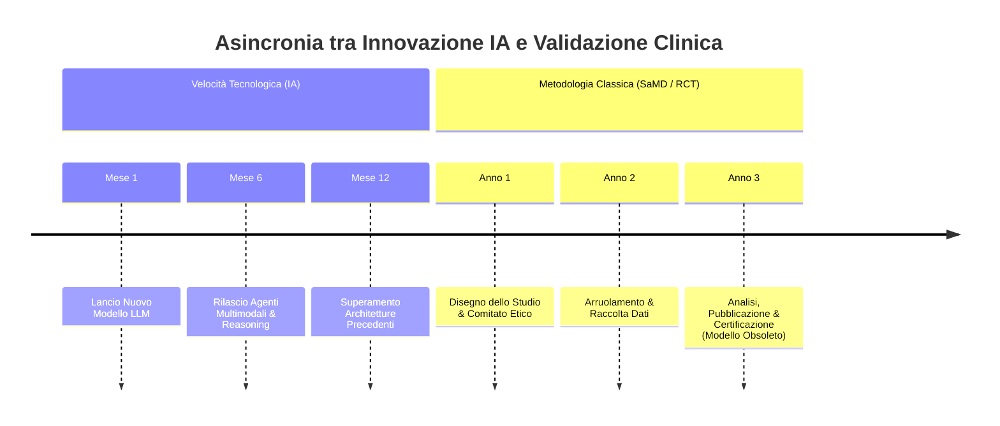

# Gap Tecnologico-Scientifico e Living Labs in Sanità Digitale

**Summary**: Fenomeno di asincronia e disallineamento sistemico tra la velocità esponenziale di avanzamento delle tecnologie di IA generativa e i tempi pluriennali richiesti dalla validazione empirica formale (trial clinici controllati, certificazioni SaMD, bioetica), con la conseguente necessità di adottare modelli di Living Lab.
**Sources**: 06-05 Riunione_ Impiego dell'IA in ambito clinico, bias e formazione.txt, 05-08 Riunione_ Sviluppo Knowledge Base AI, Etica e Applicazioni Cliniche.txt
**Last updated**: 2026-08-27
---

## Il Paradosso dell'Asincronia Temporale

Nel contesto della sanità digitale e della psicoterapia assistita da IA, emerge una frattura temporale critica tra innovazione e validazione:
- **Accelerazione Tecnologica Esponenziale**: Gli algoritmi e i modelli LLM evolvono su base mensile, modificando capacità computazionali, finestre di contesto e comportamenti emergenti.
- **Lentezza dei Processi di Validazione Tradizionale**: Gli studi clinici randomizzati controllati (RCT), le autorizzazioni regolatorie per *Software as a Medical Device* (SaMD / marcatura CE / FDA) e la definizione delle linee guida bioetiche richiedono mediamente dai 2 ai 5 anni.
- **Rischio di Obsolescenza Scientifica**: Un software o un algoritmo validato formalmente secondo gli standard classici rischia di basarsi su modelli tecnologici già ampiamente superati (*preistoria tecnologica*) al momento della commercializzazione o pubblicazione.

## Il Modello dei Living Labs

Per colmare questo divario senza rinunciare al rigore metodologico ed etico, emerge la necessità di ripensare la ricerca clinica:
- **Istituzione di Living Labs**: Laboratori accademico-clinici operativi in contesti reali (*real-world evidence*), capaci di condurre verifiche di affidabilità, accuratezza e sicurezza su base continuativa e modulare.
- **Valutazione Adattiva e Continua**: Sostituzione della certificazione "a punto fisso" con protocolli di monitoraggio dinamico delle prestazioni del modello (*continuous monitoring* e audit periodici dei bias).
- **Proattività Bioetica**: Anticipare le direttrici di impatto deontologico durante la fase di progettazione algoritmica, anziché limitarsi a interventi correttivi *post-hoc* a seguito di falle o usi sconsiderati.

---

## Related pages
- [[audit-bias-llm-clinici]]
- [[architetture-generative-dinamiche]]
- [[ai-research-ethics]]
- [[augmented-psychotherapy]]
- [[human-in-the-reasoning]]
- [[06-05_Riunione_Impiego_IA_Clinica_Bias_Formazione]]
