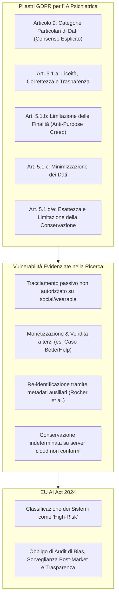

# GDPR Governance e Protezione Dati nell'IA per la Salute Mentale

**Summary**: Framework di conformità giuridico-regolatoria basato sul Regolamento Generale sulla Protezione dei Dati (GDPR) e sui vincoli specifici applicati all'IA in salute mentale (Artt. 5 e 9), analizzando la gestione dei dati sensibili, la minimizzazione, la prevenzione del purpose creep, la re-identificazione e la classificazione High-Risk secondo l'EU AI Act 2024.
**Sources**: Kandeel et al. (2026) - `ai-v5-e84305.pdf`, Rocher et al. (2019), D'Alfonso et al. (2025)
**Last updated**: 2026-08-27
---

## Inquadramento e Tensione Strutturale

L'implementazione di sistemi di intelligenza artificiale nella salute mentale genera una profonda **tensione strutturale**: da un lato, i modelli di deep learning e machine learning necessitano di grandi volumi di dati eterogenei e continui (testi di sedute, post sui social media, biometriche da sensori wearable, cartelle cliniche elettroniche); dall'altro, i dati psicologici e psichiatrici costituiscono la categoria di informazioni personali più intima, vulnerabile e ad alto rischio di stigmatizzazione e discriminazione per l'individuo.

Il **Regolamento Generale sulla Protezione dei Dati (GDPR - Regolamento UE 2016/679)**, affiancato negli Stati Uniti dall'**HIPAA** e integrato a livello comunitario dall'**EU AI Act (2024)**, impone vincoli inderogabili alla progettazione (*Privacy by Design*) e all'esercizio operativo di tali architetture.

---

## I Vincoli Chiave del GDPR

### 1. Dati Particolari e Consenso Esplicito (Articolo 9)
- Ai sensi dell'**Art. 9 del GDPR**, lo stato di salute mentale, i dati biometrici e le informazioni genetiche appartengono alle *"categorie particolari di dati personali"*, il cui trattamento è vietato a meno che non ricorra una specifica eccezione legale (consenso esplicito del paziente, salvaguardia di un interesse vitale o finalità di ricerca scientifica con adeguate misure di garanzia).
- **Criticità Empirica**: Come rilevato da Kandeel et al. (2026), numerosi studi su NLP e modelli predittivi operano in un'area grigia raccogliendo post su forum online (Reddit, Twitter/X) senza consenso informato esplicito, esponendo a rischi etici popolazioni fragili o adolescenti (D'Alfonso et al., 2025).

### 2. Principio di Minimizzazione dei Dati (Articolo 5.1.c)
- Il trattamento deve essere limitato a quanto strettamente necessario rispetto alle finalità perseguite.
- I sistemi di monitoraggio passivo continuo tramite sensori biometrici (*digital phenotyping*) tendono a raccogliere metadati sovrabbondanti (geolocalizzazione, ritmi circadiani, attigrafia, frequenza cardiaca) senza una preventiva selezione della pertinenza clinica.

### 3. Limitazione delle Finalità e "Purpose Creep" (Articolo 5.1.b)
- I dati raccolti per finalità terapeutiche o di supporto non possono essere impiegati per scopi secondari incompatibili senza un nuovo ed esplicito consenso.
- **Caso BetterHelp**: Uno dei fallimenti regolatori e deontologici più gravi ha riguardato la cessione di dati sanitari sensibili degli utenti (tra cui risposte a questionari psicologici ed e-mail) a broker pubblicitari e piattaforme social (Facebook, Pinterest) per scopi di micro-targeting commerciale.

### 4. Esattezza e Limitazione della Conservazione (Articoli 5.1.d e 5.1.e)
- Le informazioni devono essere costantemente aggiornate e conservate per un tempo non superiore a quello necessario. Modelli addestrati su dati storici statici rischiano di cristallizzare diagnosi obsolete. Applicazioni best-practice (come Woebot) limitano il periodo di conservazione dei log a 30 giorni applicando l'anonimizzazione dei testi.

---

## Il Rischio della Re-Identificazione (Rocher et al., 2019)

Un assunto diffuso nello sviluppo di modelli di IA è che la rimozione dei dati identificativi diretti (nome, cognome, ID univoco) garantisca l'anonimato. 
- La ricerca fondamentale di **Rocher et al. (2019)** ha dimostrato che, utilizzando modelli generativi e dati ausiliari (es. codice postale, data di nascita, sesso o caratteristiche stilometriche di scrittura), è possibile **re-identificare con successo il 99.98% degli individui** all'interno di dataset sanitari apparentemente anonimizzati.
- Nell'ambito dei disturbi mentali, i timestamp dei messaggi, lo stile lessicale e i parametri biometrici dei wearable costituiscono impronte quasi univoche.

---

## Integrazione con l'EU AI Act (2024)

L'entrata in vigore dell'**AI Act dell'Unione Europea (2024)** aggiunge requisiti stringenti dedicati all'intelligenza artificiale:
- **Classificazione ad Alto Rischio (*High Risk*)**: I sistemi di IA destinati all'ambito della salute mentale (diagnosi predittiva, triage, chatbot di supporto psicologico) influenzano direttamente la sicurezza, il benessere psicologico e i diritti fondamentali del paziente.
- **Obblighi Derivati**:
  - Valutazione dell'impatto sui diritti fondamentali;
  - Audit indipendenti su bias e discriminazione prima della commercializzazione;
  - Tenuta di registri di log immutabili (*audit trails*);
  - Trasparenza algoritmica e modelli *Human-in-the-Loop* con facoltà di override clinico.

---

## Disparità Internazionali e Frammentazione Giuridica

- **Inadeguatezza HIPAA negli USA**: A differenza del GDPR (che si applica a qualsiasi entità che tratti dati), l'HIPAA si applica prevalentemente a enti sanitari accreditati (*covered entities*). Le app commerciali di benessere mentale (*direct-to-consumer apps*) non ricadono sotto l'HIPAA, lasciando gli utenti privi di tutela formale (il 45% non adotta crittografia idonea e il 60% condivide dati con terze parti).
- **Blocco dei Flussi Transfrontalieri (Schrems II)**: L'annullamento del *Privacy Shield* nel 2020 impone clausole contrattuali standard (SCC) e regole vincolanti d'impresa (BCR), limitando la collaborazione scientifica e la condivisione di dataset tra Unione Europea e paesi terzi.

---

## Related pages
- [[kandeel-et-al-2026]]
- [[federated-learning-and-differential-privacy-mental-health]]
- [[software-as-a-medical-device-salute-mentale]]
- [[three-layer-governance-framework]]
- [[etica-privacy-bias-ia-clinica]]
- [[algorithmic-paternalism-in-ai-mental-health]]
- [[cross-cultural-bias-and-fairness-audits-ai]]
