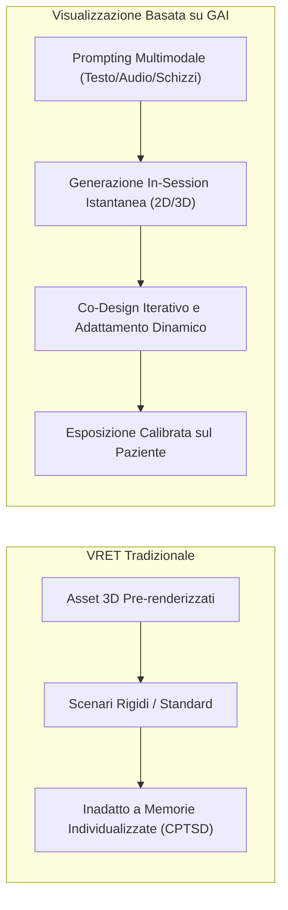

# Generative AI-based Exposure Visualization in Trauma Therapy

**Summary**: Applicazione dell'Intelligenza Artificiale Generativa (Diffusion Models, GAN, VAE) per la sintesi rapida e a basso costo di stimoli visivi 2D e 3D personalizzati nella psicoterapia di esposizione, superando i limiti di costo e tempo della Virtual Reality Exposure Therapy (VRET) convenzionale e supportando il recupero di memorie amnesiche nel CPTSD.
**Sources**: Degenhard et al. (2025) - `2505.20796v1.pdf`
**Last updated**: 2026-08-27
---

## Inquadramento e Rilevanza Clinica

La **terapia di esposizione** è l'intervento d'elezione per favorire l'integrazione autobiografica dei ricordi traumatici e ridurre i sintomi di iperarousal nel Disturbo da Stress Post-Traumatico (PTSD) e nel Disturbo da Stress Post-Traumatico Complesso (CPTSD). Tuttavia, l'esposizione classica incontra due ostacoli principali:
1. **Esposizione Immaginativa (*in sensu*)**: I pazienti attuano spesso strategie di evitamento cognitivo involontario o dissociazione, impedendo al terapeuta di verificare l'effettivo contatto con lo stimolo traumatico.
2. **Virtual Reality Exposure Therapy (VRET) Tradizionale**: Richiede la modellazione grafica preventiva di ambienti 3D. Sebbene efficace per traumi standardizzabili (es. traumi bellici), è economicamente e tecnicamente inapplicabile per il CPTSD, dove ogni trauma è strettamente individuale e legato alla storia personale (es. abusi infantili).

L'avvento dell'**Intelligenza Artificiale Generativa (GAI)** trasforma questo scenario, consentendo per la prima volta la sintesi *on-demand* e in tempo reale (*in-session*) di stimoli visivi personalizzati.

---

## Caratteristiche Funzionali della GAI nell'Esposizione

### 1. Sintesi Immediata durante la Seduta Clinica
Modelli generativi come DALL-E, Stable Diffusion e generatori 3D (es. DeepAI) permettono di tradurre frammenti descrittivi verbali del paziente in immagini visive nell'arco di pochi minuti, rendendo la visualizzazione parte integrante della fase esplorativa del colloquio clinico.

### 2. Esplorazione delle Memorie Amnesiche e Dissociative
Nel CPTSD, i ricordi traumatici sono spesso inaccessibili in forma narrativa strutturata ("*Describe me something you do not remember*"). La visualizzazione generativa precoce funge da indicatore esplorativo:
- Aiuta il paziente e il terapeuta a identificare se un frammento visivo contiene o meno lo stimolo traumatico scatenante (*trigger*).
- Facilita la comunicazione e l'esplicitazione di ricordi sensoriali non verbalizzati.

### 3. Co-Design e Controllo del Livello di Dettaglio
Il paziente non è un fruitore passivo di uno scenario predefinito, ma partecipa attivamente alla calibrazione dello stimolo:
- Scelta dello stile visivo (realistico, simbolico, astratto).
- Gradualità del livello di dettaglio per dosare l'esposizione e prevenire il superamento della finestra di tolleranza emotiva.

---

## Sfide Aperte e Limiti

- **Instabilità di Editing Locale (*Fine-Grained Editing*)**: Le architetture generative attuali tendono a rigenerare l'intera scena a ogni modifica del prompt, rischiando di cancellare dettagli già consolidati o introdurre elementi imprevisti perturbanti.
- **Rischio di Allucinazioni Visive**: Artefatti o incongruenze visive possono distrarre il paziente o innescare flashback traumatici non previsti.
- **Filtri di Sicurezza Commerciali**: Le policy contro i contenuti violenti o espliciti bloccano la generazione di stimoli necessari all'elaborazione di abusi gravi, richiedendo ambienti di ricerca e clinici dedicati.

---

## Related pages
- [[degenhard-et-al-2025]]
- [[rischi-esposizione-cptsd-ia]]
- [[interazione-triadica-terapeuta-paziente-ia]]
- [[distorsione-memoria-imagery-rescripting-ia]]
- [[ai-assisted-psychotherapy]]
- [[human-in-the-reasoning]]
