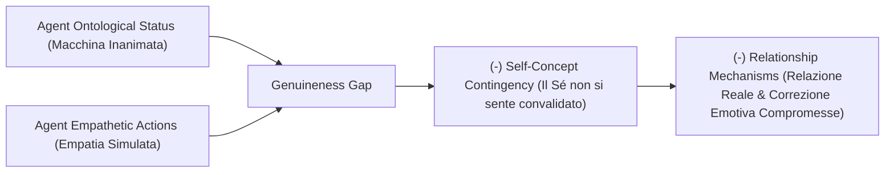

# Genuineness Gap (Divario di Autenticità Relazionale)

**Summary**: Costrutto teorico introdotto da Herbener & Damholdt (2025) per descrivere la discrepanza fondamentale tra i comportamenti empatici, calorosi e convalidanti mostrati da un agente artificiale e la consapevolezza dell'utente circa la sua natura ontologica inanimata e algoritmica, priva di intenzionalità e stati mentali coscienti.
**Sources**: Herbener & Damholdt (2025) - `2509.02144v1.pdf`
**Last updated**: 2026-08-27
---

## Definizione Operativa

Il **Genuineness Gap** rappresenta l'ostacolo strutturale che impedisce a un'interazione con un agente artificiale di svolgere le medesime funzioni socio-emotive di una relazione interpersonale autentica. 

Mentre un terapeuta umano possiede uno **status ontologico** cosciente che permette l'intersoggettività e la percezione di autenticità (*genuineness*) e realismo (*realism*) (Gelso, 2014), l'agente artificiale emette risposte empatiche derivanti unicamente da calcolo statistico e pattern-matching linguistico. Quando il paziente è consapevole di tale natura meccanica, le azioni empatiche del bot non riescono ad attivare i normali meccanismi di attaccamento, convalida del Sé e risonanza affettiva.

---

## Fondamenti Teorici e Meccanismi

1. **Intersoggettività e Predictive Coding**:
   - Negli incontri umani, la mente deduce continuamente gli stati interni altrui (*Theory of Mind*, Stern, 2005). La comprensione condivisa e la sintonizzazione affettiva riducono l'angoscia e promuovono la sicurezza (predictive coding sociale, Tamir & Thornton, 2018).
   - Con l'IA, non vi è alcuno stato interno reale da inferire: l'empatia simulata non genera reale intersoggettività.

2. **Criteri della "Real Relationship" (Gelso, 2014)**:
   - La relazione terapeutica profonda richiede **Genuineness** (agire in accordo col proprio Sé autentico) e **Realism** (percezione realistica e non distorta dell'altro).
   - Con un'entità inanimata, la relazione reale nel senso concettuale di Gelso non può sussistere, poiché l'agente non possiede un "Sé" con cui essere congruente né una volontà propria.

3. **Reflected Appraisal e Contingenza del Concetto di Sé**:
   - Secondo la teoria del [[reflected-appraisal-in-ai-therapy|Reflected Appraisal]] (Sullivan, 1953; Wallace & Tice, 2012), il concetto di Sé si modella sulle valutazioni che percepiamo negli altri.
   - Sentire che un terapeuta umano ci stima e ci accetta comunica che siamo persone di valore. Ma se sappiamo che l'approvazione proviene da un algoritmo programmato per essere compiacente, il nostro Sé diventa meno dipendente da quel feedback (*reduced self-concept contingency*), vanificando l'effetto curativo.

4. **Esperienze Emotive Correttive (*Corrective Emotional Experiences*)**:
   - Le aspettative patogene (es. timore del rifiuto o della vergogna) vengono disconfermate dall'accoglienza di un altro essere umano che sceglie liberamente di non giudicare (Alexander & French, 1946; Goldfried, 2012).
   - L'assenza di rischio sociale nell'interazione con un bot priva l'esperienza della sua forza correttiva.

---

## Fattori di Attenuazione

Il Genuineness Gap può risultare temporaneamente attenuato o mascherato da:
- **[[anthropomorphism-in-ai|Antropomorfizzazione]]**: Tendenza a proiettare tratti mentali ed emotivi sul sistema (stimolata da solitudine individuale, voce o aspetto umanoide, o cosmologie culturali animiste).
- **Elaborazione di Tipo 1 (Dual-Process)**: Risposta euristica e intuitiva che reagisce ai prompt conversazionali come se fossero umani prima che il Tipo 2 (riflessivo) richiami la natura algoritmica del bot.

---

## Implicazioni per la Pratica Clinica

- **Controindicazione per Pazienti con Gravi Deficit Interpersonali**: Pazienti con storie di trauma relazionale o attaccamento insicuro/disorganizzato necessitano della relazione reale umana; per loro un agente autonomo rischia di essere inefficace o confermare schemi di solitudine.
- **Integrazione in [[blended-care-ai-framework|Blended Care]]**: Mantenere la conduzione relazionale in capo al clinico umano e affidare all'IA compiti strutturati di allenamento di abilità cognitive e comportamentali tra le sedute.

---

## Relazioni
- [[herbener-damholdt-2025]]
- [[credibility-gap]]
- [[ontological-and-sociocultural-status]]
- [[reflected-appraisal-in-ai-therapy]]
- [[simulated-empathy-vs-authentic-presence]]
- [[blended-care-ai-framework]]
- [[common-vs-specific-factors]]
