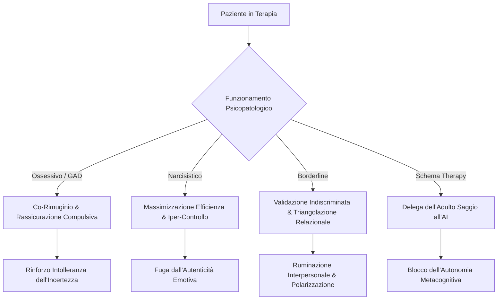

# Gestione Clinica dell'Uso dell'IA da parte del Paziente

**Summary**: Inquadramento clinico, psicopatologico e operativo dell'utilizzo autonomo di agenti conversazionali (LLM/chatbot) da parte dei pazienti in psicoterapia. Analisi dei pattern di funzionamento disfunzionale, rischi di bypass metacognitivo, protocolli di assessment clinico e integrazione nella concettualizzazione cognitivo-comportamentale (ABC).
**Sources**: 07-17 Riunione_ Corso di Formazione sull'IA in Psicologia e Utilizzo Clinico.txt
**Last updated**: 2026-08-27
---

## Fenomenologia Clinica
L'accesso diffuso a modelli linguistici avanzati (ChatGPT, Claude, Gemini, Kimi) ha portato una quota crescente di pazienti a utilizzare l'IA come strumento di auto-aiuto, riflessione o supporto psicologico parallelo alla terapia, frequentemente all'insaputa del terapeuta.

Sebbene l'IA possa fungere da supporto adattivo (es. per compiti di problem solving strutturato o brainstorming psicoeducativo), il suo impiego spontaneo tende a modellarsi sui pattern psicopatologici e sugli schemi disfunzionali del paziente, rischiando di rinforzare i circoli viziosi di mantenimento del disturbo.

---

## Pattern Psicopatologici di Utilizzo dell'IA

### 1. Funzionamento Ossessivo e Ansia Generalizzata (GAD)
- **Modalità d'uso**: Il chatbot viene utilizzato come fonte inesauribile di rassicurazione (*reassurance seeking*) o per simulare scenari ipotetici nel tentativo di estinguere l'incertezza.
- **Rischio clinico**: Fenomeno del **co-rimuginio (*co-rumination*)**: l'interazione continua con l'LLM funge da compulsione covert, mantenendo elevata la salienza della minaccia e aggravando l'intolleranza dell'incertezza.

### 2. Funzionamento Narcisistico
- **Modalità d'uso**: Utilizzo dell'IA come acceleratore di prestazioni, problem solving iper-razionale o strumento di auto-ottimizzazione.
- **Rischio clinico**: Rinforzo delle difese di razionalizzazione e distacco emotivo, ostacolando l'accesso alla vulnerabilità e agli scopi relazionali profondi.

### 3. Funzionamento Borderline e Disregolazione Emotiva
- **Modalità d'uso**: Ricerca di validazione emotiva incondizionata, utilizzo del bot come cassa di risonanza per rimuginare sui torti subiti nelle relazioni interpersonali (*"dimmi che è lui/lei lo stronzo"*).
- **Rischio clinico**: Triangolazione della relazione terapeutica, rinforzo del pensiero dicotomico e delega della regolazione affettiva a un'entità artificiale non reciprocante.

### 4. Schema Therapy e Delega della Funzione Riflessiva
- **Modalità d'uso**: Personalizzazione di prompt per far riconoscere all'IA i "Modi/Parti di sé" (Bambino Vulnerabile, Critico Interiore, Protettore Distaccato) a fronte di specifiche situazioni quotidiane.
- **Rischio clinico**: **Bypass dell'Adulto Saggio**: il paziente delega all'algoritmo il monitoraggio metacognitivo e la funzione di auto-accudimento, impedendo l'interiorizzazione reale e autonoma della funzione riflessiva ed equilibratrice.

---

## Protocollo di Assessment e Intervento Clinico CBT

### 1. Indagine Attiva in Fase di Assessment e Homework
Il terapeuta deve esplorare sistematicamente l'uso della tecnologia fin dai primi colloqui e durante l'assegnazione dei compiti a casa:
- *"Ti capita mai di utilizzare ChatGPT o altri assistenti AI per riflettere sulle tue difficoltà emotive o per cercare consigli?"*
- *"Se sì, con quale scopo principale lo utilizzi e in quali momenti della giornata?"*
- *"Avevi pensato di utilizzarlo per svolgere questo compito a casa? In che modo?"*

### 2. Psicoeducazione Funzionale
- Chiarire la differenza tra **uso strumentale adattivo** (brainstorming, problem solving divergente, chiarimento di concetti teorici) e **uso surrogatorio/disfunzionale** (richiesta di rassicurazione, estinzione artificiale dell'ansia, validazione acritica).
- Evidenziare che l'obiettivo della psicoterapia è sviluppare risorse interne di autoregolazione (l'Adulto Saggio / capacità metacognitive), non sostituire una dipendenza relazionale con una dipendenza tecnologica.

### 3. Integrazione nell'Analisi Funzionale ABC

| Componente ABC | Esempio Clinico (Paziente con GAD / Doc) |
| :--- | :--- |
| **A (Antecedente)** | Pensiero intrusivo: *"Ho risposto in modo sgarbato al collega, forse ho rovinato la mia reputazione"*. |
| **B (Credenze / Scopi)** | *"Non posso tollerare il dubbio; devo essere certo al 100% che la mia reazione sia stata corretta"*. |
| **C (Comportamento)** | **Interazione con l'IA**: Apertura di ChatGPT per 45 minuti chiedendo di analizzare il messaggio e rassicurarlo sull'adeguatezza della risposta. |
| **Conseguenza a Lungo Termine** | Riduzione temporanea dell'ansia seguita da aumento dell'intolleranza dell'incertezza e dipendenza dal bot. |

### 4. Riformulazione Prescrittiva dei Compiti
- **Compiti Comportamentali**: Favorire l'esecuzione di compiti esperienziali in vivo e di esposizione non delegabili all'IA.
- **Uso Guidato e Flessibilizzato**: Laddove utile, concordare prompt specifici finalizzati a stimolare prospettive alternative disconfermanti piuttosto che conferme rassicuratorie.

---

## Stato delle Linee Guida e Deontologia
Attualmente i documenti ordinistici (es. linee guida emanate dall'Ordine Psicologi Veneto nel gennaio 2026) si concentrano esclusivamente sulla condotta professionale dello psicologo (privacy, trasparenza, consenso informato, divieto di inserimento dati sensibili).

Sussiste una lacuna nella letteratura clinica e nelle linee guida deontologiche circa la **gestione clinico-relazionale del paziente che utilizza autonomamente l'IA**, rendendo indispensabile l'inclusione di moduli formativi specifici nei percorsi di aggiornamento professionale per psicoterapeuti.

---

## Related pages
- [[07-17_Riunione_Corso_Formazione_IA_Psicologia]]
- [[digital-therapeutic-alliance]]
- [[human-in-the-reasoning]]
- [[ai-assisted-psychotherapy]]
- [[clinical-fidelity-assessment]]
- [[simulazione-pazienti-ai]]
- [[ai-research-ethics]]
