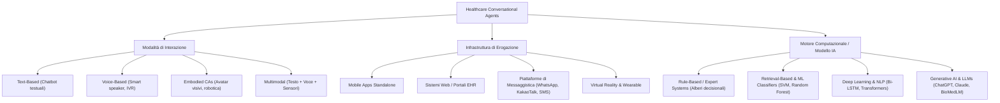

# Healthcare Conversational Agents (Agenti Conversazionali in Sanità)

## Definizione Operativa
Un **Healthcare Conversational Agent (CA)** è un sistema software interattivo basato su intelligenza artificiale progettato per dialogare con pazienti, utenti o operatori sanitari simulando interazioni umane attraverso testo, voce o modalità multimodali (Laranjo et al., 2018; Huynh et al., 2026).
- **Utilità CBT e Clinica:** Funge da interfaccia scalabile per l'erogazione di psicoeducazione, compiti di auto-monitoraggio (es. diari dei pensieri, tracciamento dell'umore), somministrazione di protocolli strutturati (es. ristrutturazione cognitiva, rilassamento) e promemoria per l'aderenza terapeutica.

---

## Tassonomia Tecnologica e Modelli Architetturali

### 1. Modalità di Interazione
- **Text-based**: Input e output esclusivamente testuali (es. Woebot, Wysa, Tess). Rappresentano la modalità più diffusa per la facilità di fruizione asincrona e il basso attrito d'uso.
- **Voice-based**: Riconoscimento vocale automatico (ASR) e sintesi vocale (TTS) (es. Amazon Alexa, Google Assistant, mHealth voice tools), particolarmente utili in contesti geriatrico-assistenziali o per disabilità visive/motorie.
- **Embodied Conversational Agents (ECA)**: Agenti dotati di rappresentazione grafica o fisica (avatar virtuali, robot sociali come NAO o Pepper), capaci di veicolare segnali non verbali (mimica facciale, postura). La presenza di un avatar è associata a dimensioni d'effetto superiori nella riduzione dei sintomi depressivi (*g* = 0.88; Lim et al., 2022).
- **Multimodal**: Integrazione combinata di testo, parlato, gesti virtuali e flussi di dati biometrici da sensori indossabili.

### 2. Architetture Algoritmiche di Elaborazione
1. **Sistemi Guidati da Regole (*Rule-based*)**: Dialogo controllato ad albero decisionale. Massima sicurezza e prevedibilità clinica, ma ridotta flessibilità conversazionale.
2. **Sistemi di Recupero e NLP Tradizionale (*Retrieval-based*)**: Classificazione dell'intento dell'utente tramite NLP/NLU (intent recognition, entity extraction, sentiment analysis) e selezione della risposta validata più appropriata.
3. **Modelli di Deep Learning Sequenziali**: Reti Bi-LSTM e Convolutional Neural Networks (CNN) impiegate per la classificazione complessa del linguaggio e il riconoscimento di indicatori di disagio emotivo.
4. **Modelli Generativi e Grandi Modelli Linguistici (*LLMs*)**: Architetture Transformer capaci di generare risposte contestualmente ricche e dinamiche, ma soggette a rischi di allucinazione, fabbricazione di evidenze e derive etiche se non vincolate (*grounded*) a basi di conoscenza verificate.

---

## Evidenze dalla Letteratura
- **Accessibilità ed Ecosistema Distribuito**: L'eterogeneità dei canali di erogazione (dalle app mobili ai social media e ai portali ospedalieri) abbatte le barriere geografiche ed economiche all'assistenza primaria e specialistica (Huynh et al., 2026).
- **Engagement e Usabilità**: Gli agenti conversazionali mostrano tassi elevati di accettabilità e soddisfazione dell'utente, in particolare quando garantiscono risposte rapide, empatia percepita e personalizzazione dei contenuti (Car et al., 2020; Ding et al., 2024).
- **Necessità di Trasparenza e Standardizzazione**: La frammentazione dei framework di sviluppo e la carenza di standard architetturali condivisi impongono l'adozione di protocolli rigorosi di validazione clinica prima dell'implementazione su larga scala (Huynh et al., 2026).

---

## Riferimenti Bibliografici
- Huynh, A. L., Roy, T. J., Jackson, K. N., Lee, A. G., Liaw, W., & Hossain, M. M. (2026). Applications of artificial intelligence-based conversational agents in healthcare: A systematic umbrella review. *International Journal of Medical Informatics*, 207, 106204.
- Laranjo, L., Dunn, A. G., Tong, H. L., et al. (2018). Conversational agents in healthcare: A systematic review. *Journal of the American Medical Informatics Association*, 25(9), 1248–1258.
- Lim, S. M., Shiau, C. W. C., Cheng, L. J., & Lau, Y. (2022). Chatbot-delivered psychotherapy for adults with depressive and anxiety symptoms: A systematic review and meta-regression. *Behavior Therapy*, 53(2), 334–347.

---

## Relazioni
- [[huynh-et-al-2026]]
- [[conversational-agents-mental-health]]
- [[ai-clinical-decision-support]]
- [[digital-therapeutic-alliance]]
- [[anthropomorphism-in-ai]]
- [[large-language-models]]
