# CDSS Ibridi Neuro-Simbolici e Constraint Logic Programming (CLP)

**Summary**: Architettura computazionale per Clinical Decision Support Systems (CDSS) ideata da Kim (2025) che combina la capacità di comprensione linguistica dei Large Language Models con la logica deterministica della Constraint Logic Programming (CLP). In questo paradigma, l'LLM funge unicamente da traduttore semantico dei criteri diagnostici testuali in regole formali ispezionabili, eliminando le allucinazioni probabilistiche ed esponendo il codice logico alla validazione umana prima dell'esecuzione clinica.
**Sources**: `AI Generativa in Psicoterapia.docx`, Kim, B. H. (2025) (*AAAI GenAI4Health Workshop / arXiv:2501.07653*)
**Last updated**: 2026-08-27
---

## Il Problema della "Scatola Nera" nei CDSS Basati su LLM Puri

I modelli linguistici autoregressivi basati su reti neurali profonde (es. GPT-4, Claude) presentano due vulnerabilità strutturali quando impiegati per decisioni cliniche:
1. **Natura Probabilistica e Allucinazioni**: Gli LLM predicono il token successivo massimizzando la verosimiglianza statistica, non la coerenza logico-deduttiva formale. Ciò genera allucinazioni fattuali e deduzioni diagnostiche non verificabili.
2. **Opacità Euristica**: È impossibile per il clinico ispezionare il percorso logico esatto che porta dall'input anamnestico all'output diagnostico.

```mermaid
flowchart TD
    subgraph Approccio_Puro_LLM ["CDSS con LLM Puro (Alto Rischio)"]
        L1["Testo Anamnestico / Criteri DSM"] --> L2["Rete Neurale Probabilistica (Black-Box)"]
        L2 --> L3["Diagnosi Generata per Completamento di Pattern"]
        L3 -. Rischio Sistemico .-> H1["Allucinazioni, Instabilità & Mancanza di Controllo"]
    end

    subgraph Approccio_Neuro_Simbolico ["CDSS Ibrido Neuro-Simbolico (Kim, 2025)"]
        N1["Criteri Diagnostici Ufficiali (es. DSM-5 / ICD-11)"] --> N2["LLM come Traduttore Semantico (Parser)"]
        N2 --> N3["Generazione Codice a Regole Deterministiche (CLP)"]
        N3 --> N4["Ispezione, Editing e Validazione da parte del Clinico"]
        N4 --> N5["Motore Esecutivo Logico Determinista (Constraint Solver)"]
        N5 --> N6["Decision Support Certo, Spiegabile e Riproducibile"]
    end
```

---

## Architettura del Sistema di Kim (2025)

L'approccio neuro-simbolico di **Kim (2025)** disaccoppia la *comprensione del linguaggio naturale* dal *ragionamento logico-deduttivo*:

### 1. Il Ruolo dell'LLM come Traduttore di Criteri
L'LLM non esegue la diagnosi. Il suo unico compito è convertire le descrizioni narrative dei manuali nosografici (es. criteri di durata, soglie sintomatologiche, esclusioni organiche) in espressioni logiche formali strutturate nel paradigma della **Constraint Logic Programming (CLP)**.

### 2. Ispezionabilità e Validazione Pre-Esecuzione (*Human-in-the-Reasoning*)
Prima che il motore venga applicato ai dati del paziente, il set di regole logiche generate dall'LLM viene presentato al clinico in formato leggibile e ispezionabile:
- Il clinico può verificare che non vi siano state errate interpretazioni dei criteri.
- È possibile modificare manualmente le soglie di vincolo (es. numero minimo di sintomi o finestre temporali).

### 3. Esecuzione Deterministica e Spiegabilità Totale
I dati clinici del paziente (sintomi rilevati, durata, severità) vengono processati dal motore CLP deterministico:
- Se i vincoli logici sono soddisfatti, il sistema produce l'inquadramento con un albero di prova (*proof tree*) esplicito, che mostra esattamente quale regola è stata applicata a ciascun dato.
- Le allucinazioni probabilistiche sono azzerate, poiché il motore logico non può generare deduzioni non vincolate alle regole validate.

---

## Vantaggi Clinici ed Epistemologici

| Dimensione | CDSS con LLM Puro | CDSS Ibrido Neuro-Simbolico (CLP) |
| :--- | :--- | :--- |
| **Allucinazioni** | Frequenti, specie in quadri complessi e comorbilità. | **Assenti** (esecuzione deterministica delle regole). |
| **Interpretabilità** | Post-hoc o simulata (approssimazione linguistica). | **Intrinseca** (albero logico e vincoli espliciti verificabili). |
| **Controllo Clinico** | Controllo a valle sull'output finale (rischio automation bias). | **Controllo a monte** sulle regole logiche prima dell'esecuzione. |
| **Riproducibilità** | Bassa (variabilità stocastica del campionamento LLM). | **100% Deterministica** a parità di dati clinici e regole. |

---

## Related Pages
- [[ai-generativa-in-psicoterapia]]
- [[mind-safe-framework]]
- [[readi-framework]]
- [[automation-bias-clinical-reasoning]]
- [[human-in-the-reasoning]]
- [[ai-clinical-decision-support]]
- [[large-language-models]]
