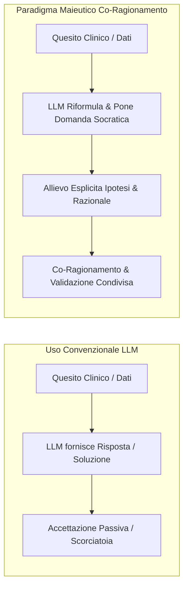

# IA Maieutica e Co-Ragionamento

**Summary**: Paradigma pedagogico e clinico che impiega l'intelligenza artificiale non come fornitore passivo di soluzioni rapide, ma come interlocutore maieutico e socratico volto ad allungare il processo di riflessione critica, prevenire l'over-confidence e gestire i bias cognitivi.
**Sources**: `07-10 Riunione_ Test e Valutazione di “Libet Prime” (Tutor AI per Libet_CBT), Trainer Simulator e Piano Operativo.txt`, `04-20 Tavola rotonda_ Integrazione dell’IA in psicoterapia — governance, co‑ragionamento e modelli ibridi.txt`
**Last updated**: 2026-08-27
---

## Il Principio dell'"Allungamento della Riflessione"

Nell'interazione convenzionale con i Large Language Model, l'utente tende a ricercare **scorciatoie cognitive** (*cognitive shortcuts*): risposte immediate, sintesi preconfezionate o soluzioni pronte all'uso.

Nel contesto della formazione clinica e specialistica in psicoterapia (es. con [[libet-prime]]), tale dinamica risulta disfunzionale ed epistemologicamente rischiosa, poiché rischia di atrofizzare le competenze di ragionamento clinico autonomo (*skill atrophy*).

L'**IA Maieutica** inverte questo paradigma:
- L'agente non "chiude" la questione con una diagnosi o una risposta categorica su dati clinici complessi.
- Introduce un **attrito pedagogico costruttivo**: risponde alle domande stimolando ulteriori riflessioni, evidenziando ambiguità e chiedendo all'allievo di argomentare le ragioni alla base di una specifica scelta concettuale o terapeutica.

---

## Gestione delle Dinamiche di Bias e Attitudini Relazionali

L'interazione tra clinico (o allievo) e agente intelligente solleva specifiche sfide psicologiche ed epistemiche:

### 1. Over-Confidence ed "Effetto Oracolo"
- **Rischio**: L'allievo attribuisce all'IA un'autorità epistemica superiore, delegando ad essa la formulazione diagnostico-clinica e accettando acriticamente allucinazioni o forzature concettuali.
- **Contromisura Maieutica**: L'agente mantiene un linguaggio probabilistico ed esplicita i limiti informativi dei dati forniti.

### 2. Rigidità e Bias di Conferma del Clinico Esperto
- **Rischio**: Il docente o terapeuta esperto rifiuta a priori gli spunti dell'agente ogni qualvolta differiscano dalla propria formulazione abituale, interpretando la divergenza come un errore dell'IA anziché come un'ipotesi alternativa fondata sul modello teorico.
- **Opportunità**: Un agente ben ancorato a una Knowledge Base formale e rigorosa può offrire prospettive aderenti al modello che il clinico, per abitudine, non aveva considerato, fungendo da strumento di disconferma e apertura cognitiva.

---

## Integrazione con lo Human-in-the-Reasoning

L'approccio maieutico è la declinazione operativa del paradigma [[human-in-the-reasoning]]:
- **Non sostituzione della responsabilità**: La responsabilità clinica rimane interamente in capo al terapeuta e all'allievo.
- **Esplicitazione dell'albero inferenziale**: L'allievo impara a decostruire i propri passi logici (perché sceglie una determinata tecnica? Su quali dati si fonda l'ipotesi di piano disfunzionale?), sviluppando una solida competenza metacognitiva indispensabile per la pratica clinica.

---

## Related pages
- [[human-in-the-reasoning]]
- [[libet-prime]]
- [[trainer-simulator]]
- [[testing-e-validazione-agenti-didattici]]
- [[07-10_Riunione_Test_Valutazione_Libet_Prime]]
- [[digital-therapeutic-alliance]]
- [[ai-research-ethics]]
