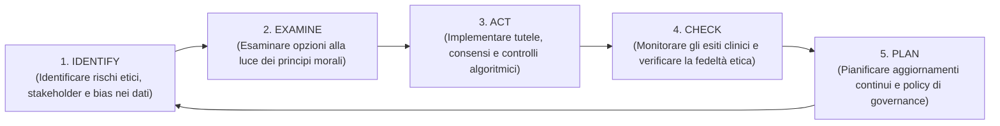
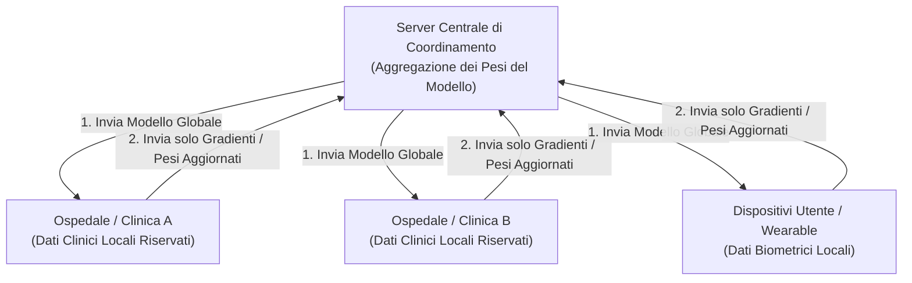

# Ethical Frameworks & Governance in Mental Health AI: IEACP Model, Canada Protocol & Federated Learning

## Inquadramento: Il Divario Etico (*Ethics Gap*)
Nella letteratura sull'Intelligenza Artificiale applicata alla salute mentale, emerge una profonda asimmetria metodologica definita **"Ethics Gap"**:
- Solo circa un terzo degli studi empirici (prevalentemente trial clinici randomizzati - RCT) documenta formalmente l'approvazione di comitati etici istituzionali, protocolli rigorosi di consenso informato e procedure di anonimizzazione dei dati (Rezaei et al., 2026).
- Al contrario, la maggioranza dei lavori in ambito Natural Language Processing (NLP) e Machine Learning addestra algoritmi su corpora pubblici (Reddit, Twitter) senza consenso esplicito, trasparenza sulla provenienza dei dati o audit sui bias algoritmici.

Per colmare questo divario, la ricerca recente ha introdotto framework strutturati di governance etica e soluzioni tecnologiche per la tutela della privacy.

---

## 1. Il Modello IEACP (Putica et al., 2025)
L'**Integrated Ethical Approach for Computational Psychiatry (IEACP)** è un modello procedurale iterativo a 5 stadi progettato per guidare lo sviluppo e la validazione clinica di sistemi intelligenti:

### I Principi Guida del Modello IEACP:
1. **Beneficenza e Non Maleficenza:** Garantire che ogni intervento algoritmico produca un beneficio clinico dimostrabile, evitando la fornitura di consigli dannosi o non validati.
2. **Autonomia del Paziente:** Preservare la capacità decisionale dell'utente tramite consenso pienamente informato, chiaro e comprensibile.
3. **Giustizia ed Equità:** Evitare disparità nell'accesso o prestazioni discriminatorie verso sottogruppi demografici.
4. **Trasparenza e Spiegabilità:** Rendere comprensibile la logica decisionale del modello attraverso strumenti di Explainable AI (XAI) come SHAP o LIME.
5. **Integrità Scientifica:** Tracciabilità metodologica, riproducibilità e dichiarazione rigorosa della provenienza dei dati.

---

## 2. Il Protocollo Canada (*Canada Protocol* - Mörch et al., 2020)
Sviluppato specificamente per la prevenzione del suicidio e gli interventi computazionali in salute mentale, il **Canada Protocol** stabilisce una checklist di verifica vincolante prima del deployment operativo:
- **Valutazione del Rischio Clinico:** Protocolli inderogabili di escalation e instradamento immediato a linee di crisi umane in caso di rilevamento di ideazione suicidaria.
- **Trasparenza e Consenso:** Obbligo di informare chiaramente l'utente circa la natura artificiale dell'interlocutore e i limiti delle sue capacità assistenziali.
- **Audit di Mitigazione del Bias:** Verifica sistematica che l'algoritmo non produca tassi differenziali di falsi negativi o falsi positivi basati su etnia, genere o estrazione socio-economica.
- **Sicurezza e Conservazione dei Dati:** Crittografia end-to-end e anonimizzazione irreversibile dei registri testuali.

---

## 3. Privacy Avanzata tramite Federated Learning (*FedHome* - Ahmadi et al., 2025)

- **Addestramento Decentralizzato:** Il *Federated Learning* permette di addestrare modelli avanzati di ML/NLP distribuendo l'elaborazione sui singoli nodi periferici (ospedali, smartphone, cartelle cliniche) senza mai centralizzare né trasferire i dati sanitari grezzi.
- **Conformità Normativa:** Assicura la piena aderenza a standard rigorosi di protezione dei dati quali GDPR e HIPAA, eliminando il rischio di fughe massive di dati clinici sensibili.

---

## 4. Principi di Ethics-by-Design e Co-Design Clinico

1. **Integrazione Preventiva:** L'etica non deve configurarsi come un controllo a posteriori, ma deve essere integrata fin dalle prime righe di codice e nella scelta delle architetture (*Ethics-by-Design*).
2. **Co-Design con Psicoterapeuti:** Coinvolgimento attivo dei clinici nella definizione dei prompt, nella verifica dei vincoli di sicurezza e nella calibrazione dell'empatia simulata.
3. **Responsabilità Condivisa (*Shared Responsibility*):** La responsabilità clinica rimane in capo al professionista sanitario supervisore; l'azienda sviluppatrice risponde della sicurezza tecnica, robustezza e conformità dell'infrastruttura algoritmica.

---

## Riferimenti Bibliografici
- Rezaei, Z., Khorraminia, A., Shi, D., & Banad, Y. M. (2026). Network-based artificial intelligence in mental healthcare: A systematic review of chatbots, artificial intelligence/machine learning models and ethical considerations in global healthcare networks. *DIGITAL HEALTH*, 12, 1–30. https://doi.org/10.1177/20552076261421688
- Putica, A., Khanna, R., Bosl, W., et al. (2025). Ethical decision-making for AI in mental health: the integrated ethical approach for computational psychiatry (IEACP) framework. *Psychol Med*, 55, e213.
- Mörch, C.-M., Gupta, A., & Mishara, B. L. (2020). Canada protocol: an ethical checklist for the use of artificial intelligence in suicide prevention and mental health. *Artif Intell Med*, 108, 101934.
- Ahmadi, A., Sharif, S. S., & Banad, Y. M. (2025). A comparative study of sampling methods with cross-validation in the FedHome framework. *IEEE Trans Parallel Distrib Syst*.

---

## Pagine Correlate
- [[rezaei-et-al-2026]]
- [[network-based-ai-mental-healthcare]]
- [[specialized-nlp-models-mental-health]]
- [[etica-privacy-bias-ia-clinica]]
- [[algorithmic-bias-and-digital-inequalities]]
- [[three-layer-governance-framework]]
- [[rischio-suicidario-ai-limits]]
