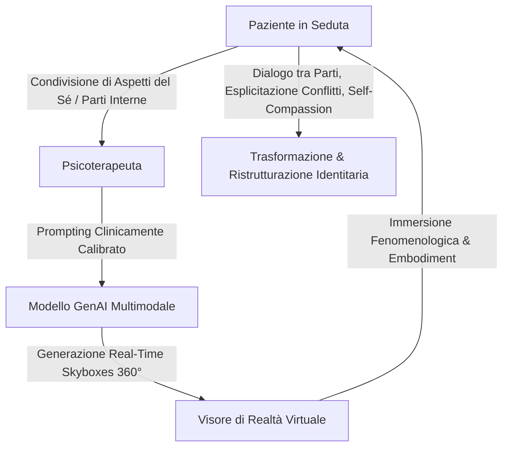

# Immersive AI e Introspecta VR (Parts Work e Trasformazione del Sé)

**Summary**: Integrazione innovativa tra Realtà Virtuale (VR) e Intelligenza Artificiale Generativa per facilitare il "parts work", l'esplorazione del sé e il cambio di prospettiva attraverso la generazione in tempo reale di ambienti metaforici immersivi a 360° (skyboxes).
**Sources**: Cavalera et al. (2026) - `11920_2026_Article_1690.pdf`; Antichi et al. (2025); Rossi et al. (2025); Hidding et al. (2024).
**Last updated**: 2026-08-27
---

## Inquadramento e Fondamenti Teorici

L'impiego della **Realtà Virtuale (VR)** in psicoterapia clinica ha dimostrato una solida efficacia nel promuovere la self-compassion, attenuare l'autocritica e favorire processi di identificazione con versioni future del sé attraverso esperienze di cambio di prospettiva (*perspective-shifting*) e incorporazione (*embodiment*) (Hidding et al., 2024; Rossi et al., 2025).

L'unione tra VR e **Intelligenza Artificiale Generativa (GenAI)** apre la strada a interventi di terza generazione in cui gli ambienti virtuali non sono pre-renderizzati o statici, ma vengono **co-creati e modificati dinamicamente in tempo reale** a partire dai vissuti narrativi del paziente e dalla guida del terapeuta.

---

## Il Framework Triadico del Progetto "Introspecta VR"

Sviluppato da Antichi, Baglìo, Rossi e Riva (2025), il progetto **"Introspecta VR"** implementa un framework triadico integrato:

1. **Scenari Metaforici a 360° (*AI-generated skyboxes*)**:
   - Il paziente seleziona e descrive scenari che rappresentano configurazioni identitarie o parti specifiche di sé (es. la parte autocritica, la parte vulnerabile, il sé futuro desiderato).
   - L'IA generativa elabora i prompt trasformandoli istantaneamente in ambienti immersivi a 360° altamente evocativi.
2. **Parts Work e Dialogo tra Parti**:
   - L'immersione in paesaggi personalizzati rende visibili e narrabili conflitti intrapsichici altrimenti difficili da verbalizzare, facilitando l'esplicitazione dei blocchi emotivi.
   - Permette il lavoro sulle parti (ispirato a modelli come l'Internal Family Systems, la Schema Therapy e l'approccio costruttivista).
3. **Potenziamento del Cambiamento di Prospettiva**:
   - L'utente sperimenta la transizione visiva ed emotiva tra lo scenario del "sé presente sofferente" e lo scenario del "sé futuro resiliente", favorendo processi di auto-rassicurazione e trasformazione personale.

---

## Vantaggi Clinici dell'IA Immersiva Rispetto ai Chatbot Tradizionali

- **Superamento della Mera Interazione Testuale**: Mentre i chatbot operano solo su token linguistici privi di ancoraggio corporeo, la VR fornisce un'esperienza fenomenologica incarnata (*embodied presence*) e multisensoriale.
- **Mediazione Terapeutica Costante**: Nel paradigma Introspecta VR, l'IA non opera in autonomia ma è guidata dal clinico, garantendo sicurezza, alleanza e sintonizzazione emotiva.
- **Attivazione Emotiva e Riconoscimento del Sé**: La visualizzazione esterna delle parti interne consente di ridurre la vergogna e il senso di minaccia associati a vissuti traumatici o frammentati.

---

## Pagine Correlate
- [[cavalera-et-al-2026]]
- [[calibrated-mismatches]]
- [[simulated-empathy-vs-authentic-presence]]
- [[digital-therapeutic-alliance]]
- [[process-based-therapy]]
