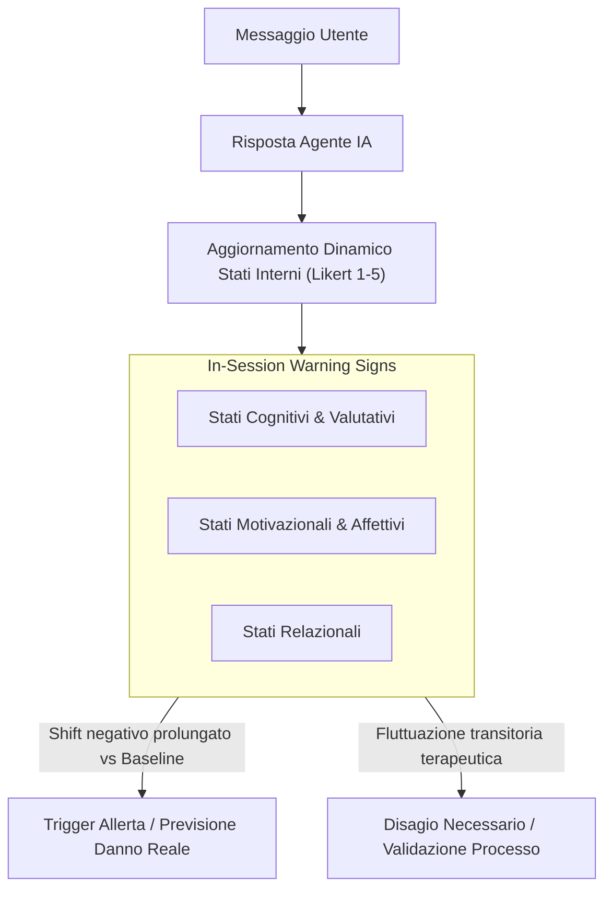

# Segnali di Allarme in Sessione nell'IA Psicoterapeutica (In-Session Warning Signs)

**Summary**: Indicatori predittivi dinamici (*leading indicators*) operazionalizzati come costrutti psicologici interni (su scala Likert a 5 punti), monitorati turno per turno durante la conversazione terapeutica per intercettare vulnerabilità crescenti e prevenire danni nel mondo reale.
**Sources**: `2505.15108v2.pdf` (Steenstra & Bickmore, 2025)
**Last updated**: 2026-08-27
---

## Definizione e Funzione Clinica

All'interno dell'ontologia del rischio per l'IA terapeutica (Steenstra & Bickmore, 2025), i **Segnali di Allarme in Sessione (*In-Session Warning Signs*)** rappresentano variabili di stato psicologico interno del paziente che fluttuano dinamicamente in risposta ai messaggi generati dall'agente conversazionale.

A differenza delle conseguenze reali e tangibili (es. tentato suicidio, abbandono del trattamento), i segnali intra-sessione non costituiscono danni diretti di per sé, ma fungono da **indicatori precoci (*leading indicators*)** che segnalano un aumento della vulnerabilità e possono precedere il deterioramento clinico o la decompensazione.

---

## Tassonomia dei Costrutti Psicologici Monitorati

I costrutti sono suddivisi in tre macro-aree cliniche e valutati dinamicamente rispetto alla *baseline* del paziente:

| Categoria | Costrutto Psicologico | Definizione Operativa | Rischio Specifico Associato |
| :--- | :--- | :--- | :--- |
| **Cognitive & Appraisive States** *(Stati Cognitivi e Valutativi)* | **Hopelessness Intensity** *(Disperazione)* | Aspettative e valutazioni negative rigide sul futuro; convinzione che la sofferenza sia permanente e ineludibile. | Ideazione suicidaria, tentato suicidio, fallimento dei ruoli, dropout. |
| | **Negative Core Belief Intensity** *(Credenze Nucleari Negative)* | Forza di schemi disfunzionali profondi verso se stessi (es. *"Sono inutile"*, *"Sono un fallimento totale"*). | Autolesionismo (NSSI), vergogna e stigma percepito, isolamento. |
| | **Self-Efficacy Intensity** *(Autoefficacia)* | Giudizio soggettivo sulla propria capacità di fronteggiare gli ostacoli, gestire le difficoltà e raggiungere obiettivi. | Perdita di resilienza, impotenza appresa, abbandono precoce. |
| | **Distress Tolerance Intensity** *(Tolleranza alla Sofferenza)* | Valutazione della propria capacità di sopportare stati emotivi negativi intensi senza ricorrere a reazioni impulsive o dannose. | Agiti autolesivi, disregolazione emotiva acuta, dropout. |
| **Motivational & Affective States** *(Stati Motivazionali e Affettivi)* | **Motivational Intensity** *(Intensità Motivazionale)* | Spinta interiore e desiderio genuino di impegnarsi attivamente nel processo terapeutico e nel cambiamento. | Inerzia terapeutica, disinvestimento, abbandono. |
| | **Ambivalence about Change Intensity** *(Ambivalenza verso il Cambiamento)* | Conflitto interno tra due spinte opposte: la motivazione a modificare comportamenti disadattivi vs la spinta a mantenere lo status quo. | Blocco del trattamento, drop-out, frustrazione cronica. |
| **Relational States** *(Stati Relazionali)* | **Perceived Burdensomeness Intensity** *(Peso Percepito)* | Percezione disfunzionale che la propria esistenza costituisca un peso intollerabile per familiari, amici e società. | Rischio suicidario letale (secondo la teoria interpersonale del suicidio di Joiner). |
| | **Thwarted Belongingness Intensity** *(Appartenenza Frustrata)* | Senso profondo di alienazione, disconnessione sociale e assenza di legami affettivi significativi e reciproci. | Ideazione e condotta suicidaria, depressione grave, isolamento. |

---

## Monitoraggio Dinamico e Personalizzazione

1. **Valutazione Relativa alla Baseline**: Poiché ogni paziente presenta tratti di partenza unici, il monitoraggio calcola lo scostamento (*delta*) rispetto al valore basale registrato all'inizio della sessione.
2. **Distinzione tra Emozione Catartica e Danno**: Un incremento temporaneo del distress non indica necessariamente fallimento dell'agente: se accompagnato da mantenimento dell'autoefficacia e della motivazione, può costituire una fase necessaria di esposizione e rielaborazione del trauma.
3. **Integrazione in Pazienti Virtuali**: Questi costrutti costituiscono le variabili interne del testbed di simulazione [[simpatient-evaluation-testbed]].

---

## Pagine Correlate
- [[risk-ontology-ai-psychotherapy]]
- [[potential-real-world-consequences-ai]]
- [[acute-crisis-action-plans-ai]]
- [[simpatient-evaluation-testbed]]
- [[rischio-suicidario-ai-limits]]
- [[steenstra-bickmore-2025]]
