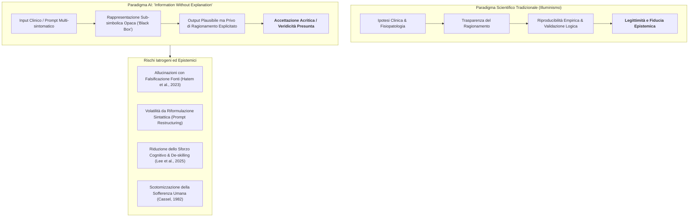
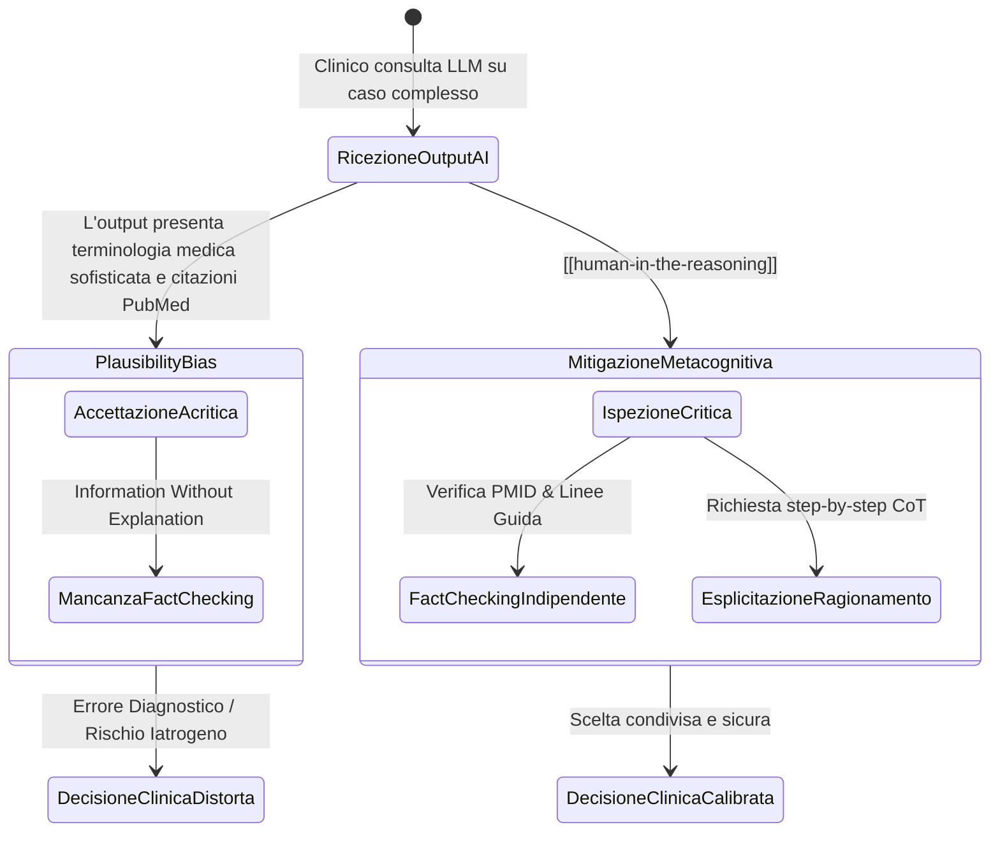

# Information Without Explanation in Clinical AI

## Definizione Operativa
Il paradigma di **Information Without Explanation in Clinical AI** (informazione priva di spiegazione nei sistemi sanitari intelligenti) descrive la crisi epistemologica e il rischio clinico derivanti dall'adozione di modelli di Intelligenza Artificiale ([[large-language-models]]) i cui output diagnostici e terapeutici vengono accettati dai clinici senza che sia possibile comprenderne o verificarne la catena logico-inferenziale interna.

- **Origine Concettuale ed Epistemologica:** Formulato nel trattato filosofico *Genesis: Artificial Intelligence, Hope, and the Human Spirit* (Kissinger, Mundie & Schmidt, 2024) e applicato alla medicina da Bhasin et al. (2025), segna la rottura con il **metodo scientifico di matrice illuminista**—secondo cui qualsiasi asserzione priva di trasparenza, riproducibilità e validazione logica è considerata intrinsecamente incompleta e inaffidabile.
- **Rilevanza Clinica e Decisionale:** In medicina e psicoterapia, la generazione di output apparentemente autorevoli da parte di sistemi "black-box" espone i professionisti a gravi vulnerabilità decisionali: incapacità di discriminare tra correlazioni spurie e causalità fisiopatologica, distorsioni dovute alla volatilità del prompting, allucinazioni con bibliografia fittizia e atrofia del giudizio clinico critico (*cognitive deskilling*).

## Evidenze dalla Letteratura

### 1. Opacità delle Rappresentazioni Interne e Volatilità da Prompting
I modelli addestrati mediante machine learning consentono agli umani di conoscere "nuove cose" (l'output predittivo o generativo), ma precludono la comprensione di come tali scoperte siano state elaborate. Come osservato da Bhasin et al. (2025) nella pratica clinica, minime variazioni nel fraseggio o nella sintassi di una richiesta clinica generano raccomandazioni o elenchi di diagnosi differenziali radicalmente discordanti, dimostrando che l'output non scaturisce da una comprensione semantica stabile del quadro clinico.

### 2. Allucinazioni Convincenti e Bibliografia Fittizia
Gli LLM producono narrazioni cliniche estremamente convincenti e sofisticate corredate da riferimenti bibliografici interamente inventati (titoli inesistenti, PMID assegnati ad articoli non pertinenti; Hatem et al., 2023). In assenza di fact-checking indipendente, l'illusione di autorevolezza (*plausibility bias*) induce il clinico ad adottare percorsi diagnostico-terapeutici privi di reale fondamento scientifico.

### 3. Sovraccarico Metacognitivo vs Atrofia Cognitiva (*Cognitive De-skilling*)
Interagire efficacemente con l'IA richiede un livello superiore di consapevolezza e vigilanza metacognitiva (Tankelevitch et al., 2024), necessario per individuare errori sottili e allucinazioni mascherate. Indagini empiriche (Lee et al., 2025) documentano una progressiva riduzione dello sforzo cognitivo e della profondità di analisi all'aumentare dell'affidamento all'IA.

### 4. Incapacità Ontologica di Cogliere la Sofferenza e la Sentience
Le macchine possono quantificare un *pain score* o processare codici ICD/EHR, ma sono strutturalmente incapaci di comprendere la **sofferenza, l'angoscia e la demoralizzazione** (Cassel, 1982; Clarke & Kissane, 2002), le quali richiedono sintonizzazione affettiva, risonanza empatica e comprensione relazionale.

**Riferimenti Bibliografici:**
- **Bhasin, R., El-Sayed, W., Salami, K., Abdul-Nabi, M., Elashmawy, A., & Jaruzel II, M. E. (2025).** Clinical decision-making and artificial intelligence: The role of large language models in medicine. *Clinical Research in Practice*, 11(1), eP3601. https://doi.org/10.22237/crp/1743681960
- **Cassel, E. J. (1982).** The nature of suffering and the goals of medicine. *New England Journal of Medicine*, 306(11), 639–645.
- **Clarke, D. M., & Kissane, D. W. (2002).** Demoralization: its phenomenology and importance. *Aust N Z J Psychiatry*, 36(6), 733–742.
- **Hatem, R., Simmons, B., & Thornton, J. E. (2023).** A Call to Address AI "Hallucinations" and How Healthcare Professionals Can Mitigate Their Risks. *Cureus*, 15(9), e44720.
- **Kissinger, H. A., Mundie, C., & Schmidt, E. (2024).** *Genesis: Artificial Intelligence, Hope, and the Human Spirit*. Little, Brown and Company.
- **Lee, H. P. H., Sarkar, A., Tankelevitch, L., et al. (2025).** The Impact of Generative AI on Critical Thinking. *Microsoft Research Preprint*.
- **Liaw, W., Kueper, J. K., Lin, S., et al. (2022).** Competencies for the Use of Artificial Intelligence in Primary Care. *Ann Fam Med*, 20(6), 559–563.
- **Tankelevitch, L., Kewenig, V., Simkute, A., et al. (2024).** The metacognitive demands and opportunities of generative AI. *CHI '24*, 680, 1–24.

## Relazioni
- [[clinical-decision-making-and-artificial-intelligence]]
- [[single-correct-answer-fallacy-in-clinical-ai]]
- [[human-in-the-reasoning]]
- [[automation-bias-clinical-reasoning]]
- [[cognitive-offloading-e-diagnostic-deskilling]]
- [[epistemic-markers-in-ai]]
- [[modello-centauro-clinico]]
- [[three-layer-governance-framework]]
- [[simulated-empathy-vs-authentic-presence]]
