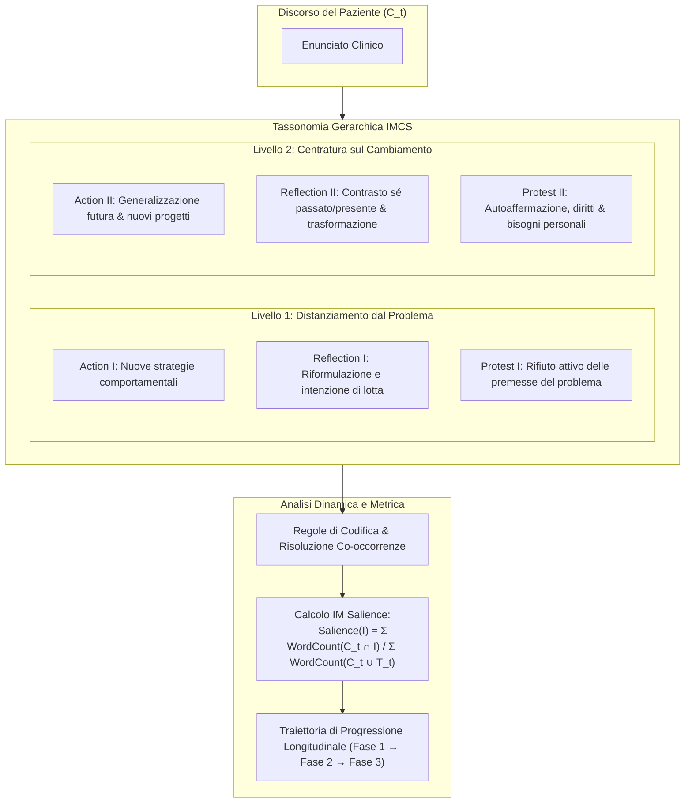

# Innovative Moment Assessment (IMA)

**Summary**: Metodologia di valutazione computazionale e clinica process-oriented che quantifica l'efficacia dei dialoghi psicoterapeutici attraverso il tracciamento degli *Innovative Moments* (IM) nel discorso del paziente. Basato sulla teoria di Gonçalves et al. (2011, 2012), IMA classifica 6 tipologie di IM su due livelli gerarchici e calcola la metrica di *IM Salience* per monitorare la progressione longitudinale del cambiamento.
**Sources**: `2507.20241v2.pdf`
**Last updated**: 2026-08-27
---

## Fondamenti Teorici dell'Assessment Narrativo

Nella ricerca sui processi psicoterapeutici ([[process-of-change]]), i **Momenti Innovativi (Innovative Moments - IM)** sono definiti come episodi del discorso clinico in cui il paziente esprime pensieri, emozioni o comportamenti che contraddicono la narrazione satura di problema (*problem-saturated narrative*) e segnalano l'emergere di narrazioni alternative preferite (White, 2007; Gonçalves et al., 2011).

Le metriche convenzionali di Natural Language Processing (BLEU, ROUGE, BERTScore) o i punteggi statici di alleanza di lavoro e livello di empatia non sono in grado di catturare la **traiettoria dinamica e longitudinale della trasformazione clinica**. L'**Innovative Moment Assessment (IMA)** (Feng et al., 2025) traduce l'*Innovative Moments Coding System (IMCS)* in una procedura rigorosa di valutazione automatica e supervisionata da esperti per sistemi di IA clinica.



---

## Tassonomia dei Momenti Innovativi (IM)

IMA struttura i marcatori linguistici di trasformazione narrativa in due livelli clinici:

### Livello 1: Creazione del Distanziamento dal Problema
Rappresenta le fasi precoci di esplorazione e decostruzione (corrispondenti a *Trust Building* ed *Externalization*):
1. **Action I**: Azioni intraprese o pianificate per superare il problema ed esplorazione attiva di soluzioni.
   - *Esempio*: *"Ieri sono andato al cinema da solo per la prima volta in tre mesi."*
2. **Reflection I**: Nuove comprensioni del problema, consapevolezza dei suoi effetti nocivi e intenzione di contrastarlo.
   - *Esempio*: *"Mi rendo conto che l'ansia vuole controllare ogni mia decisione, ma non posso più permetterglielo."*
3. **Protest I**: Rifiuto e opposizione diretta alle premesse del problema o critica verso chi le supporta.
   - *Esempio*: *"I miei genitori dovrebbero sostenermi, non pretendere la perfezione. Ne ho abbastanza di sentirmi sbagliato."*

### Livello 2: Centratura sul Cambiamento e Riscelta Identitaria
Rappresenta le fasi avanzate di ricostruzione (*Re-authoring* e *Re-membering*):
1. **Action II**: Generalizzazione proiettata nel futuro o in altri ambiti di vita; impegno in nuovi progetti e relazioni non definiti dal problema.
   - *Esempio*: *"Applicherò questa determinazione anche sul lavoro, rifiutando carichi ingiustificati."*
2. **Reflection II**: Contrasto temporale tra posizioni del sé (*cosa è cambiato e perché*); presa di coscienza di una nuova identità più resiliente.
   - *Esempio*: *"Un tempo mi sarei chiuso in casa a rimuginare per giorni. Ora vedo che riesco ad affrontare i contrattempi con calma."*
3. **Protest II**: Assertività matura ed empowerment; affermazione incondizionata dei propri bisogni, diritti e valori fondamentali.
   - *Esempio*: *"Anche il mio benessere ha valore: ho il pieno diritto di riposarmi e di vivere secondo i miei ritmi, non per compiacere gli altri."*

---

## Regole di Codifica e Calcolo della Salienza (IM Salience)

### Regole di Risoluzione delle Co-occorrenze
Nella codifica enunciato-per-enunciato ($C_t$):
- Se **Action** e **Reflection** co-occorrono nello stesso turno, vengono codificate entrambe come categorie distinte.
- Se **Action** o **Reflection** co-occorrono con **Protest**, l'enunciato è codificato prioritariamente come **Protest** (in conformità ai protocolli clinici di Gonçalves et al., 2011).
- Enunciati puramente descrittivi o privi di riflessione vengono classificati come `None`.

### Metrica Quantitativa di IM Salience
La salienza dell'innovazione misura il peso percentuale del discorso orientato al cambiamento rispetto alla totalità dell'interazione:

$$\text{Salience}(I_i) = \frac{\sum_{t=1}^N \text{WordCount}(C_t \cap I_i)}{\sum_{t=1}^N \text{WordCount}(C_t \cup T_t)}$$

dove $C_t \cap I_i$ rappresenta il segmento di testo del cliente contenente il marcatore $I_i$, e $C_t \cup T_t$ è la lunghezza complessiva del turno di dialogo.

---

## Traiettorie Longitudinali nel Percorso Terapeutico

Nelle sperimentazioni condotte con l'agente [[interactive-narrative-therapist]], l'analisi temporale tramite IMA evidenzia un pattern trifasico speculare ai processi di psicoterapia umana di successo (Montesano et al., 2017):

1. **Fase Iniziale (Turni 3–20)**: Prevalenza netta di IM di Livello 1, guidata da *Reflection I* (riconoscimento dei meccanismi del problema).
2. **Fase Intermedia (Turni 21–35)**: Transizione evolutiva con rapida ascesa simultanea di *Action II* e *Reflection II*, che documenta la co-costruzione di significati inediti e l'apertura a comportamenti adattivi.
3. **Fase Avanzata (Turni 36–50)**: Consolidamento ad alta intensità di IM di Livello 2 e comparsa di *Protest II*, attestando la piena ristrutturazione dell'identità narrativa e l'acquisizione di solida agency personale.

```
Salienza IM (%)
  ▲
  │               [Reflection II & Action II] ──────► Consolidamento Livello 2
  │                       ▲                                  ▲
  │       [Reflection I]  │                                  │
  │            ▲          │                               [Protest II]
  │            │          │                                  │
  └────────────┴──────────┴──────────────────────────────────┴────────► Turni di Dialogo
          Fase Iniziale         Fase Intermedia            Fase Finale
          (Turni 3-20)          (Turni 21-35)             (Turni 36-50)
```

---

## Rilevanza per la Ricerca su LLM e Salute Mentale

- **Benchmark Oltre l'Empatia di Facciata**: Evidenzia che modelli come GPT-4o o Claude-3.7 generano alti livelli di rassicurazione affettiva ma bassissima salienza di Livello 2 (~4–5%), bloccando il cliente in un ciclo di lamentela confortata anziché guidarlo verso la trasformazione.
- **Validazione Processuale Obiettiva**: Fornisce uno standard computazionale replicabile per misurare l'efficacia di interventi terapeutici guidati da agenti artificiali, integrando la supervisione clinica qualitativa con indicatori statistici granulari.

---

## Related pages
- [[feng-et-al-2025]]
- [[interactive-narrative-therapist]]
- [[terapia-narrativa-ia]]
- [[process-of-change]]
- [[clinical-fidelity-assessment]]
- [[process-based-therapy]]
- [[simulazione-pazienti-ai]]
