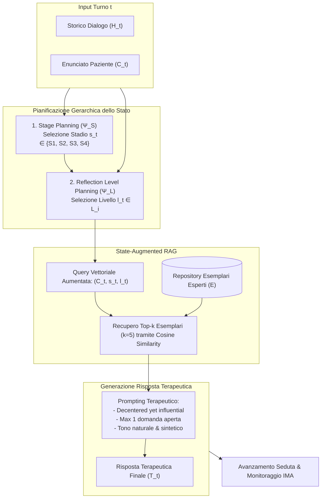

# Interactive Narrative Therapist (INT)

**Summary**: Framework architetturale basato su Large Language Models per la simulazione rigorosa di psicoterapeuti narrativi esperti. INT formalizza la progressione della seduta attraverso uno spazio di pianificazione gerarchico a due livelli (stadi terapeutici e livelli di riflessione intra-stadio) integrato con Retrieval-Augmented Generation (RAG) da un repository di interventi clinici esemplari.
**Sources**: `2507.20241v2.pdf`
**Last updated**: 2026-08-27
---

## Definizione e Razionale Clinico

Nella simulazione di colloqui terapeutici mediante [[large-language-models]], i modelli di role-playing diretto tendono a produrre risposte generiche, focalizzandosi eccessivamente sulla validazione empatica superficiale (*Reassuring*) e fallendo nel guidare il paziente verso la progressione terapeutica. Inoltre, un avanzamento prematuro senza adeguata prontezza emotiva del paziente rischia di compromettere l'alleanza, mentre la stagnazione impedisce la trasformazione della narrazione problematica.

L'**Interactive Narrative Therapist (INT)** (Feng et al., 2025) risolve questo problema traducendo la pratica clinica della terapia narrativa (White & Epston, 1990; White, 2007) in un'architettura computazionale controllata da uno spazio di pianificazione formale $\Phi = (\mathcal{S}, \mathcal{L})$.

---

## Architettura a Due Livelli di Pianificazione

### 1. Stage Planning ($\mathcal{S}$)
Ad ogni turno $t$, la funzione di pianificazione $\Psi_S(H_t, C_t, \pi_{stage})$ valuta lo stato del dialogo e assegna uno dei 4 stadi progressivi:
1. **$s_1$: Trust Building (Costruzione della Fiducia)**: Creazione di una base sicura, ascolto non giudicante ed esplorazione delle emozioni dolorose.
2. **$s_2$: Problem Externalization (Esternalizzazione del Problema)**: Separazione concettuale del problema dall'identità del cliente (*"il problema è il problema, la persona non è il problema"*).
3. **$s_3$: Re-authoring Conversation (Riscrivere la Narrazione)**: Ricerca di eventi eccezionali (*unique outcomes*) e costruzione di storie alternative.
4. **$s_4$: Re-membering Conversation (Ri-membrare i Legami)**: Esplorazione delle relazioni significative che convalidano la nuova identità preferita.

### 2. Reflection Level Planning ($\mathcal{L}$)
All'interno dello stadio $s_t$, la funzione $\Psi_L(s_t, H_t, C_t, \pi_{reflection})$ seleziona il micro-livello di ingaggio riflessivo $l_t^t \in \mathcal{L}_t$, consentendo una progressione calibrata:
- **Trust Building**: $L_1$ (Esplorazione dell'evento problematico), $L_2$ (Supporto empatico e validazione).
- **Problem Externalization**: $L_1$ (Negoziazione del nome metaforico del problema), $L_2$ (Mappatura degli effetti su lavoro/relazioni), $L_3$ (Valutazione degli effetti), $L_4$ (Giustificazione valoriale delle valutazioni).
- **Re-authoring**: $L_1$ (Elaborazione di eccezioni alla narrazione dominante), $L_2$ (Esplorazione del panorama identitario: scopi e valori), $L_3$ (Esplorazione del panorama dell'azione: pianificazione di nuovi comportamenti).
- **Re-membering**: $L_1$ (Contributo delle figure significative), $L_2$ (Vedere se stessi attraverso gli occhi degli altri), $L_3$ (Proprio contributo alla vita altrui), $L_4$ (Impatto della propria crescita sull'identità degli altri).

---

## Retrieval-Augmented Generation Guidato dallo Stato

Una volta identificato lo stato terapeutico $(s_t, l_t^t)$, INT non si affida unicamente alle conoscenze implicite dell'LLM, ma interroga un database indicizzato di risposte cliniche esperte $\mathcal{E}$:
1. **Query Formulation**: La query densa combina l'enunciato del paziente $C_t$ con le etichette esplicite dello stadio $s_t$ e del livello di riflessione $l_t^t$.
2. **Top-$k$ Retrieval**: Vengono estratti i 5 esempi clinici più pertinenti mediante *cosine similarity* su vettori di embedding densi.
3. **Generation Guardrails**: La risposta terapeutica finale $T_t$ viene vincolata a rispettare:
   - Posizione di *“decentered yet influential”* (il terapeuta guida con curiosità, ma il cliente è l'esperto della propria vita).
   - Concisione comunicativa (risposte brevi e colloquiali, ~66 parole).
   - Divieto di domande multiple o ridondanti (massimo una domanda aperta mirata per turno).

---

## Evidenze di Efficacia Clinica e Confronto Sperimentale

Nei trial sperimentali con 230 partecipanti umani e 260 profili simulati:
- **Efficacia nelle Dimensioni Trasformative**: Rispetto a GPT-4o e Claude-3.7 in modalità role-playing, INT ottiene incrementi marcati nelle dimensioni avanzate della terapia: **Empowering (+0.36)**, **Transformative (+0.90)** e **Reconnecting (+0.88)**.
- **Raddoppio dei Marcatori di Cambiamento**: INT stimola quasi il doppio degli *Innovative Moments* di Livello 2 (azioni future e ridefinizione del sé) valutati tramite [[innovative-moment-assessment]].
- **Coinvolgimento del Paziente**: Produce dialoghi significativamente più lunghi (57 vs 42 turni medi) con risposte dell'utente più ricche e articolate (38.8 vs 31.5 parole per turno).

---

## Related pages
- [[feng-et-al-2025]]
- [[terapia-narrativa-ia]]
- [[innovative-moment-assessment]]
- [[rag-in-psicoterapia]]
- [[clinical-fidelity-assessment]]
- [[simulazione-pazienti-ai]]
- [[process-of-change]]
