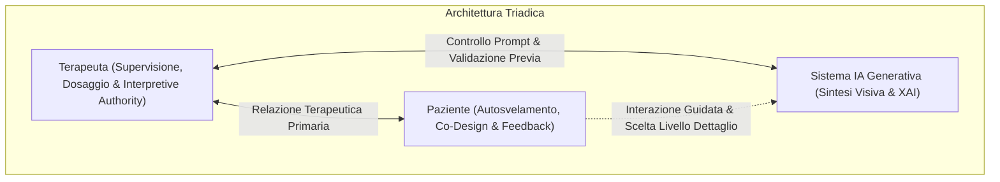

# Interazione Triadica e Trauma-Informed Design in Salute Mentale

**Summary**: Modello architetturale e relazionale a tre vie (Paziente – Terapeuta – Sistema IA) basato sull'integrazione dei principi di *Trauma-Informed HCI Design*, Explainable AI (XAI) e controllo clinico esclusivo per garantire un'applicazione sicura ed efficace dell'IA generativa in psicoterapia.
**Sources**: Degenhard et al. (2025) - `2505.20796v1.pdf`
**Last updated**: 2026-08-27
---

## Il Modello di Interazione Triadica

Nel contesto della psicoterapia potenziata da intelligenza artificiale, in particolare per disturbi complessi come il CPTSD, il modello diadico (Paziente – Sistema autonomo) è clinicamente controindicato e altamente rischioso. Degenhard et al. (2025) teorizzano una struttura **triadica**, in cui il terapeuta umano esercita un ruolo insostituibile di mediazione, regolazione affettiva e governance tecnica in tempo reale.

---

## Principi Fondamentali di Trauma-Informed HCI Design

L'adattamento delle linee guida *Trauma-Informed* all'interazione uomo-macchina (HCI) in ambito clinico richiede specifici accorgimenti di progettazione:

### 1. Spazio Sicuro e Trasparenza (*Safe Space & Transparency*)
- L'utente deve comprendere in ogni momento come il sistema elabora le informazioni e per quale motivo produce determinati output visivi.
- L'integrazione di tecniche di **Explainable AI (XAI)** riduce la natura di "scatola nera" (*black box*), favorendo la fiducia epistemica del paziente e abbassando l'ansia legata a risposte impreviste.

### 2. Adattamento allo Stile Comunicativo Senza Suggestione
- Il sistema deve essere in grado di sintonizzarsi sul registro lessicale ed emotivo del paziente (specialmente considerando la frammentazione del linguaggio causata dal trauma).
- **Regola di Non-Suggestione**: L'IA deve sintetizzare e riflettere le descrizioni fornite dal paziente, astenendosi categoricamente dal suggerire sviluppi narrativi o aggiungere dettagli non esplicitati, per prevenire la formazione di falsi ricordi (*false memory effect*).

### 3. Presidio dell'Attaccamento e Dipendenza Relazionale
- I pazienti con CPTSD presentano frequentemente schemi di attaccamento disfunzionali o tendenze alla dipendenza interpersonale.
- È fondamentale evitare l'antropomorfizzazione dell'IA e definire chiaramente i confini relazionali per impedire dinamiche di attaccamento illusorio verso l'agente artificiale (*simulated moral agency*).

---

## Il Ruolo del Clinico come Filtro (*Therapist-in-the-Loop*)

Il terapeuta mantiene l'autorità decisionale e operativa su tutte le fasi dell'esposizione:
- **Pre-Visualizzazione (Gating)**: Controllo visivo preliminare di ogni immagine o ambiente 3D prima di consentirne la visualizzazione al paziente.
- **Modulazione del Dosaggio (Titration)**: Capacità di ridurre istantaneamente l'esposizione (es. passando a una visualizzazione sfocata o simbolica) qualora si rilevino segni di dissociazione o panico.
- **Rimodulazione Narrativa**: Traduzione degli stimoli visivi in elementi di significato all'interno della cornice terapeutica condivisa.

---

## La Dialettica tra Sicurezza ed Efficacia

Un dilemma cruciale evidenziato dal modello è il trade-off tra rigore cautelativo ed efficacia clinica:
> Un'adesione rigida e incondizionata a principi di sicurezza assoluta (es. rimozione totale di ogni elemento perturbante) rischierebbe di svuotare l'esposizione della sua carica trasformativa, impedendo l'attivazione emotiva necessaria per l'estinzione della paura e l'integrazione della memoria.

L'interazione triadica consente di mantenere questo delicato equilibrio: massimizzare la sicurezza attraverso la supervisione clinica senza sacrificare la potenza elaborativa dell'esposizione.

---

## Related pages
- [[degenhard-et-al-2025]]
- [[generative-ai-exposure-therapy]]
- [[rischi-esposizione-cptsd-ia]]
- [[distorsione-memoria-imagery-rescripting-ia]]
- [[human-in-the-reasoning]]
- [[simulated-empathy-vs-authentic-presence]]
- [[gestione-clinica-paziente-ia]]
