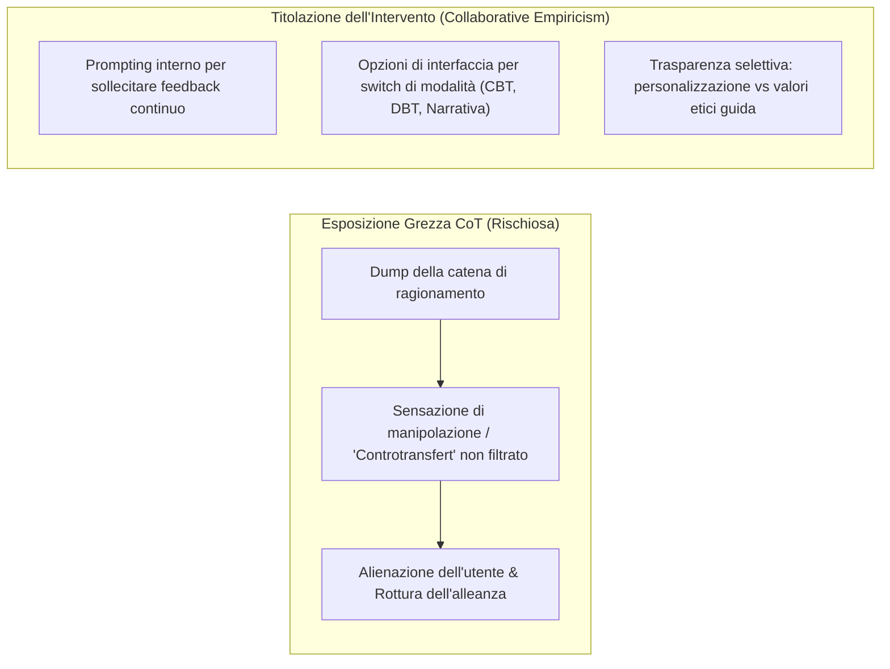

# Intervention Titration in AI Support (Titolazione dell'Intervento Terapeutico nell'IA)

**Summary**: Principio di design interattivo per la salute mentale digitale mutuato dalla titolazione farmacologica in psichiatria: processo iterativo e collaborativo per regolare l'orientamento teorico, il tono e il livello di approfondimento dell'intervento di supporto dell'IA in base al feedback continuo dell'utente, evitando il sovraccarico cognitivo derivante dall'esposizione grezza delle tracce Chain-of-Thought (CoT).
**Sources**: Pendse et al. (2026) - `2512.16206v2.pdf`; Caffrey & Borrelli (2020); Dattilio & Hanna (2012); Pang et al. (2025); Korbak et al. (2025).
**Last updated**: 2026-08-27
---

## Origine Psichiatrica: La Titolazione Farmacologica

In psichiatria e medicina generale, la **Titolazione del Farmaco (*Drug Titration*)** è un processo clinico altamente collaborativo (Caffrey & Borrelli, 2020):
- Si inizia con un dosaggio minimo efficace;
- Si monitorano costantemente gli effetti terapeutici soggettivi e gli effetti collaterali;
- Medico e paziente discutono e aggiustano progressivamente il dosaggio o cambiano molecola in base al feedback.

---

## Il Problema nell'IA: Trial-and-Error Opaco e Rischio di Rigetto

Attualmente, quando gli utenti interagiscono con LLM generici per supporto emotivo:
1. Spesso sentono che il modello adotta un tono alieno o culturalmente inappropriato (es. stile californiano/iper-ottimista non allineato al contesto culturale; Song et al., 2024; Jung et al., 2025).
2. Per ottenere il supporto desiderato, gli utenti si imbarcano in complessi tentativi di prompting (*trial-and-error*) per forzare il modello ad agire come un terapeuta CBT o DBT, rischiando di far scattare filtri di sicurezza e provando frustrazione (Jung et al., 2025).
3. L'esposizione acritica delle catene di pensiero interne (*Chain-of-Thought - CoT*) può peggiorare le cose: se il modello mostra ragionamenti come "l'utente ha pensieri irrazionali, devo persuaderlo a cambiare idea", l'utente si sente **giudicato, patologizzato o manipolato** (analogo al rischio di un'aperta esteriorizzazione del controtransfert in psicoterapia; Tower, 1956; Pendse et al., 2026).

---

## Applicazione Tecnica: Empirismo Collaborativo

Nel paradigma dell'Interpretabilità Riflessiva (Pendse et al., 2026), la titolazione dell'intervento viene implementata come **Empirismo Collaborativo (*Collaborative Empiricism*)** (Dattilio & Hanna, 2012):
1. **Sollecitazione Proattiva del Feedback**: Il chatbot interroga l'utente con regolarità: "Questo modo di esplorare la situazione ti sembra utile o preferisci un approccio più pratico/orientato alle emozioni?"
2. **Esplorazione Guidata di Modalità Terapeutiche**: L'interfaccia offre selettori intuitivi per confrontare prospettive teoriche validate (es. ristrutturazione cognitiva CBT, validazione dialettica DBT, decostruzione narrativa), spiegando brevemente la ratio di ciascuna senza costringere a prompt hacking.
3. **Pacing e Trasparenza Calibrata**: Vengono rese visibili le motivazioni di alto livello che guidano la risposta (es. "Ho evidenziato questo schema perché segue un principio di accettazione radicale concordato") senza riversare il CoT grezzo che sovraccarica e confonde.

---

## Pagine Correlate
- [[reflective-interpretability]]
- [[pendse-et-al-2026]]
- [[role-induction-ai-mental-health]]
- [[prosocial-advance-directives]]
- [[recourse-mechanisms-ai-mental-health]]
- [[psychological-distress-interaction-patterns]]
- [[calibrated-mismatches]]
- [[weird-bias-cultural-adaptability-ai]]
