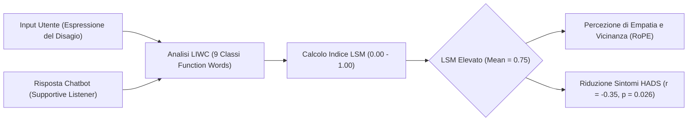

# Language Style Matching (LSM) in Human-AI Dyads

**Summary**: Analisi del Language Style Matching (LSM) come metrica computazionale di convergenza e sintonizzazione linguistica nelle diadi umano-IA applicate alla salute mentale, basata sul calcolo LIWC delle parole funzione e sulla sua correlazione clinica con la riduzione di ansia e depressione.
**Sources**: Sahab et al. (2025) - `2508.00847v1.pdf`, Ireland et al. (2011), Borelli et al. (2019)
**Last updated**: 2026-08-27
---

## Definizione e Fondamenti Teorici

Il **Language Style Matching (LSM)** è una metrica quantitativa sviluppata nell'ambito della linguistica computazionale e della psicologia sociale (Ireland et al., 2011) che quantifica il grado di sincronizzazione verbale e coordinazione stilistica tra due interlocutori. 

A differenza dell'analisi semantica del contenuto (*what is said*), l'LSM misura la co-occorrenza e la similarità proporzionale nell'uso delle **parole funzione (*function words*)** (*how it is said*), tra cui:
- Pronomi personali e impersonali
- Articoli determinativi e indeterminativi
- Preposizioni
- Congiunzioni coordinanti e subordinanti
- Avverbi e verbi ausiliari
- Negazioni e quantificatori

In psicoterapia umana, alti livelli di LSM riflettono una solida alleanza di lavoro implicita, sintonizzazione affettiva e rispecchiamento reciproco (*therapist-client synchrony*), associandosi a migliori esiti terapeutici (Borelli et al., 2019; Aafjes-van Doorn et al., 2020).

---

## Applicazione nelle Diadi Human-AI (Sahab et al., 2025)

Nello studio controllato randomizzato di **Sahab et al. (2025)** condotto su donne afghane esposte a grave trauma e isolamento sociale:
1. **Benchmark Human-AI**: L'interazione con il chatbot configurato come *Supportive Listener* ha prodotto un LSM medio significativamente più alto rispetto a *GPT-4 standard* ($0.75 \text{ vs } 0.69, p = 0.030, d = -0.71$).
2. **Correlazione con l'Efficacia Clinica**: È stata riscontrata una correlazione negativa statisticamente significativa tra i punteggi LSM e le variazioni nei punteggi della *Hospital Anxiety and Depression Scale* ($r = -0.35, p = 0.026$). Maggiore è l'allineamento stilistico tra utente e IA, maggiore è la riduzione dell'ansia e della depressione post-intervento.
3. **Fattori di Moderazione Linguistica**: La condizione di parlanti non-madrelingua inglesi (*ESL*) modula l'uso delle parole funzione, determinando benchmark LSM leggermente inferiori rispetto alle diadi umane native ($0.87 - 0.89$), ma sufficienti a stabilire un'efficace risonanza conversazionale.

---

## Confronto tra Benchmark di LSM

| Contesto Interattivo | Range Medio LSM | Significato Clinico / Relazionale |
| :--- | :--- | :--- |
| **Conversazioni quotidiane tra sconosciuti** | $0.60 - 0.65$ | Sincronia di base, coordinazione minima. |
| **Conversazioni tra pari / amici intimi** | $0.80 - 0.85$ | Elevata sintonizzazione socio-emotiva. |
| **Psicoterapia Umano-Umano (Early sessions)** | $0.87 - 0.89$ | Forte alleanza terapeutica predittiva di esito positivo. |
| **Human-AI (GPT-4 Standard senza prompt)** | $0.69$ | Asincronia stilistica, disconnessione pragmatica. |
| **Human-AI (GPT-4 Supportive Listener)** | $0.75$ | Convergenza adattiva, facilitazione del contenimento emotivo. |

---

## Implicazioni per il Design di Agenti Terapeutici

- **Prompting per l'Allineamento Stilistico**: Istruire esplicitamente gli LLM a calibrare la complessità sintattica, la lunghezza delle frasi e la proporzione di pronomi/particelle grammaticali sullo stile dell'utente per massimizzare la percezione di accoglienza.
- **Biomarcatore Digitale di Efficacia**: L'LSM estratto in tempo reale dalle sessioni di chat può fungere da indicatore oggettivo non invasivo della qualità del contatto e dell'aderenza all'intervento.

---

## Related pages
- [[sahab-et-al-2025]]
- [[supportive-listener-prompting]]
- [[digital-therapeutic-alliance]]
- [[simulated-empathy-vs-authentic-presence]]
- [[simulated-therapeutic-alliance]]
- [[lexical-psychological-features]]
- [[conversational-agents-mental-health]]
