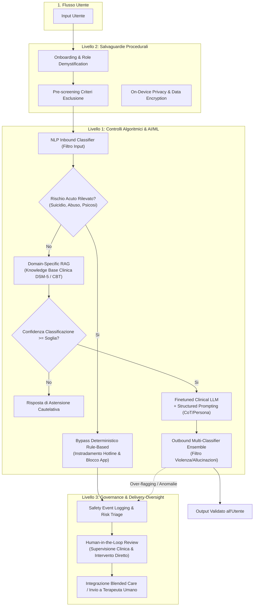

# Layered Safeguards in Clinical AI (Architettura di Salvaguardie Multilivello per l'IA Clinica)

## Definizione Operativa
- Framework architetturale e sociotecnico a **difesa in profondità** (*defense-in-depth*) specificamente progettato per governare i rischi iatrogeni, le allucinazioni cliniche e i fallimenti di gestione delle emergenze nei sistemi conversazionali basati su Intelligenza Artificiale Generativa per la salute mentale (Olisaeloka et al., 2026).
- **Superamento del Guardrail Monolitico:** Supera la fragilità dei semplici filtri lessicali o dei singoli prompt di sistema (dimostratisi vulnerabili a jailbreak e incapaci di rilevare coerentemente il rischio suicidario, come documentato nel caso di *HopeBot*), articolando la sicurezza su tre livelli sinergici e coordinati lungo l'intero ciclo di vita dell'intervento:
  1. **Controlli Algoritmici & AI/ML (Technical Safeguards):** Fine-tuning clinico supervisionato su dataset validati da psichiatri (es. *Therabot*, *VCounselor*), Prompt engineering con vincoli procedurali strutturati (es. logica PHQ-9, Chain-of-Thought maieutico), Retrieval-Augmented Generation (RAG) con basi di conoscenza esperte e meccanismi di astensione (*abstention thresholds* in caso di bassa confidenza), e classificatori a cascata (*safety net*, filtri multilivello su input e output, bypass deterministico rule-based per contenuti ad alto rischio);
  2. **Salvaguardie Procedurali & Pre-Deployment:** Co-design partecipativo con clinici e persone con esperienza vissuta, rigidi criteri di eleggibilità ed esclusione (esclusione di psicosi attiva, mania e rischio suicidario acuto nei trial), onboarding educativo trasparente con demistificazione del ruolo (chiarimento che il chatbot non sostituisce la psicoterapia) e architetture privacy-first (storage locale on-device e cifratura dei dati);
  3. **Governance Operativa & Delivery Oversight:** Protocolli formalizzati di rilevamento e deviazione verso numeri verdi di emergenza con eventuale blocco temporaneo dell'app (*Clare R*), supervisione *Human-in-the-Loop* (HITL) modulare e triage automatico del rischio, affiancati da monitoraggio e reporting sistematico degli eventi avversi (*adverse event logging*).
- **Utilità Clinica e per la Governance Sanitaria:** Fornisce la struttura portante indispensabile per permettere la transizione dei chatbot da prototipi accademici o app di benessere non regolate a veri e propri dispositivi medici digitali certificati (*Software as a Medical Device - SaMD*), idonei per l'integrazione sicura nei sistemi sanitari pubblici e nei modelli di *blended care*.

---

## I Tre Livelli dell'Architettura Layered

La scoping review di Olisaeloka et al. (2026) su 21 interventi primari ha formalizzato l'articolazione delle misure di sicurezza su tre livelli integrati:

### 1. Livello Computazionale e Tecnico (AI/ML Safeguards)
- **Fine-Tuning Domain-Specific (12/21 studi, 57%):** L'adattamento dei pesi su corpora clinici supervisionati da esperti (es. *Therabot*, *Woebot*, *VCounselor*) riduce drasticamente la tendenza dei modelli generalisti a formulare raccomandazioni arbitrarie o inappropriate.
- **Prompt Engineering Vincolato (9/21 studi, 43%):** L'inclusione di istruzioni vincolanti che obbligano il modello a rispettare specifici protocolli terapeutici (es. la sequenza standard del PHQ-9 o del metodo BATHE) e a non deviare verso consigli medici non autorizzati.
- **RAG con Soglie di Astensione (5/21 studi, 24%):** L'ancoraggio a librerie psicoeducative validate limita le allucinazioni fattuali. Sistemi evoluti come *TeaBot* introducono un meccanismo di *abstention*: se la similarità cosinusoidale o la confidenza del classificatore è inferiore a una soglia prestabilita, il sistema non inventa risposte ma dichiara la propria limitazione.
- **Ensemble di Classificazione e Safety Net (6/21 studi, 29%):**
  - *Woebot Safety Net:* Pipeline a tre stadi in cui l'input viene prima scansionato da un classificatore proprietario, processato tramite RAG + LLM fine-tuned, e infine passato attraverso un ensemble di modelli che filtrano discorsi d'odio, violenza sessuale o autolesionismo prima che il testo arrivi all'utente.
  - *Bypass Deterministico (Vossen et al., 2024):* Architettura ibrida che sfrutta Rasa per il rilevamento di intenti ad alto rischio: se viene rilevata un'ideazione suicidaria, l'LLM generativo viene completamente disattivato e il sistema eroga risposte deterministiche non generiche con i contatti dei servizi di emergenza.

### 2. Livello Procedurale e Pre-Deployment
- **Co-Design Multidisciplinare (14/21 studi, 67%):** Coinvolgimento attivo e continuativo di psichiatri, psicoterapeuti, esperti di interazione uomo-macchina (HCI) e pazienti/caregiver fin dalle prime fasi di progettazione (*MindTalker*, *ExpandXR*, *Ana*).
- **Onboarding e Demistificazione del Ruolo (15/21 studi, 71%):** Dichiarazione esplicita della natura non-umana dell'agente, spiegazione dei limiti operativi, definizione dei confini di riservatezza e invito esplicito a rivolgersi a un professionista in caso di emergenza.
- **Criteri di Eleggibilità e Screening del Rischio (5/21 studi, 24%):** Esclusione preventiva dai protocolli di individui che presentano sintomi psicotici attivi, episodi maniacali o ideazione suicidaria acuta (*Heinz et al.*, *Sabour et al.*).
- **Architetture Privacy-Preserving (15/21 studi, 71%):** Adozione di modelli con memorizzazione dei dati al 100% on-device (*Wellness Buddy*), crittografia end-to-end e diritto esplicito dell'utente alla cancellazione permanente della cronologia.

### 3. Livello Operativo e Governance di Consegna (Operational Delivery)
- **Protocolli di Gestione delle Crisi (8/21 studi, 38%):** Instradamento attivo verso helpline telefoniche e servizi territoriali di emergenza. Nel caso di *Clare R*, il framework di sicurezza blocca temporaneamente l'accesso all'applicazione per evitare un uso compensatorio pericoloso.
- **Supervisione Human-in-the-Loop (HITL, 5/21 studi, 24%):**
  - In *Therabot*, tutti gli output generati sono stati monitorati da clinici, rendendo necessari **13 interventi correttivi diretti** per bloccare consigli medici impropri.
  - In *ExpandXR*, la seduta di esposizione in realtà aumentata è costantemente controllata da un terapeuta che modula in tempo reale l'intensità dell'avatar e può interrompere la sessione.
  - In *Limbic Care* ed *Emohaa*, team di moderatori umani esaminano le interazioni contrassegnate come dubbie dai filtri algoritmici.
- **Monitoraggio Sistematico degli Eventi Avversi (2/21 studi, 10%):** Solo una stretta minoranza di studi registra formalmente gli eventi avversi in conformità con i protocolli clinici (es. 4 eventi avversi minori in *Woebot*, nessun danno permanente).

---

## Pattern Architetturali a Confronto

La tabella sintetizza i principali pattern di sicurezza implementati nei sistemi di GenAI mental health:

| Sistema | Pipeline di Filtraggio | RAG & Astensione | Supervisione Umana (HITL) | Gestione Crisi Suicidaria |
| :--- | :--- | :--- | :--- | :--- |
| **Woebot (2025)** | Pipeline a 3 stadi (Input NLP -> RAG/FAQ -> Outbound Ensemble) | Si (FAQ validate) | No (Completamente automatizzato) | Flagging NLP + routing a helpline |
| **Limbic Care (2024)** | "Limbic Layer" proprietario (ML per emotion & safety) | No (Fine-tuning NHS) | Si (Clinici del gruppo CBT NHS) | Monitoraggio clinico costante tra sedute |
| **Therabot (2025)** | Guardrail su modello ensemble (Falcon + LLaMA) | No (Fine-tuning QLoRA) | Si (Supervisione 100% dei messaggi con 13 correzioni) | Instradamento a risorse di crisi |
| **Vossen et al. (2024)** | Framework RASA per intenti; bypass totale LLM | No | No | Disattivazione ChatGPT e invio contatti hotline |
| **TeaBot (2023)** | Classificatore Curie + Generatore Davinci | Si (240 distorsioni) con astensione | No | Istruzione generica di richiesta aiuto esterno |
| **HopeBot (2024)** | Prompt di sistema PHQ-9 (Single Guardrail) | No | No | **Fallimento:** risposte generiche senza escalation |

---

## Implicazioni Cliniche, Regolatorie e SaMD

1. **Inadeguatezza del Single-Prompt Guardrail:** Gli studi dimostrano che affidarsi unicamente al prompt engineering di sistema (come in *HopeBot*) comporta elevatissimi tassi di fallimento nel riconoscimento del rischio suicidario e nell'aderenza alle linee guida cliniche.
2. **La Necessità di Classificatori Esterni Indipendenti:** I modelli generativi non devono auto-valutarsi: il controllo di sicurezza deve essere demandato a modelli discriminativi dedicati (BERT, RoBERTa, RASA o safety classifiers proprietari) posti sia a monte che a valle del generatore.
3. **Scalabilità del Triage HITL:** Sebbene la supervisione umana totale (stile *Therabot*) sia insostenibile su larga scala, l'approccio scalabile consiste in un sistema di **triage algoritmico multilivello** che filtra le conversazioni a basso rischio e devia tempestivamente a operatori umani i casi con anomalie o distress acuto.
4. **Conformità agli Standard FDA e SaMD:** L'integrazione dei Layered Safeguards è la condizione propedeutica affinché i chatbot GenAI possano soddisfare i requisiti del *Software as a Medical Device (SaMD)* e le raccomandazioni del *FDA Digital Health Advisory Committee* per la tracciabilità e la sicurezza dei dispositivi digitali in salute mentale.

---

## Riferimenti Bibliografici
- Olisaeloka, L., Richardson, C., Wang, A. Y., Munthali, R., & Vigo, D. (2026). Generative AI Mental Health Chatbot Interventions: A Scoping Review of Safety and User Experience. *Department of Psychiatry, University of British Columbia*.
- Campellone, T. R., Flom, M., Montgomery, R. M., Bullard, L., Pirner, M. C., Pavez, A., et al. (2025). Safety and User Experience of a Generative Artificial Intelligence Digital Mental Health Intervention: Exploratory Randomized Controlled Trial. *Journal of Medical Internet Research*, 27, e67365.
- Heinz, M. V., Mackin, D. M., Trudeau, B. M., Bhattacharya, S., Wang, Y., Banta, H. A., et al. (2025). Randomized Trial of a Generative AI Chatbot for Mental Health Treatment. *NEJM AI*, 2, AIoa2400802.
- Habicht, J., Viswanathan, S., Carrington, B., Hauser, T. U., Harper, R., & Rollwage, M. (2024). Closing the accessibility gap to mental health treatment with a personalized self-referral chatbot. *Nature Medicine*, 30, 595–602.
- Food and Drug Administration (FDA). (2025). *FDA Digital Health Advisory Committee Meeting: Adverse Event Definitions and Monitoring for AI-Enabled Health Tools*. FDA.
- Cho, H. N., Wang, J., Hu, D., & Zheng, K. (2026). Large Language Model–Based Chatbots and Agentic AI for Mental Health Counseling: Systematic Review of Methodologies, Evaluation Frameworks, and Ethical Safeguards. *JMIR AI*, 5, e80348.

---

## Relazioni
- [[generative-ai-mental-health-chatbot-interventions]]: Scoping review di Olisaeloka et al. (2026) su safety e UX nei chatbot GenAI.
- [[relational-engagement-paradox-genai]]: Il paradosso tra alta alleanza terapeutica iniziale e drastico calo di engagement nel tempo.
- [[clinical-readiness-gap-in-mh-chatbots]]: Il divario di prontezza clinica e sicurezza nei chatbot per la salute mentale.
- [[traffic-light-quality-appraisal-clinical-ai]]: Framework di valutazione a semaforo per il rischio etico e la validazione esterna.
- [[modello-centauro-clinico]]: Integrazione Human-in-the-Loop e collaborazione tra clinico e agente artificiale.
- [[software-as-a-medical-device-salute-mentale]]: Inquadramento regolatorio SaMD e certificazione dei dispositivi medici digitali.
- [[three-layer-governance-framework]]: Governance a tre livelli per l'intelligenza artificiale in sanità.
- [[rag-in-psicoterapia]]: Recupero aumentato da conoscenza clinica strutturata per mitigare le allucinazioni.
- [[automated-clinical-ai-red-teaming]]: Test di vulnerabilità e adversarial attack per validare i guardrail clinici.
- [[stepped-care-ai-integration]]: Inserimento di strumenti digitali sicuri all'interno delle reti territoriali di cura a gradini.
