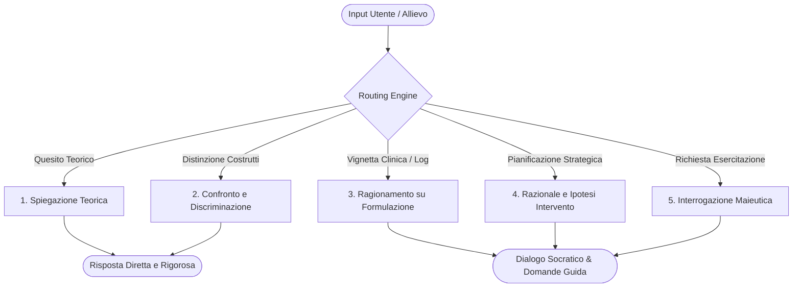

# Libet Prime

**Summary**: Tutor clinico-didattico basato su LLM (Gemini Gem) specializzato sul modello LIBET (Life Themes and Plans in CBT), progettato per guidare gli allievi di psicoterapia nell'apprendimento teorico e nel ragionamento clinico attraverso un'architettura bimodale e maieutica.
**Sources**: `07-10 Riunione_ Test e Valutazione di “Libet Prime” (Tutor AI per Libet_CBT), Trainer Simulator e Piano Operativo.txt`, `05-08 Riunione_ Sviluppo Knowledge Base AI, Etica e Applicazioni Cliniche.txt`
**Last updated**: 2026-08-27
---

## Definizione e Obiettivi Didattici

**Libet Prime** è un agente conversazionale specializzato (*Gem* su piattaforma Google Workspace / Gemini) sviluppato per le scuole di psicoterapia cognitivo-comportamentale di SC Formazione (Studi Cognitivi).

L'obiettivo primario non è fornire un mero motore di risposte automatiche o un surrogato di ChatGPT, bensì fungere da **tutor didattico-clinico** che allena le capacità di concettualizzazione e ragionamento dell'allievo nei primi anni di specializzazione.

### Cosa fa
- Chiarisce e discrimina i costrutti del modello LIBET (*Life Themes and Plans in CBT*) e delle psicoterapie cognitivo-comportamentali.
- Aiuta a distinguere costrutti teoricamente o lessicalmente vicini provenienti da diversi modelli cognitivisti.
- Guida lo studente nell'analisi di vignette cliniche, nella formulazione del caso e nella definizione di un razionale d'intervento prudente e ipotetico.
- Interroga l'allievo con domande maieutiche per verificarne la padronanza concettuale.

### Cosa NON è (Guardrails di Perimetro)
- **Non è un terapeuta**: Non interagisce con pazienti né eroga trattamenti.
- **Non è un supervisore clinico**: Non valida decisioni su casi reali né si sostituisce alla supervisione umana.
- **Non è uno strumento diagnostico**: Rifiuta categoricamente di emettere etichette nosografiche o diagnosi definitive a partire da dati parziali.
- **Non è un oracolo generico**: Rigetta richieste fuori dominio (*out-of-domain*) per mantenere la massima fedeltà e sicurezza d'uso.

---

## Architettura del Sistema e Modalità Operative

Libet Prime è strutturato su un macro-prompt che governa un sistema di **routing dinamico** tra 5 modalità funzionali:

1. **Spiegazione Teorica**: Esposizione rigorosa dei concetti fondanti del modello (es. tema di vita, piani di protezione/prevenzione, credenze di base, metacontrollo).
2. **Confronto e Distinzione di Costrutti**: Analisi differenziale tra concetti analoghi (es. credenza patogena vs credenza di base; piani di sicurezza vs comportamenti di sicurezza).
3. **Ragionamento sulla Formulazione del Caso**: Analisi strutturata di dati clinici e vignette, guidando l'allievo nell'identificazione ricorsiva del legame tra attivatori, credenze nucleari e piani.
4. **Razionale e Ipotesi di Intervento**: Supporto nell'elaborazione del razionale logico alla base della scelta delle tecniche (es. prioritizzazione tra sintomo acuto e ristrutturazione dei piani).
5. **Interrogazione e Stimolo Riflessivo**: Modalità maieutica in cui l'agente pone quesiti all'allievo, fornendo feedback graduali e rilanci metacognitivi.

---

## Postura Bimodale: Rigore Teorico vs Dialogo Socratico

Una caratteristica centrale del design di Libet Prime è il **comportamento bimodale**:
- **Ambito Teorico**: Risposte scolastiche, esaustive, con definizioni puntuali, esempi clinici standard ed errori tipici di comprensione.
- **Ambito Clinico**: Postura dialogica e maieutica (*Human-in-the-reasoning*). L'agente non risolve il caso per l'allievo ma pone domande di rilancio ("*Quali elementi della vignetta ti portano a considerare questo piano come obbligato anziché opzionale?*"), forzando il ragionamento clinico ed evitando la delega acritica.

---

## Knowledge Base e Versioning

- **Knowledge Base Dedicata**: L'agente si fonda su un corpus proprietario di **33 capitoli e oltre 230 pagine**, redatto dagli autori del modello e strutturato per l'indicizzazione e il recupero ottimale da parte del modello di linguaggio.
- **Evoluzione e Prevenzione della Regressione**: Durante lo sviluppo (dalla v1.0 alla v1.2), si è evidenziato il rischio di regressione qualitativa (*prompt over-constraining*). Il versioning viene validato tramite script di test standardizzati per garantire che le modifiche non alterino la coerenza inferenziale.

---

## Related pages
- [[07-10_Riunione_Test_Valutazione_Libet_Prime]]
- [[trainer-simulator]]
- [[testing-e-validazione-agenti-didattici]]
- [[ia-maieutica-e-co-ragionamento]]
- [[human-in-the-reasoning]]
- [[simulazione-pazienti-ai]]
- [[05-08_Riunione_Knowledge_Base]]
