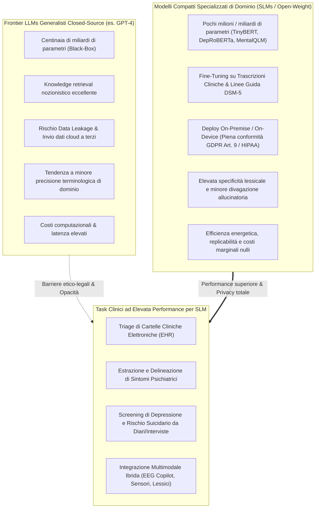
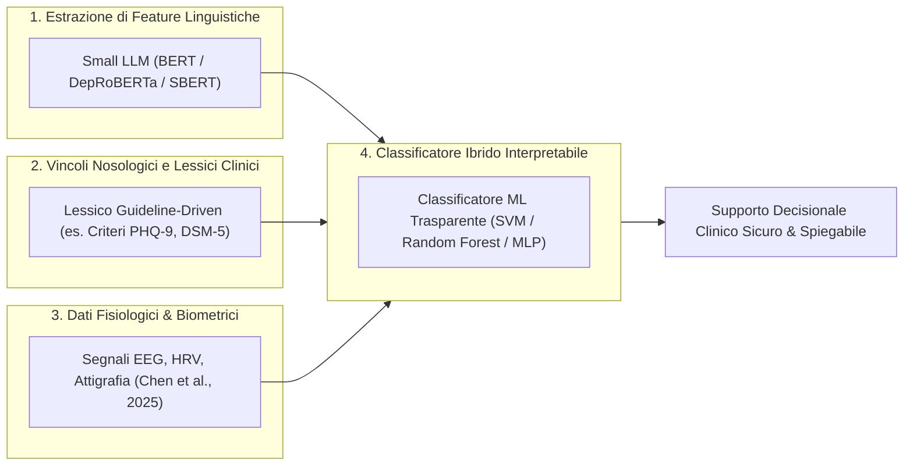

# Modelli Linguistici Compatti e Specializzati di Dominio nella Salute Mentale (Lightweight & Domain-Tuned Models)

## Definizione Operativa
- Il paradigma dei **Modelli Linguistici Compatti e Specializzati di Dominio (*Lightweight & Domain-Tuned Models*)** nella salute mentale descrive l'adozione strategica e l'adattamento specialistico (*fine-tuning*, *instruction tuning*, integrazione di moduli *LoRA*) di modelli di dimensioni contenute o moderate (Small Language Models - SLM, architetture encoder-only quali *MentalBERT*, *DepRoBERTa*, *XLM-RoBERTa*, e modelli compatti come *TinyBERT*, *MobileBERT*, *DistilBERT*, *Flan-T5*, *MentalLLaMA*, *MentalQLM*) ottimizzati su lessico psicopatologico e corpora clinici, in contrapposizione all'uso acritico di mastodontici modelli frontier commerciali generalisti (*Closed-Source Frontier LLMs* come GPT-4 o Claude) (Lokadjaja et al., 2026).
- **Razionale Clinico e Computazionale:** La ricerca empirica dimostra che, nei contesti clinici e ospedalieri ad alte risorse vincolate o con stringenti requisiti di riservatezza dei dati, i modelli compatti specificamente tarati sul dominio eguagliano o **superano sistematicamente i grandi modelli generalisti non calibrati** in compiti critici di triage, estrazione sintomatica da interviste ed elaborazione di cartelle cliniche (Taylor et al., 2024; Ohse et al., 2024; Shin et al., 2024; Chen et al., 2025).

---

## Evidenze Empiriche di Superiorità dei Modelli Compatti

### 1. Triage Sanitario su Cartelle Cliniche NHS (Taylor et al., 2024)
- **Studio e Metodologia:** Taylor e colleghi hanno valutato modelli miniaturizzati derivati da BERT (*TinyBERT*, *MobileBERT*, *DistilBERT*, *BERT-base-OHFT*) rispetto al modello open-source a 7 miliardi di parametri *LLaMA-2 7B* nel compito di triage di cartelle cliniche elettroniche (*NHS EHR*) di pazienti con disturbi di salute mentale generale.
- **Risultato:** I modelli compatti fine-tunati hanno ottenuto un'**accuratezza diagnostica e di smistamento superiore rispetto a LLaMA-2 7B**, dimostrando che la specializzazione supervisionata su un task clinico circoscritto supera l'effetto della mera scala parametrica (*scale efficiency*), consentendo un funzionamento efficiente su hardware ospedaliero standard a basso consumo.

---

### 2. Delineazione dei Sintomi e Riassunto di Sedute (So et al., 2024; Adhikary et al., 2024)
- **Granularità Diagnostica:** Nello studio di So et al. (2024) sull'analisi di interviste psichiatriche per la delineazione dei sintomi, un modello compatto adattato al dominio ha superato GPT-4 out-of-the-box, dimostrando la capacità di individuare e mappare con precisione millimetrica le singole emissioni vocali (*utterances*) associate a specifici criteri psicopatologici.
- **Modelli di Dominio nel Counseling:** Adhikary et al. (2024) hanno comparato 11 architetture nella sintesi di sessioni di counseling psicologico reale, evidenziando che i modelli specificamente addestrati sul dominio clinico (*MentalBART*, *MentalLLaMA*) generavano riassunti significativamente più concisi, pertinenti e clinicamente rilevanti rispetto ai modelli generalisti (Mistral, Phi-2, LLaMA-2).

---

### 3. Diagnostica su Interviste Cliniche e Diari Reali (Ohse et al., 2024; Shin et al., 2024)
- **Superamento dei Modelli Frontier Untuned:** Ohse et al. (2024) hanno confrontato GPT-4, GPT-3.5, LLaMA-2 13B e BERT nella diagnosi di depressione maggiore da interviste cliniche trascritte. Sebbene GPT-4 fosse il miglior modello non sintonizzato, è stato nettamente superato da versioni sintonizzate di GPT-3.5 e BERT.
- **Rilevamento del Rischio da Diari Personali:** Shin et al. (2024) hanno confermato che modelli linguistici fine-tunati su testi narrativi personali superavano GPT-4 untuned nel rilevamento congiunto di depressione e ideazione suicidaria.

---

### 4. Precisione Terminologica e Copilot Multimodali (Chen et al., 2025; Shi et al., 2025)
- **Il Rischio di Perdita di Precisione nei Modelli Giganti:** Chen et al. (2025) hanno rilevato che i modelli linguistici massivi tendono paradossalmente a essere *meno precisi* e più verbosi nella terminologia diagnostica specialistica rispetto a modelli compatti dedicati (come le versioni ottimizzate di *Qwen* o *InternLM*), integrati con tracciati elettroencefalografici (EEG) per la classificazione degli stati affettivi e la generazione di cartelle cliniche assistite.
- **Dual LoRA Modules (*MentalQLM*):** Shi et al. (2025) hanno sviluppato *MentalQLM*, un LLM leggero basato su moduli LoRA paralleli per compiti di diagnosi del disturbo ossessivo-compulsivo e da trauma, ottenendo prestazioni allo stato dell'arte con una frazione della memoria computazionale richiesta dai modelli frontier.

---

## Confronto Sistematico: Modelli Frontier vs Modelli Compatti di Dominio

| Dimensione di Analisi | Modelli Frontier Generalisti (es. GPT-4, Claude 3.5) | Modelli Compatti & Specializzati (es. MentalBERT, TinyBERT, MentalQLM) |
| :--- | :--- | :--- |
| **Privacy e GDPR Art. 9** | Dati inviati a server cloud terzi; rischio di data leakage e violazione del segreto professionale. | **Deploy On-Premise/On-Device locale**; nessun dato esce dall'infrastruttura clinica protetta. |
| **Accuratezza su Task Clinico Specifico** | Ottima su esami nozionistici; variabile e soggetta ad allucinazioni su note cliniche ambigue. | **Massima accuratezza e coerenza terminologica** grazie al fine-tuning dedicato. |
| **Costi Computazionali & Latenza** | Costi di abbonamento/API continui; latenza di rete; dipendenza da provider commerciale. | **Costi marginali di inferenza quasi nulli**; operatività in tempo reale a bassissima latenza. |
| **Flessibilità Fuori Dominio** | Elevatissima (*zero-shot generalist* su molteplici discipline). | Ristretta al dominio psicopatologico/clinico di addestramento (*task-specific*). |
| **Audit e Trasparenza Metodologica** | Architetture proprietarie chiuse; pesi inaccessibili; cutoff e aggiornamenti non controllabili. | **Pesi aperti (Open-Weight)**, trasparenza architetturale e totale riproducibilità scientifica. |

---

## Architetture Ibride e Prospettive Future

- **Integrazione Neuro-Simbolica e Ibrida:** Come dimostrato da Dalal et al. (2024), Sadeghi et al. (2024), Thomas et al. (2025) e Palominos et al. (2025), il vertice prestazionale e di sicurezza non si ottiene delegando l'intero processo diagnostico a un generatore testuale black-box, bensì combinando le rappresentazioni dense (*embeddings*) generate da modelli compatti specializzati con alberi decisionali, classificatori trasparenti e ontologie cliniche formali.

---

## Riferimenti Bibliografici
- Lokadjaja, M. C., Kho, J. J., Schulz, P. J., & Goh, W. W. B. (2026). Large Language Models and Their Applications in Mental Health: Scoping Review. *JMIR Mental Health*, 13, e88057. https://doi.org/10.2196/88057
- Adhikary, P. K., Srivastava, A., Kumar, S., et al. (2024). Exploring the efficacy of large language models in summarizing mental health counseling sessions: benchmark study. *JMIR Ment Health*, 11, e57306.
- Chen, H., Zeng, W., Chen, C., et al. (2025). EEG emotion copilot: optimizing lightweight LLMs for emotional EEG interpretation with assisted medical record generation. *Neural Netw*, 192, 107848.
- Dalal, S., Tilwani, D., Gaur, M., et al. (2024). A cross attention approach to diagnostic explainability using clinical practice guidelines for depression. *IEEE JBHI*, 2024, 1–11.
- Mahbub, M., Dams, G. M., Srinivasan, S., et al. (2025). Decoding substance use disorder severity from clinical notes using a large language model. *Npj Ment Health Res*, 4(1), 5.
- Ohse, J., Hadžić, B., Mohammed, P., et al. (2024). Zero-shot strike: testing the generalisation capabilities of out-of-the-box LLM models for depression detection. *Comput Speech Lang*, 88, 101663.
- Palominos, C., Kirdun, M., Nikzad, A. H., et al. (2025). A single composite index of semantic behavior tracks symptoms of psychosis over time. *Schizophr Res*, 279, 116–127.
- Sadeghi, M., Richer, R., Egger, B., et al. (2024). Harnessing multimodal approaches for depression detection using large language models and facial expressions. *Npj Ment Health Res*, 3(1), 66.
- Shi, J., Wang, Z., Zhou, J., et al. (2025). MentalQLM: a lightweight large language model for mental healthcare based on instruction tuning and dual LoRA modules. *IEEE JBHI*, 2025.
- Shin, D., Kim, H., Lee, S., et al. (2024). Using large language models to detect depression from user-generated diary text data. *J Med Internet Res*, 26, e54617.
- So, J., Chang, J., Kim, E., et al. (2024). Aligning large language models for enhancing psychiatric interviews through symptom delineation and summarization. *JMIR Form Res*, 8, e58418.
- Taylor, N., Ghose, U., Rohanian, O., et al. (2024). Efficiency at scale: investigating the performance of diminutive language models in clinical tasks. *Artif Intell Med*, 157, 103002.
- Thomas, J., Lucht, A., Segler, J., et al. (2025). An explainable artificial intelligence text classifier for suicidality prediction in youth crisis text line users. *JMIR Public Health Surveill*, 11, e63809.

---

## Relazioni
- [[mental-2026-1-e88057]]
- [[validation-gap-in-mental-health-llms]]
- [[specialized-nlp-models-mental-health]]
- [[on-device-slm-mental-health]]
- [[federated-learning-and-differential-privacy-mental-health]]
- [[gdpr-governance-mental-health-ai]]
- [[ai-v5-e84305]]
- [[modello-centauro-clinico]]
- [[hybrid-neuro-symbolic-cdss]]
- [[clinical-readiness-gap-in-mh-chatbots]]
