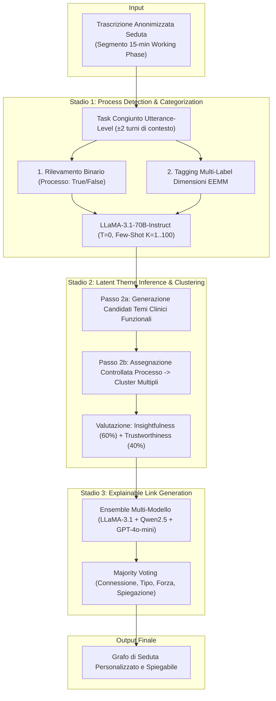

# Multi-Stage LLM Pipeline for Clinical Case Conceptualization

## Definizione Architetturale
La **pipeline multi-stadio per la concettualizzazione del caso clinico** è un'architettura modulare di elaborazione del linguaggio naturale (NLP) basata su Large Language Models (LLM), ideata da Ong et al. (2025) per trasformare le trascrizioni grezze dei colloqui terapeutici in grafi causali e funzionali strutturati (*personalized networks*).

L'architettura risolve i limiti dei tradizionali tentativi "end-to-end a prompt singolo" (*direct single-shot prompting*) suddividendo il complesso compito del ragionamento clinico in tre sotto-obiettivi sequenziali ben delimitati e controllabili.

---

## Struttura della Pipeline a Tre Stadi

---

## Dettaglio Operativo dei Singoli Stadi

### 1. Stadio 1: Process Detection e Classificazione Dimensionale
- **Contesto Locale:** L'LLM analizza ogni singolo turno di parola del paziente unitamente ai 2 turni precedenti e successivi per catturare la pragmatica conversazionale.
- **Output Strutturato:** Formattazione rigorosa in JSON schema con flag booleana `is_process` e lista di dimensioni `types` (secondo l'Extended Evolutionary Meta-Model - EEMM).
- **Apprendimento In-Context:** L'integrazione di esempi bilanciati nel prompt (*few-shot* $K=1..100$) aumenta la precisione fino al 15% rispetto al prompting zero-shot, garantendo una sensibilità (*recall*) $>90\%$.

### 2. Stadio 2: Inferenza dei Temi Clinici (Two-Step Prompt-Based Clustering)
- **Superamento del Clustering Lessicale:** Il modello non raggruppa le frasi per mera somiglianza sintattica o superficiale, ma identifica il **meccanismo psicologico latente** o la funzione comune (es. unire *"mi immergo nel lavoro"* e *"faccio scrolling continuo sui social"* sotto il tema *"Coping di evitamento tramite distrazione da emozioni dolorose"*).
- **Separazione a Due Fasi:**
  1. *Fase 2a (Generazione etichette):* Produzione di proposizioni cliniche concise esprimenti funzioni, conflitti o trasformazioni.
  2. *Fase 2b (Assegnazione controllata):* Allocazione dei singoli processi a uno o più cluster (con circa il 60% di assegnazioni multi-cluster).
- **Metriche di Validazione Esperta:** Punteggio aggregato ponderato che bilancia la rilevanza clinica, la novità e l'utilità (*Insightfulness*) con la specificità, copertura, assenza di nodi intrusi e non-ridondanza (*Trustworthiness*).

### 3. Stadio 3: Generazione di Connessioni Spiegate (Ensemble Link Reasoning)
- **Valutazione Coppia-a-Coppia:** Per ogni coppia di temi $A$ e $B$, il sistema valuta separatamente $A \rightarrow B$ e $B \rightarrow A$.
- **Ensemble Multi-Modello con Majority Voting:** L'aggregazione delle risposte di tre LLM indipendenti (LLaMA-3.1-70B, Qwen2.5-72B, GPT-4o-mini) riduce la varianza e previene allucinazioni relazionali.
- **Attributi dell'Arco:** Direzione, tipologia d'influenza (*eccitatoria* o *inibitoria*), intensità (*strong*, *moderate*, *weak*) e razionale clinico esplicativo.

---

## Vantaggi della Decomposizione Gerarchica rispetto al Prompting Diretto

Nel benchmark su 77 sedute cliniche condotto da Ong et al. (2025), la pipeline multi-stadio ha surclassato nettamente l'approccio *direct prompting single-shot*:

1. **Utilità Clinica per il Trattamento:** Preferita nel **92.4%** delle valutazioni di esperti clinici rispetto al 7.6% del prompt diretto ($\kappa = 0.79$).
2. **Qualità Tematica:** Preferita nell'**89.4%** dei casi per la significatività e profondità dei temi clinici individuati ($\kappa = 0.62$).
3. **Logica e Coerenza Relazionale:** Preferita nel **77.3%** dei casi per la precisione degli archi causali e delle spiegazioni fornite ($\kappa = 0.44$).

---

## Misure di Sicurezza, Privacy e Controllo dei Bias

- **Esecuzione Locale Open-Source:** Utilizzo di modelli LLaMA-3.1-70B eseguiti su server dedicati sicuri per evitare la trasmissione di dati clinici sensibili a fornitori terzi proprietari nelle fasi di elaborazione del trascritto grezzo.
- **De-identificazione Preventiva:** Rimozione di ogni identificatore anagrafico o demografico (sostituito con token standardizzati) prima dell'input all'LLM.
- **Riduzione della Casualità:** Impostazione della temperatura a $0$ per garantire output riproducibili e deterministici nei compiti di classificazione e clustering.

---

## Riferimenti Bibliografici
- Ong, C. W., Arnaout, H., Sheehan, K., Fox, E., Owtscharow, E., & Gurevych, I. (2025). Using Large Language Models to Create Personalized Networks From Therapy Sessions. *arXiv preprint arXiv:2512.05836v1*. https://doi.org/10.48550/arXiv.2512.05836
- Huang, C., & He, G. (2024). Text clustering as classification with LLMs. *arXiv preprint arXiv:2410.00927*.

---

## Pagine Correlate
- [[ong-et-al-2025]]
- [[personalized-networks-in-psychotherapy]]
- [[extended-evolutionary-meta-model]]
- [[ensemble-prompting-in-clinical-nlp]]
- [[ai-clinical-decision-support]]
- [[human-in-the-reasoning]]
