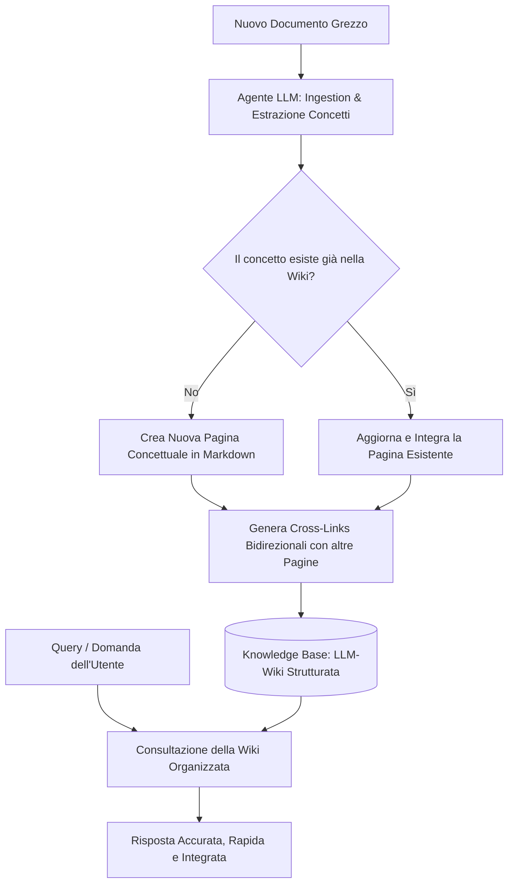

# LLM-Wiki (Architettura di Conoscenza Processuale)

**Summary**: Paradigma di gestione e strutturazione della conoscenza computazionale introdotto da Andrej Karpathy. Invece di interrogare archivi di documenti grezzi tramite RAG reattivo (chunk retrieval), un agente LLM compila e aggiorna continuamente un'enciclopedia/wiki strutturata in Markdown con collegamenti concettuali bidirezionali.
**Sources**: 07-17 Riunione_ Corso di Formazione sull'IA in Psicologia e Utilizzo Clinico.txt
**Last updated**: 2026-08-27
---

## Definizione e Origine
Il paradigma **LLM-Wiki** è un'architettura di *knowledge management* computazionale proposta da Andrej Karpathy (co-fondatore di OpenAI ed ex-direttore AI di Tesla) per superare i limiti strutturali del Retrieval-Augmented Generation (RAG) tradizionale e di piattaforme come NotebookLM.

Nel modello convenzionale, i documenti vengono archivati in forma grezza e "spezzettati" in frammenti vettoriali (*chunks*); alla ricezione di un prompt, il sistema recupera i passaggi più simili e genera una risposta sul momento. 

Al contrario, l'approccio **LLM-Wiki** trasforma il modello di linguaggio in un "curatore enciclopedico":
- L'LLM elabora proattivamente ogni documento in ingresso (*ingestion*).
- Estrae concetti chiave, relazioni teoriche ed evidenze empiriche.
- Compila o aggiorna pagine tematiche strutturate in formato Markdown.
- Costruisce e mantiene una rete ipertestuale di collegamenti semantici bidirezionali tra i concetti.

---

## Confronto Architetturale: RAG vs LLM-Wiki

| Dimensione | RAG Tradizionale / NotebookLM | Architettura LLM-Wiki |
| :--- | :--- | :--- |
| **Natura della Base Dati** | Documenti grezzi archiviati in forma statica (PDF, TXT, DOCX). | Enciclopedia in Markdown organizzata e gerarchizzata per concetti. |
| **Momento di Elaborazione** | *Reattivo*: sintesi ed estrazione avvengono on-demand durante la query. | *Proattivo*: sintesi, strutturazione e cross-linking avvengono all'assimilazione del documento. |
| **Unità di Recupero** | Frammenti disgiunti di testo (*chunk retrieval* vettoriale). | Pagine concettuali sintetiche, verificate e interconnesse. |
| **Continuità Contestuale** | Elevato rischio di perdita del contesto globale (*fragmentation loss*). | Visione olistica e contestualizzata per intere aree tematiche. |
| **Evoluzione della Conoscenza** | Cumulativa lineare (si aggiungono documenti all'elenco). | Organica e processuale (la conoscenza pregressa viene raffinata e integrata). |
| **Affidabilità dell'Output** | Vulnerabile ad allucinazioni da frammenti decontestualizzati. | Elevata precisione grazie a una conoscenza pre-sintetizzata e verificata. |

---

## Workflow Operativo di una LLM-Wiki

1. **Ingestion & Analisi**: Quando un nuovo articolo, trascritto o manuale clinico viene inserito, l'LLM lo legge integralmente.
2. **Estrazione e Sintesi Concettuale**: Il modello individua le novità, le discrepanze teoriche e le relazioni con i costrutti già noti.
3. **Aggiornamento Incrementale**: Le pagine tematiche rilevanti vengono aggiornate (aggiungendo evidenze, raffinando definizioni, integrando casistiche).
4. **Tessitura dei Collegamenti (Cross-Linking)**: Vengono generati collegamenti ipertestuali tra costrutti correlati, creando una mappa cognitiva esplorabile sia da agenti AI che da professionisti umani.
5. **Interrogazione ad Alto Livello**: Le domande future non chiedono *"cerca nei miei documenti grezzi"*, ma *"cosa sappiamo oggi sul costrutto X sulla base della nostra conoscenza integrata?"*.

---

## Applicazioni in Psicologia e Psicoterapia

1. **Knowledge Base Cliniche Integrate (es. Libet Prime, CBT, ACT)**:
   - Superamento della necessità di caricare manuali ponderosi nel prompt.
   - Creazione automatizzata di una Wikipedia clinico-terapeutica continuamente arricchita da nuovi paper, protocolli e linee guida.
2. **Archiviazione della Prassi d'Equipe**:
   - Integrazione delle discussioni cliniche d'equipe in un *living document* clinico che evolve nel tempo senza sovrapposizioni o duplicazioni disordinate.
3. **Efficienza e Riduzione del Carico Cognitivo**:
   - Eliminazione del lavoro manuale di sintesi e catalogazione per i terapeuti e i ricercatori.
   - Riduzione dei token necessari per prompt complessi, aumentando la velocità di risposta e riducendo i costi computazionali.

---

## Related pages
- [[07-17_Riunione_Corso_Formazione_IA_Psicologia]]
- [[bottom-up-clinical-documentation]]
- [[human-in-the-reasoning]]
- [[large-language-models]]
- [[hybrid-ai-research-workflows]]
- [[llm-assisted-synthesis]]
- [[structured-literature-reviews]]
- [[ai-assisted-psychotherapy]]
