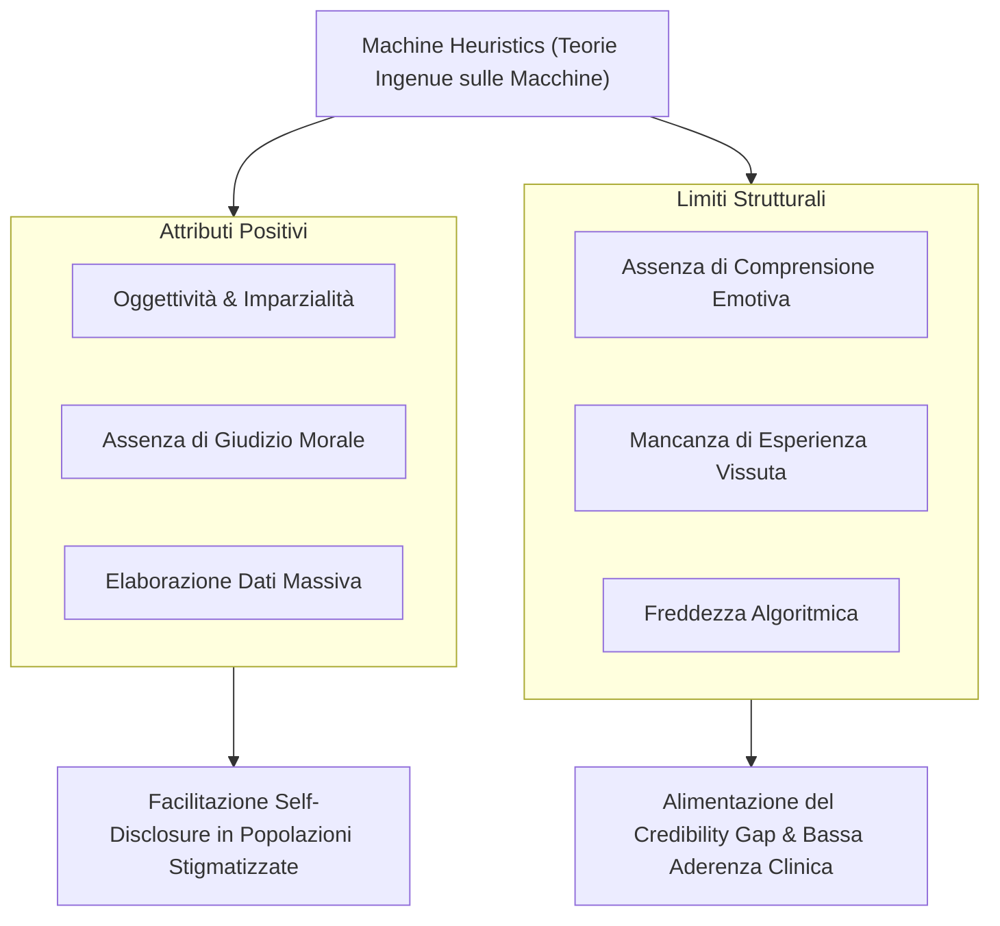

# Machine Heuristics (Euristiche della Macchina) in Psicoterapia

**Summary**: Disamina del ruolo delle *Machine Heuristics* nei contesti clinici e psicoterapeutici assistiti da IA. Concettualizzate da Sundar (2008) e Yang & Sundar (2024) e applicate alla salute mentale da Herbener & Damholdt (2025), descrivono le scorciatoie cognitive attraverso cui le persone valutano le tecnologie basandosi su credenze a priori circa la natura computazionale dei computer.
**Sources**: Herbener & Damholdt (2025) - `2509.02144v1.pdf`
**Last updated**: 2026-08-27
---

## Definizione del Costrutto

Le **Machine Heuristics** (euristiche della macchina) sono scorciatoie cognitive e schemi mentali che le persone attivano quando interagiscono con sistemi digitali e algoritmi, attribuendo loro proprietà intrinseche basate su "teorie ingenue" (*folk theories*) relative alle macchine (Sundar, 2008; Yang & Sundar, 2024).

Nei contesti di cura e supporto psicologico, queste euristiche determinano un'aspettativa bipolare:
- **Affordance Positive Attribuite**: Elevata capacità di calcolo ed elaborazione dati, oggettività sistematica, precisione analitica, instancabilità, totale assenza di pregiudizi emotivi o stanchezza.
- **Limiti Strutturali Percepiti**: Incapacità radicale di comprensione emotiva profonda, assenza di saggezza esistenziale, mancanza di intuito e incapacità di provare empatia autentica.

---

## Il Conflitto tra Machine Heuristics ed Expert Heuristics

Nel setting clinico, l'interazione con un terapeuta umano attiva le **Expert Heuristics** (legate a titoli, credenziali, reputazione istituzionale e autorevolezza deontologica).

Quando un agente artificiale utilizza espressioni tipiche del gergo psicoterapeutico o tenta di impersonare un clinico:
- L'utente sperimenta una **dissonanza cognitiva**: i segnali di perizia verbale confliggono con l'attivazione della *machine heuristic*.
- La consapevolezza che l'interlocutore è un algoritmo riduce la propensione ad affidargli la guida di processi emotivi complessi, contribuendo direttamente all'insorgenza del **[[credibility-gap|Credibility Gap]]**.

---

## Dinamiche Differenziali: Quando le Machine Heuristics Aiutano o Ostacolano

| Scenario Clinico | Impatto della Machine Heuristic | Meccanismo Operativo |
| :--- | :--- | :--- |
| **Supporto Socio-Emotivo & Crisi** | **Negativo / Sfavorevole** | L'utente percepisce il bot come inadatto a comprendere il dolore soggettivo, determinando bassa aderenza e sfiducia. |
| **Trattamento di Tematiche Stigmatizzanti (es. dipendenze, vergogna, disfunzioni sessuali)** | **Positivo / Favorevole** | L'assenza di giudizio morale umano favorisce una maggiore sincerità e apertura (*higher verbal self-disclosure*). |
| **Esercizi Strutturati CBT & Homework** | **Positivo / Favorevole** | L'agente è percepito come uno strumento oggettivo, rigoroso e metodico per il monitoraggio quotidiano. |

---

## Implicazioni per il Design degli Agenti di Salute Mentale

Herbener & Damholdt (2025) sottolineano un dilemma progettuale:
- **Enfatizzare l'identità di macchina** (trasparenza algoritmica, focus sui dati e sui protocolli) rafforza l'euristica di oggettività, ma riduce il coinvolgimento emotivo.
- **Enfatizzare tratti pseudo-umani** (antropomorfismo spinto) stimola la fiducia spontanea immediata, ma amplifica il rischio di disillusione traumatica e rottura dell'alleanza quando il modello fallisce.

---

## Relazioni
- [[herbener-damholdt-2025]]
- [[credibility-gap]]
- [[ontological-and-sociocultural-status]]
- [[anthropomorphism-in-ai]]
- [[blended-care-ai-framework]]
