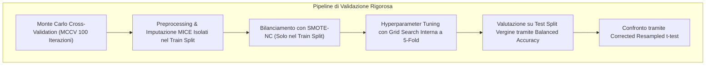
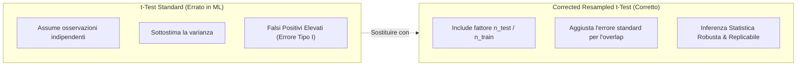

# Validazione MCCV, Bilanciamento Dati e Test Statistici Corretti nel Machine Learning Clinico

**Summary**: Framework metodologico per la valutazione rigorosa e la significatività statistica di algoritmi di Machine Learning applicati a coorti cliniche di dimensioni ridotte o sbilanciate, basato su Monte Carlo Cross-Validation (MCCV), sovracampionamento sintetico (SMOTE-NC), Balanced Accuracy e Corrected Resampled $t$-test.
**Sources**: Jacobs et al. (2026) - `2601.06159v1.pdf`, Nadeau & Bengio (2003), Bouckaert & Frank (2004), Lemaître et al. (2017)
**Last updated**: 2026-08-27
---

## Il Problema della Validazione Statistica nei Dataset Clinici

Nel Machine Learning applicato alla psicologia e alla psichiatria, le dimensioni campionarie sono frequentemente contenute ($N \approx 100 - 500$) e i tassi di prevalenza delle classi sono sbilanciati (es. $70-80\%$ di responder vs $20-30\%$ di non-responder). Questo scenario espone la ricerca a tre gravi rischi metodologici:
1. **Instabilità delle Stime da Singolo Split**: Una singola partizione train/test casuale può generare sovrastime ottimistiche (*flukes*) o sottostime delle prestazioni a seconda di come i casi outlier o rari vengono allocati.
2. **Distorsione da Accuratezza Standard**: Nei dataset sbilanciati, un classificatore banale che assegna sempre la classe maggioritaria ottiene un'accuratezza elevata (es. $80\%$) pur avendo un'utilità clinica nulla.
3. **Inflazione dell'Errore di Tipo I nei Test di Significatività**: L'esecuzione di $t$-test convenzionali su split ripetuti viola l'assunzione di indipendenza delle osservazioni (i dataset di training e test si sovrappongono parzialmente tra iterazioni), portando a falsi positivi.

---

## Componenti Fondamentali della Pipeline Metodologica

### 1. Monte Carlo Cross-Validation (MCCV)
A differenza del $k$-fold cross-validation standard (che suddivide il dataset in $k$ blocchi fissi), la **MCCV** esegue ripetutamente (es. 100 iterazioni) una partizione casuale indipendente tra training set e test set con seed casuali differenti:
- Permette di campionare la distribuzione di variabilità delle metriche (Mean $\pm$ SD).
- Riduce sensibilmente il rischio di sovrastima delle performance legato a specifici split fortuiti.

### 2. Bilanciamento delle Classi: SMOTE-NC
Nelle coorti cliniche contenenti sia variabili continue (punteggi psicometrici come YBOCS, BDI-II) sia nominali/categoriche (genere, stato civile, anamnesi farmacologica), si applica il **Synthetic Minority Over-sampling Technique for Nominal and Continuous features (SMOTE-NC)** (Lemaître et al., 2017):
- Genera campioni sintetici interpolando nello spazio euclideo per le continue e calcolando la moda della distanza di Hamming per le categoriche.
- **Regola Metodologica Fondamentale**: SMOTE-NC deve essere applicato **esclusivamente al training set** di ciascuna iterazione per evitare data leakage verso il test set.

### 3. Balanced Accuracy come Metrica Primaria
La **Balanced Accuracy** è definita come la media aritmetica di Sensibilità e Specificità:
$$\text{Balanced Accuracy} = \frac{\text{Sensitivity} + \text{Specificity}}{2} = \frac{1}{2} \left( \frac{\text{TP}}{\text{TP} + \text{FN}} + \frac{\text{TN}}{\text{TN} + \text{FP}} \right)$$
- Assegna pari peso alla capacità del modello di identificare i responder e i non-responder.
- Un modello casuale produce un valore di riferimento pari a $0.50$, indipendentemente dalla prevalenza delle classi.

---

## Inferenza Statistica: Corrected Resampled $t$-Test

Nei confronti tra due algoritmi di Machine Learning (es. Random Forest standard vs Random Forest pre-addestrato), un $t$-test standard per campioni appaiati sulle $K = 100$ iterazioni di cross-validation sottostima sistematicamente la varianza campionaria a causa della sovrapposizione dei dati, gonfiando la statistica $t$ e producendo $p$-value ingannevolmente bassi.

Per correggere questa dipendenza, si applica la correzione di **Nadeau & Bengio (2003)** e **Bouckaert & Frank (2004)**:

$$t_{\text{corrected}} = \frac{\bar{d}}{\sqrt{ \left( \frac{1}{K} + \frac{n_{\text{test}}}{n_{\text{train}}} \right) \hat{\sigma}_d^2 }}$$

Dove:
- $\bar{d}$ è la differenza media di prestazione (es. $\Delta \text{Balanced Accuracy}$) tra i due algoritmi sulle $K$ iterazioni.
- $\hat{\sigma}_d^2$ è la varianza non corretta delle differenze.
- $\frac{n_{\text{test}}}{n_{\text{train}}}$ è il rapporto tra la dimensione del test set e del training set (il fattore di correzione per la sovrapposizione dei campioni).
- I gradi di libertà sono pari a $K - 1$.

---

## Linee Guida per il Reporting nel Machine Learning Clinico

1. **Evitare l'Uso Esclusivo dell'Accuratezza Globale**: Riportare sempre congiuntamente Balanced Accuracy, Area Under the ROC Curve (AUROC), Sensibilità e Specificità con intervalli di confidenza o deviazioni standard su tutte le iterazioni.
2. **Preregistrazione dei Protocolli**: Preregistrare le ipotesi, gli outcome primari e la pipeline su piattaforme pubbliche (es. Open Science Framework - OSF) prima dell'inizio delle analisi computazionali.
3. **Controllo Rigoroso del Data Leakage**: Assicurare che tutte le fasi di imputazione dei dati mancanti, standardizzazione, selezione delle feature e oversampling avvengano rigorosamente all'interno del ciclo di cross-validation.

---

## Related pages
- [[jacobs-et-al-2026]]: Applicazione empirica del framework MCCV e del corrected resampled t-test.
- [[pretraining-simulated-data-clinical-ml]]: Modelli di pretraining per Random Forest e confronto statistico.
- [[open-data-scarcity-clinical-psychology]]: Sfide di trasparenza metodologica e replicabilità nei dati clinici.
- [[treatment-outcome-and-relapse-prediction]]: Metriche e modelli predittivi nella ricerca psicoterapeutica.
