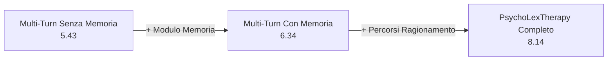

# Memoria Aumentata nel Dialogo Terapeutico (Memory-Augmented Therapeutic Dialogue)

**Summary**: Paradigma architetturale per agenti conversazionali di supporto psicologico che integra moduli esterni di memoria episodica e semantica a lungo termine (come MemoBase) e profilazione dinamica per superare i limiti dell'amnesia conversazionale, della perdita di contesto e del sovraccarico della finestra di contesto (*context window degradation*). Consente di mantenere coerenza affettiva, personalizzazione e aderenza clinica su sessioni terapeutiche estese e longitudinali.
**Sources**: `2510.03913v1.pdf` (Abbasi & Naderi, 2025: *PsychoLexTherapy: Simulating Reasoning in Psychotherapy with Small Language Models in Persian*), `2402.17753.pdf` (Maharana et al., 2024: *LoCoMo Benchmark*), `2408.16967.pdf` (Liu et al., 2024: *Memlong*)
**Last updated**: 2026-08-27
---

## Il Fallimento della Concatenazione Grezza (*Naive History Concatenation*)

Nella simulazione della psicoterapia, la continuità relazionale e la capacità di ricordare rivelazioni intime passate (*prior disclosures*), conflitti ricorrenti e preferenze espresse sono requisiti indispensabili per l'alleanza di lavoro. Nei sistemi convenzionali basati su LLM, la cronologia viene semplicemente concatenata turno dopo turno nel prompt. Questo approccio fallisce sistematicamente nei dialoghi estesi a causa di:
1. **Saturazione e Attenzione Dispersa**: All'aumentare dei turni (10–15+ scambi), il modello perde attenzione su dettagli cruciali enunciati all'inizio della seduta o nelle sessioni precedenti (*Lost in the Middle effect*).
2. **Incoerenza Emotiva e Amnesia Clinica**: Il bot dimentica eventi scatenanti, ripete domande già poste o risponde con tono contraddittorio rispetto alla fase terapeutica in corso.
3. **Esplosione dei Costi Computazionali e di Latenza**: Ricaricare l'intera trascrizione a ogni turno rallenta drasticamente l'inferenza, rendendo impossibile l'esecuzione fluida su dispositivi locali (*on-device*).

```mermaid
graph TD
    subgraph NaiveFlow ["Concatenazione Grezza (Naive)"]
        T1["Turno 1"] --> T2["Turno 2"] --> T3["... Turno N"]
        T3 --> Concat["Prompt Enorme con Tutto il Testo Grezzo"]
        Concat --> Fallimento["Perdita di Dettagli, Amnesia, Costo Elevato (Media: 5.43/10)"]
    end

    subgraph MemoryAugmentedFlow ["Memoria Strutturata (MemoBase Engine)"]
        RawMsg["Nuovo Messaggio Utente"] --> Buffer["Modulo di Buffering Temporaneo"]
        Buffer --> Extractor["Estrattore di Entità & Stati Clinici"]
        Extractor --> Profile["Profilo Gerarchico Dinamico<br>(Anagrafica, Preferenze, Eventi, Personalizzazione)"]
        Profile --> Retrieval["Recupero Mirato per il Ragionamento"]
        Retrieval --> SLM["SLM Locale + Percorso Terapeutico"]
        SLM --> Risposta["Intervento Altamente Coerente & Personalizzato (Media: 8.14/10)"]
    end
```

---

## Architettura del Modulo di Memoria (Caso Studio MemoBase)

In PsychoLexTherapy (Abbasi & Naderi, 2025), la gestione della memoria è affidata a **MemoBase**, che trasforma le interazioni grezze in un profilo utente gerarchico strutturato in 4 blocchi fondamentali:

| Sezione del Profilo | Contenuto Specifico | Funzione Clinica |
| :--- | :--- | :--- |
| **1. Informazioni di Base (*Basic Information*)** | Età, genere, occupazione, contesto socioculturale, fuso orario, varianti dialettali. | Evita richieste anagrafiche ridondanti e garantisce forme di indirizzo appropriate. |
| **2. Preferenze Conversazionali (*Ongoing Preferences*)** | Temi emotivi prioritari, obiettivi terapeutici concordati, stili di coping prediletti. | Allinea l'orientamento della seduta agli scopi concordati con il paziente. |
| **3. Parametri di Personalizzazione (*Personalization Settings*)** | Tolleranza all'umorismo, preferenza per risposte concise o articolate, livello di formalità. | Adatta la modulazione prosodica e verbale allo stile recettivo del cliente. |
| **4. Eventi di Vita Recenti (*Recent Events*)** | Cambiamenti salienti (lutti, separazioni, licenziamenti, litigi) con timestamp. | Permette al terapeuta di fare riferimento spontaneo agli eventi cruciali del passato. |

### Il Meccanismo del Buffering di Sicurezza
Per evitare che singole dichiarazioni isolate, fraintendimenti o battute alterino bruscamente il profilo permanente del paziente (*profile drift*), i nuovi dati vengono temporaneamente isolati in una **memoria tampone (*buffer zone*)**. Solo quando l'informazione viene ribadita o confermata dalla coerenza dei turni successivi, essa viene consolidata nella memoria a lungo termine.

---

## Evidenze Sperimentali dell'Impatto della Memoria

Nel benchmark su 3.400 sessioni cliniche multi-turno di [[persian-psychotherapy-benchmarks#psycholexdialogue|PsychoLexDialogue]], il confronto tra varianti architetturali dimostra l'impatto trasformativo della memoria strutturata:

- **Incremento dell'Empatia**: Passa da **7,8** (senza memoria) a **9,2** (con memoria e percorsi strutturati), poiché l'empatia percepita dipende fortemente dal ricordo dei vissuti pregressi.
- **Continuità e Coerenza Emotiva**: Raggiunge il punteggio di **8,6/10**, eliminando le oscillazioni immotivate di tono tipiche dei bot tradizionali.
- **Fluidità e Chiarezza**: L'eliminazione del rumore testuale della cronologia non compressa raddoppia i punteggi di fluidità linguistica (da **3,1** a **7,3**).

---

## Concetti Correlati

- [[psycholextherapy-framework]]: Architettura globale che integra MemoBase e selettore clinico.
- [[therapeutic-reasoning-paths]]: Interazione tra profilo utente e logica deduttiva CBT/RT/PCT.
- [[on-device-slm-mental-health]]: Come la memoria esterna consente ai piccoli modelli di gestire lunghe sedute.
- [[persian-psychotherapy-benchmarks]]: Il dataset PsychoLexDialogue utilizzato per validare la memoria.
- [[synthetic-clinical-dialogues]]: Generazione di profili clinici sintetici per testare la memoria.
