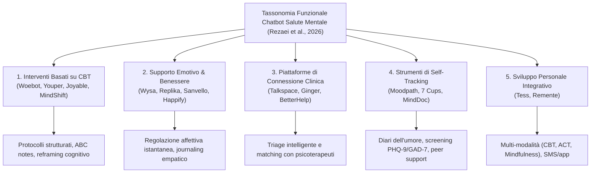

# Functional Taxonomy of Mental Health Chatbots (Tassonomia Funzionale dei Chatbot per la Salute Mentale)

## Definizione e Modello Classificatorio
Classificazione sistematica degli agenti conversazionali impiegati nell'ambito della salute mentale e del benessere psicologico, basata sui meccanismi algoritmici, le funzioni cliniche primarie e il livello di integrazione con professionisti sanitari (Rezaei et al., 2026).

---

## Le 5 Categorie Funzionali

### 1. Interventi Basati su CBT (Cognitive-Behavioral Therapy)
- **Finalità:** Erogazione di percorsi strutturati di auto-aiuto basati su principi cognitivo-comportamentali.
- **Sistemi di riferimento:** **Woebot**, **Youper**, **Joyable**, **MindShift CBT**.
- **Caratteristiche Operative:** Guidano l'utente nell'identificazione dei pensieri automatici negativi, nell'esecuzione di schede ABC (Antecedente-Credenza-Conseguenza), nella pianificazione di esperimenti comportamentali e in esercizi di mindfulness.
- **Efficacia Documentata:** Diminuzione significativa dei punteggi PHQ-9 per la depressione e GAD-7 per l'ansia; tassi di remissione sintomatica fino al 30% rispetto a gruppi di controllo passivi (He et al., 2022).

### 2. Sistemi di Supporto Emotivo e Benessere (*Emotional Support & Wellness*)
- **Finalità:** Fornire ascolto empatico immediato, riduzione del distress acuto e tecniche di rilassamento.
- **Sistemi di riferimento:** **Wysa**, **Replika**, **Sanvello**, **Mindbloom**, **Shine**, **Happify**.
- **Caratteristiche Operative:** Utilizzano elaborazione del linguaggio naturale affettiva (*affective NLP*) per validare gli stati emotivi dell'utente, proponendo micro-interventi di regolazione emotiva, respirazione guidata e journaling riflessivo.

### 3. Piattaforme di Connessione con Professionisti (*Professional-Connection Platforms*)
- **Finalità:** Facilitare l'accesso a psicoterapeuti e psichiatri abilitati all'interno di ambienti digitali crittografati.
- **Sistemi di riferimento:** **Talkspace**, **Ginger**, **BetterHelp**.
- **Caratteristiche Operative:** Il chatbot funge da agente di intake, eseguendo un triage iniziale della gravità sintomatologica e abbinando l'utente al terapeuta umano più qualificato.

### 4. Strumenti di Self-Tracking e Monitoraggio Continuo (*Tracking & Monitoring*)
- **Finalità:** Monitorare le fluttuazioni del tono dell'umore nel tempo e offrire psicoeducazione su misura.
- **Sistemi di riferimento:** **Moodpath (ora MindDoc)**, **7 Cups**, **My Possible Self**.
- **Caratteristiche Operative:** Raccolta passiva e attiva di metriche affettive tramite brevi check-in giornalieri; identificazione automatica di trigger ambientali o cognitivi; possibilità di interfacciamento con reti di supporto tra pari (*trained listeners*).

### 5. Applicazioni di Sviluppo Personale e Supporto Integrato (*Personal Development & Integrative AI*)
- **Finalità:** Sostegno psicologico modulare orientato al raggiungimento di obiettivi esistenziali e gestione dello stress.
- **Sistemi di riferimento:** **Tess**, **Remente**.
- **Caratteristiche Operative:** Integrazione multi-teorica (CBT, Acceptance and Commitment Therapy - ACT, Mindfulness) erogata su canali diversificati (SMS, app mobile, piattaforme cliniche istituzionali). Studi RCT hanno dimostrato riduzioni cliniche marcate di ansia (*d* = 0.52) e depressione (*d* = 0.64) in popolazioni universitarie (Fulmer et al., 2018).

---

## Evoluzione Architetturale e Strategie di Engagement

1. **Transizione da Rule-Based a Ibridi:**
   - I primi sistemi (fino al 92,5%) utilizzavano esclusivamente alberi logici deterministici (*rule-based*), apprezzati in clinica per l'assoluta prevedibilità e l'assenza di rischio allucinatorio.
   - I modelli moderni adottano architetture **ibride**, che integrano classificatori NLU/Transformer per il riconoscimento dell'intento emotivo con flussi di risposta clinica rigidamente vincolati.
2. **Fattori di Coinvolgimento Utente (UI/UX):**
   - **Interattività Multimediale:** Negli adolescenti, l'inclusione di elementi visivi (GIF) e domande a risposta multipla aumenta l'engagement e la probabilità di risposta del **20%** rispetto a formati testuali aperti o binari (Mariamo et al., 2021).
   - **Personalizzazione del Tono:** Un registro eccessivamente caloroso o artificialmente amichevole può generare diffidenza e reazioni di allontanamento, evidenziando la necessità di un'empatia sobria, rispettosa e trasparente.

---

## Riferimenti Bibliografici
- Rezaei, Z., Khorraminia, A., Shi, D., & Banad, Y. M. (2026). Network-based artificial intelligence in mental healthcare: A systematic review of chatbots, artificial intelligence/machine learning models and ethical considerations in global healthcare networks. *DIGITAL HEALTH*, 12, 1–30. https://doi.org/10.1177/20552076261421688
- Abd-Alrazaq, A. A., et al. (2019). An overview of the features of chatbots in mental health: a scoping review. *Int J Med Inf*, 132, 103978.
- Fulmer, R., et al. (2018). Using psychological artificial intelligence (Tess) to relieve symptoms of depression and anxiety: randomized controlled trial. *JMIR Ment Health*, 5, e9782.
- He, Y., et al. (2022). Mental health chatbot for young adults with depressive symptoms during the COVID-19 pandemic. *J Med Internet Res*, 24, e40719.

---

## Pagine Correlate
- [[rezaei-et-al-2026]]
- [[conversational-agents-mental-health]]
- [[network-based-ai-mental-healthcare]]
- [[specialized-nlp-models-mental-health]]
- [[stepped-care-ai-integration]]
- [[human-in-the-reasoning]]
