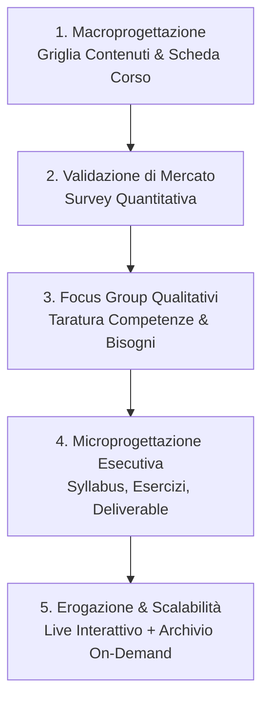

# Microprogettazione Formativa per l'IA

**Summary**: Modello metodologico iterativo per la progettazione, validazione e implementazione di percorsi formativi specialistici sull'Intelligenza Artificiale applicata alla psicoterapia. Si articola in cinque fasi: macroprogettazione dei contenuti, validazione quantitativa dell'interesse, focus group di taratura, microprogettazione modulare a base esperienziale e governance economica sostenibile.
**Sources**: 07-08 Riunione_ Pianificazione corso IA per psicoterapia — struttura, validazione interessi, microprogettazione e coordinamento.txt
**Last updated**: 2026-08-27
---

## 1. Il Razionale della Progettazione Iterativa

La formazione sull'Intelligenza Artificiale in ambito sanitario ed ecologico-clinico presenta sfide didattiche uniche:
- **Evoluzione Rapida degli Strumenti**: L'obsolescenza rapida dei software richiede percorsi modulari facilmente aggiornabili.
- **Eterogeneità delle Competenze di Partenza**: I clinici presentano livelli di alfabetizzazione digitale molto disparati, con il rischio di proporre moduli troppo avanzati o, al contrario, ridondanti.
- **Rischio di Sradicamento Metodologico**: Necessità di ancorare l'insegnamento tecnico al modello epistemico e clinico di riferimento (es. CBT di Studi Cognitivi) piuttosto che alla mera operatività dei tool.

---

## 2. Le 5 Fasi del Processo Formativo

### Fase 1: Macroprogettazione (Griglia dei Contenuti)
Stesura della scheda preliminare del corso, con definizione chiara di:
- Obiettivi formativi e competenze attese (knowledge, skills, attitudes).
- Macro-tematiche e suddivisione per livelli (Base vs Avanzato).
- Target professionale (es. allievi del 3°-4° anno, docenti, psicoterapeuti senior).

### Fase 2: Validazione dell'Interesse (Survey di Coorte)
Somministrazione di un questionario quantitativo alla popolazione di riferimento per testare:
- Propensione all'iscrizione e percezione di rilevanza clinica.
- Preferenze logistiche: cadenza (settimanale vs bisettimanale), orari e fasce giornaliere.
- Fascia di prezzo sostenibile e disponibilità economica.

### Fase 3: Focus Group Qualitativi
Sessioni guidate con campioni rappresentativi di corsisti/docenti per:
- Esplorare le credenze implicite e i timori legati all'uso dell'IA nella professione.
- Rilevare il livello effettivo di alfabetizzazione digitale di base (evitando di dare per scontate nozioni come prompt design o basi di machine learning).

### Fase 4: Microprogettazione Modulare ed Esperienziale
- Articolazione delle singole unità didattiche (es. moduli di 90 minuti).
- **Deliverable pratico a fine sessione**: Ogni incontro prevede un output applicativo tangibile (es. un prompt validato per la scala di esposizione, la configurazione di un workspace in Obsidian, una procedura di de-identificazione).
- Compiti di sperimentazione tra una sessione e l'altra per consolidare l'apprendimento sul campo.

### Fase 5: Erogazione Live e Scalabilità On-Demand
- **Erogazione Sincrona (Live)**: Massimizza il valore formativo attraverso la discussione di casi clinici, domande in tempo reale e role-play assistiti.
- **Repository On-Demand**: Registrazioni e sintesi distillate per consentire il ripasso asincrono e la fruizione continua nella community.

---

## 3. Modello di Governance e Ruoli Operativi

Il framework prevede una distinzione funzionale ed economica chiara dei ruoli:
1. **Progettazione Scientifica**: Ideazione della macro e microstruttura, redazione dei syllabus ed elaborazione delle esercitazioni.
2. **Docenza d'Aula**: Conduzione delle sessioni live, facilitazione dei role-play e discussione interattiva.
3. **Coordinamento e Tutoraggio Continuo**: Mantenimento della community, gestione del canale di supporto discenti e aggiornamento progressivo dei contenuti.

---

## Related pages
- [[07-08_Pianificazione_Corso_IA_Psicoterapia]]
- [[second-brain-clinico]]
- [[ai-literacy-in-academia]]
- [[human-in-the-reasoning]]
- [[prompting-in-psychology]]
