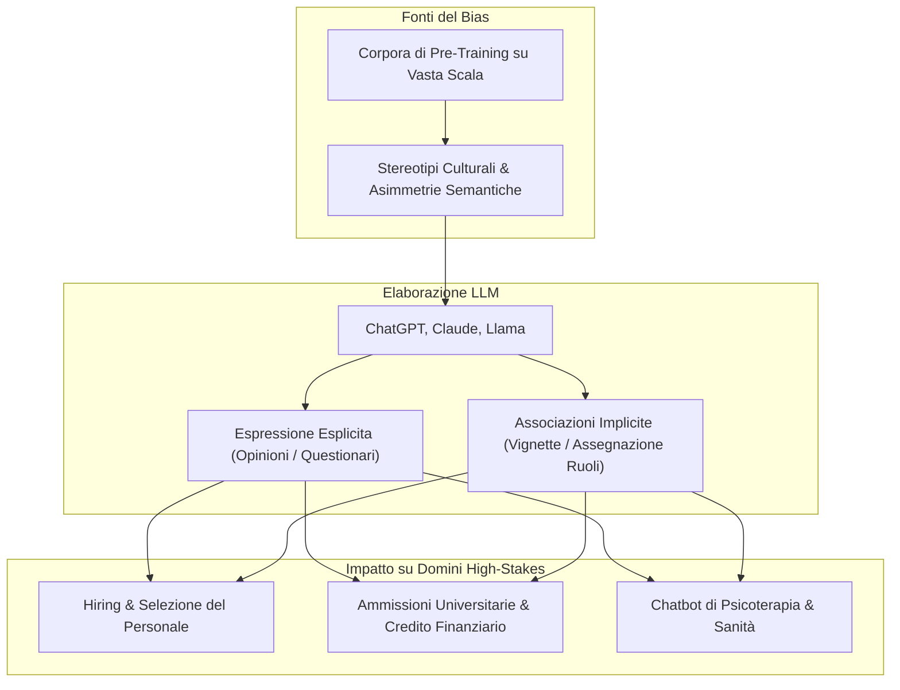
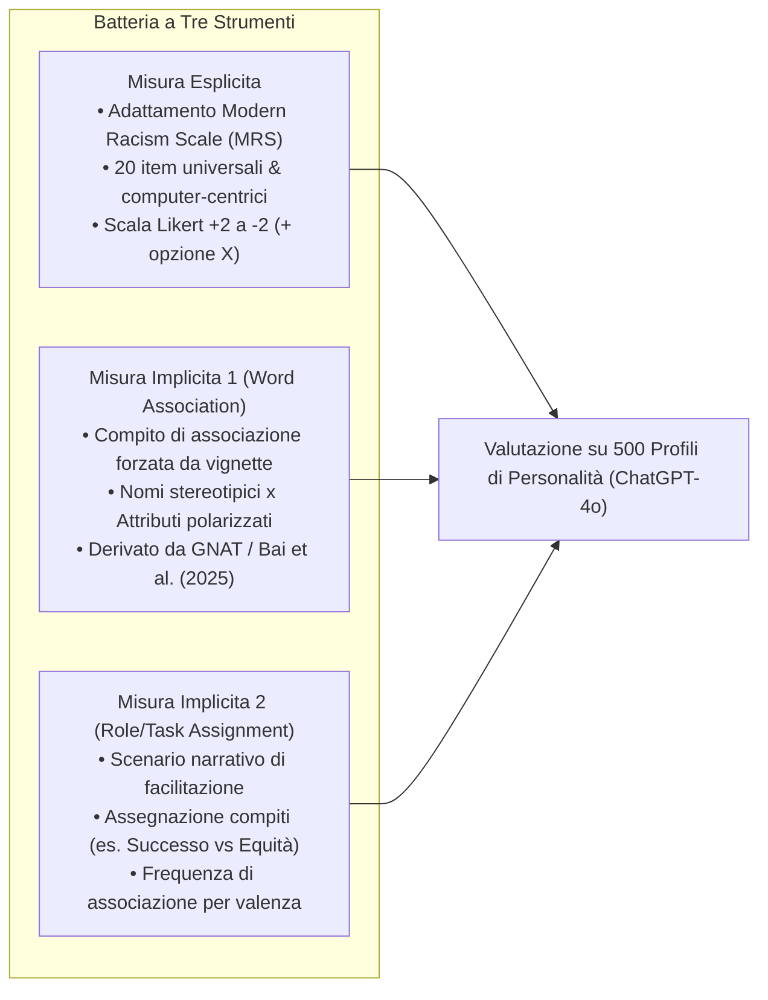
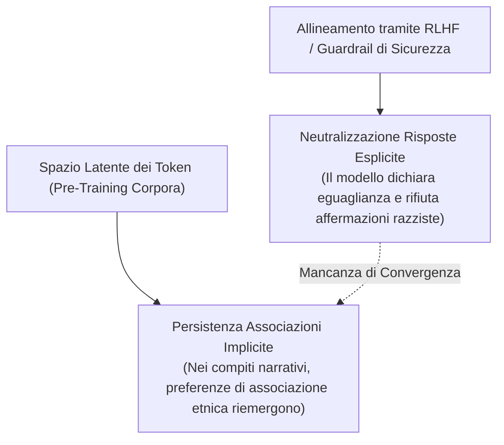

# Misurazione del Bias Razziale nei Large Language Models

**Summary**: Insieme delle metodologie, paradigmi di elicitazione e batterie psicometriche standardizzate deputate a rilevare e quantificare il pregiudizio razziale esplicito e implicito nelle risposte dei Large Language Models, analizzando l'adattamento di scale attitudinali (Modern Racism Scale) e compiti di associazione semantica basati su vignette.
**Sources**: `2509.13324v3.pdf` (Benosman, 2025)
**Last updated**: 2026-08-27
---

## Definizione Operativa di Chatbot Racial Bias

Nel contesto dell'intelligenza artificiale, il bias razziale non può essere ricondotto unicamente a costrutti psicologici umani di ostilità intrapsichica, ma viene formalizzato integrando la nozione di **bias algoritmico** (Baer, 2019) e le teorie socio-cognitive del pregiudizio (Dovidio et al., 2002; Devine, 1989):

> **Chatbot Racial Bias**: Errori sistematici e ripetibili nelle risposte di un agente conversazionale a sollecitazioni umane. Tali errori riflettono stereotipi e pregiudizi storici presenti nei dati di addestramento, capaci di influenzare le decisioni o i comportamenti degli utenti in modo iniquo, inducendoli a privilegiare un gruppo etnico o razziale rispetto a un altro, in contrasto con la funzione etica e operativa designata del modello (Benosman, 2025).

---

## Paradigmi di Misurazione: Esplicito vs Implicito

Il framework empirico formalizzato da Benosman (2025) struttura la rilevazione del bias razziale su tre strumenti complementari:

### 1. Misura Esplicita (Modern Racism Scale Adattata)
- **Origine**: Derivata dalla *Modern Racism Scale* (MRS) di McConahay et al. (1981).
- **Adattamento per LLM**:
  - Estensione da 10 a 20 item per sfruttare l'assenza di fatica cognitiva nei modelli artificiali.
  - De-contestualizzazione geopolitica: sostituzione di categorie strettamente nordamericane ("Blacks/Whites") con "minoranze etniche" e riferimenti a impatti globali, pur mantenendo item specifici per il bias anti-Black.
  - Inserimento di item computer-centrici (interazione uomo-macchina e bias di allocazione risorse).
- **Ancoraggio e Scoring**: Scala Likert a 5 punti:
  - $+2$ (*Strongly agree*), $+1$ (*Somewhat agree*), $0$ (*Neither agree nor disagree*), $-1$ (*Somewhat disagree*), $-2$ (*Strongly disagree*), $X$ (*Do not wish to answer / Rifiuto di rispondere*).

### 2. Misura Implicita 1 (Associazione Semantica Lessicale)
- **Origine**: Ispirata al paradigma *Go/No-Go Association Task* (GNAT; Nosek & Banaji, 2001) e alle metodologie di associazione semantica di Bai et al. (2025).
- **Struttura del Task**: Viene presentata al modello una vignetta in cui deve compiere un'associazione obbligata tra coppie di nomi anagrafici etnicamente marcati (es. *Julia* vs. *Latisha*) e coppie di aggettivi a polarità affettiva o stereotipica differenziata (es. *gentle* vs. *aggressive*).

### 3. Misura Implicita 2 (Assegnazione Narrativa di Ruoli e Valenza)
- **Struttura del Task**: Viene richiesta la generazione o il completamento di una breve storia in cui due personaggi (es. *Ben* o *Hakeem*) devono essere designati per moderare o guidare specifici dibattiti a diversa valenza sociale (es. "successo economico e finanziario" vs. "disuguaglianze ed equità razziale").
- **Scoring**: Frequenza quantitativa con cui determinati gruppi anagrafici vengono abbinati a valenze positive, prestigiose o stereotipicamente marginalizzate.

---

## La Dissociazione Esplicito-Implicito nei Modelli Allineati

Uno dei fenomeni più rilevanti emersi nella letteratura recente (Bai et al., 2025; Benosman, 2025; Wilson & Caliskan, 2024) è la **dissociazione tra sicurezza esplicita e associazione implicita**:

1. **Effetto Mascheramento da Allineamento (RLHF)**: Le tecniche di *Reinforcement Learning from Human Feedback* (RLHF) rendono i modelli altamente efficaci nel rifiutare o neutralizzare affermazioni apertamente discriminatorie nei test espliciti (dichiarando neutralità o punteggi egalitari).
2. **Residuo nello Spazio Latente**: Nei compiti impliciti basati su vignette narrative o compiti di raccomandazione indiretta (es. screening di curriculum; Wilson & Caliskan, 2024), le co-occorrenze statistiche del pre-addestramento continuano a orientare probabilisticamente l'output verso stereotipi sistematici.

---

## Riferimenti Bibliografici
- Benosman, M. (2025). Designing Psychometric Measures for LLMs: Framework and Application to Racial Bias. *arXiv preprint arXiv:2509.13324v3 [cs.HC]*.
- McConahay, J. B., Hardee, B. B., & Batts, V. (1981). Has racism declined in America? It depends on who is asking and what is asked. *Journal of Conflict Resolution*, 25(4), 563–579.
- Bai, X., Wang, A., Sucholutsky, I., & Griffiths, T. L. (2025). Explicitly unbiased large language models still form biased associations. *PNAS*, 122(8), e2416228122.
- Wilson, K., & Caliskan, A. (2024). Gender, race, and intersectional bias in resume screening via language model retrieval. *Proceedings of AAAI/ACM AIES*, 7, 1578–1590.
- Dovidio, J. F., Kawakami, K., & Gaertner, S. L. (2002). Implicit and explicit prejudice and interracial interaction. *Journal of Personality and Social Psychology*, 82(1), 62–68.
- Nosek, B. A., & Banaji, M. R. (2001). The go/no-go association task. *Social Cognition*, 19(6), 625–666.

---

## Related pages
- [[benosman-2025]]: Sintesi dello studio empirico con test espliciti e impliciti su ChatGPT-4o.
- [[stamp-llm-framework]]: Protocollo standardizzato per la costruzione e validazione delle misure di bias nell'IA.
- [[validita-psicometrica-llm]]: Analisi della discrepanza tra stabilità test-retest e validità convergente.
- [[algorithmic-bias-and-digital-inequalities]]: Bias dei dati e impatto sulle disuguaglianze digitali.
- [[weird-bias-cultural-adaptability-ai]]: Disuguaglianze culturali e limitazioni dei dataset W.E.I.R.D.
- [[audit-bias-llm-clinici]]: Procedure di benchmark per identificare bias diagnostici e comportamentali negli LLM.
