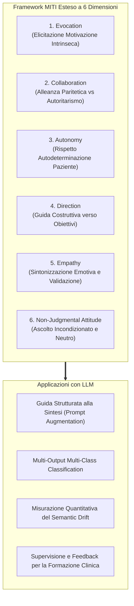

# Framework MITI per la Valutazione e Codifica Clinica con LLM

## Definizione Operativa

L'adattamento del sistema di codifica **Motivational Interviewing Treatment Integrity (MITI 4.1)** (Moyers et al., 2014, 2016) come benchmark standardizzato per valutare la competenza clinica, guidare la sintesi automatica e misurare l'allineamento semantico dei Large Language Models nei dialoghi terapeutici (Kumar, Rajawat, & Ntoutsi, 2025).

Il framework si articola in una **tassonomia a 6 dimensioni** valutate su una scala ordinale Likert a 5 punti (1 = *Extremely Low*, 2 = *Low*, 3 = *Moderate*, 4 = *High*, 5 = *Extremely High*), estendendo le 5 dimensioni globali originarie del MITI con la dimensione di *Non-Judgmental Attitude*.

---

## Le 6 Dimensioni del Framework

### 1. Evocation (Evocazione)
- **Concetto Clinico**: Focalizzazione del terapeuta nel far emergere dal paziente i motivi personali, i valori e le risorse per il cambiamento (*change talk*), evitando di imporre argomentazioni dall'esterno.
- **Rilevanza per l'IA**: Consente di verificare se l'LLM riconosce la differenza tra una guida maieutica e un consiglio direttivo non richiesto.

### 2. Collaboration (Collaborazione)
- **Concetto Clinico**: Costruzione di una partnership egualitaria in cui clinico ed utente esplorano insieme le opzioni decisionali, evitando posture autoritarie.
- **Rilevanza per l'IA**: Misura se i modelli linguistici sanno rappresentare relazioni simmetriche o se tendono a privilegiare risposte paternalistiche.

### 3. Autonomy (Autonomia)
- **Concetto Clinico**: Riconoscimento esplicito del diritto e della responsabilità del paziente di scegliere se, quando e come cambiare, rafforzando l'autoefficacia percepita.
- **Rilevanza per l'IA**: Previene che le sintesi generino l'illusione di una conformità forzata o riducano la complessità decisionale del paziente.

### 4. Direction (Direzione)
- **Concetto Clinico**: Capacità di mantenere il focus tematico sugli obiettivi di cambiamento concordati senza risultare rigidi o dispersivi.
- **Rilevanza per l'IA**: Valuta la capacità dell'LLM di tracciare il filo conduttore della seduta senza perdersi in deviazioni aneddotiche.

### 5. Empathy (Empatia)
- **Concetto Clinico**: Sforzo attivo e continuo di comprendere accuratamente il mondo interiore del paziente, trasmettendo comprensione profonda e validazione emotiva.
- **Rilevanza per l'IA**: Rileva l'appiattimento affettivo dei modelli e quantifica la sensibilità del sistema verso segnali emotivi sottili.

### 6. Non-Judgmental Attitude (Atteggiamento Non Giudicante)
- **Concetto Clinico**: Accettazione incondizionata delle esperienze, delle ambivalenze e delle ricadute del paziente, creando uno spazio di sicurezza psicologica.
- **Rilevanza per l'IA**: Estensione introdotta da Kumar et al. (2025) per monitorare bias impliciti, giudizi moralizzanti o linguaggi stigmatizzanti generati dai modelli.

---

## Struttura della Scala Likert a 5 Livelli

| Livello | Etichetta | Definizione Clinico-Operativa | Esempio Comportamentale |
| :---: | :--- | :--- | :--- |
| **1** | **Extremely Low** | Attributo completamente assente o contraddetto da comportamenti opposti. | Il terapeuta impone un trattamento farmacologico ignorando i dubbi del paziente. |
| **2** | **Low** | Attributo debolmente presente, sporadico e inefficace. | Riconoscimento formale delle preoccupazioni senza reale approfondimento. |
| **3** | **Moderate** | Dimostrazione moderata con impatto percepibile sulla conversazione. | Buona collaborazione con momenti occasionali di eccessiva direttività. |
| **4** | **High** | Attributo fortemente e costantemente dimostrato con impatto positivo. | Esplorazione attiva delle motivazioni del paziente con riformulazioni accurate. |
| **5** | **Extremely High** | Dimostrazione magistrale; fattore determinante dell'efficacia della seduta. | Piena sintonizzazione empatica, supporto incondizionato all'autonomia e assenza totale di giudizio. |

---

## Formulazione Matematica come Task Multi-Output

Dato un testo di sintesi $S$ generato da un modello linguistico a partire da un dialogo $D$, il compito di classificazione si definisce come:
$$\hat{\mathbf{y}} = f_{\theta}(S) = [\hat{y}_{\text{Evo}}, \hat{y}_{\text{Col}}, \hat{y}_{\text{Aut}}, \hat{y}_{\text{Dir}}, \hat{y}_{\text{Emp}}, \hat{y}_{\text{NonJ}}]^T$$
dove $\hat{y}_k \in \{1, 2, 3, 4, 5\}$ per ciascuna dimensione $k \in \{1, \dots, 6\}$.

La deviazione rispetto al vettore di ground truth annotato da esperti umani $\mathbf{y}^*$ è espressa da:
$$\mathbf{\Delta} = \hat{\mathbf{y}} - \mathbf{y}^*$$

---

## Relazioni
- [[motivational-interviewing-dialogue-summarization]]: Applicazione del framework alla sintesi di colloqui clinici.
- [[semantic-drift-in-therapy-llms]]: Quantificazione della divergenza semantica attraverso le metriche MITI.
- [[annosum-mi-dataset]]: Il dataset di riferimento annotato con il framework MITI a 6 dimensioni.
- [[ctrs-automated-evaluation]]: Parallelismo con la scala CTRS usata per la valutazione della fedeltà in CBT.
- [[clinical-fidelity-assessment]]: Tassonomia generale delle scale di integrità del trattamento in psicoterapia.
- [[kumar-et-al-2025]]: Studio che formalizza ed estende il framework MITI per l'elaborazione automatica del linguaggio.
