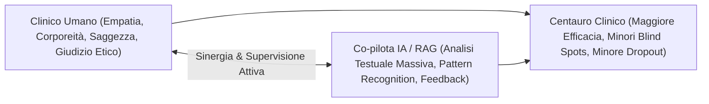

# Modello Centauro Clinico (Centaur Clinical Model)

**Summary**: Paradigma di integrazione clinico-tecnologica ispirato al "Centaur Chess" di Garry Kasparov, in cui il terapeuta umano, potenziato dall'intelligenza artificiale e dal feedback computazionale, raggiunge livelli di efficacia e accuratezza superiori sia al solo clinico isolato sia alla macchina autonoma.
**Sources**: `06-10 Lezione_ RAG, LLM in Psicoterapia e Governance Etica.txt`
**Last updated**: 2026-08-27
---

## Origine Storica ed Epistemologica
Nel 1997, dopo la sconfitta contro il supercomputer *Deep Blue* di IBM, il campione del mondo di scacchi Garry Kasparov ideò il concetto di **Centaur Chess** (o "scacchi avanzati"). Kasparov osservò che una squadra ibrida composta da un giocatore umano affiancato da un computer era in grado di sconfiggere sia il più forte grande maestro umano sia il più potente supercomputer che operasse da solo.

Trasposto in psicoterapia, il **Modello Centauro** postula che:
$$\text{Clinico Umano} + \text{Intelligenza Artificiale (Co-pilota)} > \text{Clinico Umano da Solo} \gg \text{Intelligenza Artificiale Autonoma}$$

## Caratteristiche Operative
1. **Potenziamento e non Sostituzione**: l'algoritmo non interagisce direttamente né autonomamente con il paziente, ma funge da assistente per il clinico nell'analisi post-seduta, nella rilevazione di pattern verbali e nella concettualizzazione.
2. **Asimmetria di Ruolo e Human-in-the-Loop**:
   - La macchina elabora rapidamente moli imponenti di dati testuali e prosodici, evidenzia ricorrenze tematiche e segnala marker di rottura dell'alleanza.
   - Il clinico possiede il corpo, l'esperienza incarnata, la relazione terapeutica e il giudizio clinico indispensabile per contestualizzare, interpretare o respingere le indicazioni dell'algoritmo.
3. **Integrazione nel "Lavoro di Bottega"**: i feedback generati dal sistema vengono discussi e validati all'interno di gruppi di intervisione e supervisione tra pari, impedendo sia un'adesione fideistica sia un rifiuto aprioristico.

## Linee Rosse e Limiti Invalicabili
- **Divieto di Agenti Autonomi con Pazienti Fragili**: esclusione di chatbot non supervisionati nei percorsi di cura (pericolo evidenziato dal fallimento del chatbot *Tessa*).
- **Nessuna Decisione Clinica Automatica**: la titolarità etica, deontologica e legale di ogni atto clinico rimane tassativamente in capo al terapeuta umano.

---

## Pagine Correlate
- [[rag-in-psicoterapia]]
- [[feedback-informed-practice-ai]]
- [[supervisione-clinica-ai]]
- [[augmented-psychotherapy]]
- [[human-in-the-reasoning]]
