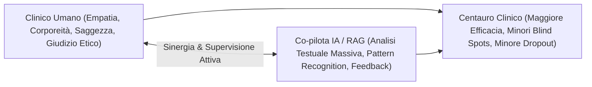

# Modello Centauro Clinico (Centaur Clinical Model)

## Definizione Operativa
Il Modello Centauro Clinico è un paradigma di integrazione clinico-tecnologica ispirato al concetto di "Centaur Chess" di Garry Kasparov. Esso postula che la combinazione sinergica tra le competenze umane (empatia, corporeità, saggezza, giudizio etico) e la capacità di calcolo dell'intelligenza artificiale (analisi massiva, pattern recognition, feedback in tempo reale) superi, in efficacia e accuratezza, le prestazioni del singolo clinico o della macchina autonoma.

Il principio fondamentale è riassumibile come:
$$\text{Clinico Umano} + \text{Intelligenza Artificiale (Co-pilota)} > \text{Clinico Umano da Solo} \gg \text{Intelligenza Artificiale Autonoma}$$

Le caratteristiche operative includono:
1. **Potenziamento e non Sostituzione**: l'algoritmo funge da co-pilota per l'analisi post-seduta e la concettualizzazione, non interagendo autonomamente con il paziente.
2. **Human-in-the-Loop**: la macchina elabora dati (testuali, prosodici), mentre il clinico fornisce il giudizio critico, la contestualizzazione e l'esperienza incarnata.
3. **Integrazione nel "Lavoro di Bottega"**: i feedback generati sono validati in contesti di intervisione e supervisione.
4. **Governance**: la responsabilità legale, deontologica ed etica resta interamente in capo al terapeuta.

## Evidenze dalla Letteratura
Il concetto trae origine storica dal gioco degli scacchi avanzato sviluppato da Garry Kasparov nel 1997, a seguito della sconfitta contro il computer *Deep Blue*. L'evidenza aneddotica e osservativa in ambito scacchistico ha dimostrato che le squadre ibride umano-computer superano sistematicamente le prestazioni dei soli umani o delle sole macchine. 

In psicoterapia, l'applicazione di questo modello mira a mitigare i bias cognitivi, ridurre i *blind spots* clinici e prevenire il dropout terapeutico. Il modello sottolinea esplicitamente i pericoli di un approccio non supervisionato, citando casi di fallimento come il chatbot *Tessa* come evidenza della necessità di limitare l'uso di agenti autonomi in contesti di fragilità clinica.

**Riferimenti Bibliografici:**
- 06-10 Lezione_ RAG, LLM in Psicoterapia e Governance Etica.txt

## Relazioni

- [[rag-in-psicoterapia]]
- [[feedback-informed-practice-ai]]
- [[supervisione-clinica-ai]]
- [[augmented-psychotherapy]]
- [[human-in-the-reasoning]]
