# Moral Buffering, Gap di Attribuibilità e Moral Deskilling

**Summary**: Fenomeno psicologico e deontologico in cui l'interposizione dell'Intelligenza Artificiale funge da "cuscinetto morale" tra il terapeuta e le decisioni cliniche, creando un gap di attribuibilità (*attributability gap*), un bacino di dispersione della colpa (*liability sink*) e la conseguente atrofia del giudizio etico (*moral deskilling*).
**Sources**: Signorini & Paganin (2026, *Frontiers in Psychology*, DOI: 10.3389/fpsyg.2026.1690291); APA (2025); GPA (2026); `AI in Psicoterapia 2023-2026.docx`.
**Last updated**: 2026-08-27
---

## Il Concetto di "Moral Buffering" (Cuscinetto Morale)

Nelle professioni sanitarie, il processo decisionale etico è intrinsecamente faticoso e gravato dal peso della responsabilità soggettiva verso il paziente. Quando un algoritmo generativo o predittivo suggerisce, orienta o struttura la scelta terapeutica, esso si interpone come un **"buffer morale" (*Moral Buffer*)**:

```mermaid
flowchart TD
    subgraph DecisioneUmana ["Processo Etico Tradizionale"]
        U1["Dilemma Clinico Complesso"] --> U2["Fatica Cognitiva & Risonanza Etica"]
        U2 --> U3["Scelta Terapeutica Autonoma"]
        U3 --> U4["Piena Psychological Ownership & Responsabilità"]
    end

    subgraph DecisioneMediata ["Processo Mediato da IA (Moral Buffering)"]
        A1["Dilemma Clinico Complesso"] --> A2["Suggerimento Algoritmico / Output Predittivo"]
        A2 --> A3["Moral Buffering: Interposizione dell'IA"]
        A3 --> A4["Gap di Attribuibilità & Diluizione della Colpa (Liability Sink)"]
        A4 --> A5["Moral Deskilling: Atrofia del Senso di Agency Morale"]
    end
```

---

## Le Dimensioni Chiave del Rischio Deontologico

### 1. Gap di Attribuibilità (*Attributability Gap*)
- Si genera quando un errore o un danno clinico scaturisce da una raccomandazione dell'algoritmo validata superficialmente dal clinico.
- Psicologicamente, il professionista è tentato di attribuire l'errore al "malfunzionamento del software" o a dati di training incompleti, scindendo l'azione dalla propria colpa.

### 2. Dispersione della Responsabilità (*Liability Sink*)
- Nonostante le normative vigenti (APA 2025, BPS 2026, [EU AI Act 2024/1689](consenso-dinamico-e-governance-dati-ia.md)) stabiliscano in modo non derogabile che la **responsabilità giuridica e morale ricade esclusivamente sul clinico umano**, a livello inconscio l'infrastruttura tecnologica opera come un bacino di assorbimento della responsabilità (*liability sink*).
- Il terapeuta rischia di degradarsi a mero esecutore burocratico o validatore passivo di procedure algoritmiche.

### 3. Moral Deskilling (Atrofia del Ragionamento Morale)
- La capacità di gestire dilemmi bioetici complessi (es. confidenze di reati, gestione del rischio suicidario, conflitti d'interesse, limiti del segreto professionale) richiede un costante esercizio decisionale incarnato.
- La delega continuativa a linee guida sintetizzate o raccomandazioni automatizzate riduce l'agency etica, atrofizzando la sensibilità morale del clinico.

---

## Salvaguardie Istituzionali e Standard Deontologici

| Livello | Presidio / Principio | Norma / Framework |
| :--- | :--- | :--- |
| **Istituzionale Globale** | *Human-in-the-Loop Oversight* e non delegabilità della cura | GPA Top 10 Principles (2026); APA Ethical Guidance (2025) |
| **Normativo Europeo** | Responsabilità legale esclusiva del "deployer" umano; Audit del rischio clinico | Regolamento UE 2024/1689 (EU AI Act - High Risk) |
| **Procedurale Operativo** | Obbligo di validazione critica differita e confronto in supervisione umana | [Framework SADAR (Signorini & Paganin, 2026)](sadar-framework.md) |

---

## Pagine Correlate
- [cognitive-offloading-e-diagnostic-deskilling](cognitive-offloading-e-diagnostic-deskilling.md)
- [sadar-framework](sadar-framework.md)
- [digital-analytic-third](digital-analytic-third.md)
- [consenso-dinamico-e-governance-dati-ia](consenso-dinamico-e-governance-dati-ia.md)
- [ai-in-psicoterapia-2023-2026](../sintesi/ai-in-psicoterapia-2023-2026.md)
- [sindrome-impostore-ia-specifica](sindrome-impostore-ia-specifica.md)

## Riferimenti Bibliografici
- [Da integrare]
