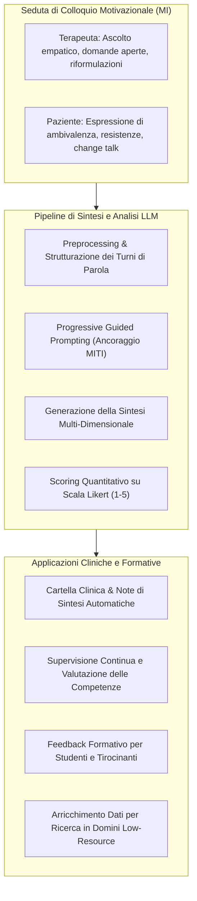
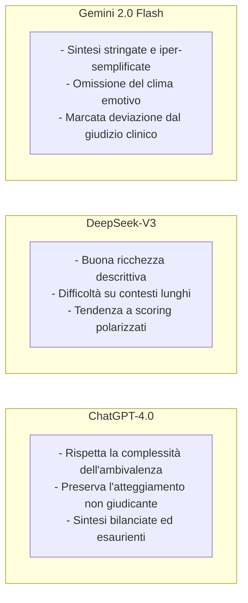

# Sintesi e Comprensione del Colloquio Motivazionale (MI) tramite LLM

## Definizione Operativa

L'applicazione di modelli di Natural Language Processing (NLP) e Large Language Models (LLM) per analizzare, riassumere e valutare sedute di **Colloquio Motivazionale** (*Motivational Interviewing*, MI), uno stile di counseling direttivo e centrato sul cliente ideato da Miller e Rollnick per esplorare e risolvere l'ambivalenza verso il cambiamento comportamentale (Kumar, Rajawat, & Ntoutsi, 2025; Wu et al., 2023; Moyers et al., 2016).

La sintesi automatizzata del MI si differenzia dalla sintesi generica di testi in quanto deve riflettere con precisione le componenti dell'alleanza terapeutica, la distinzione tra discorso di cambiamento (*change talk*) e discorso di mantenimento (*sustain talk*), e la qualità tecnica e relazionale dell'intervento del professionista.

---

## Peculiarità Cliniche del Colloquio Motivazionale nella Sintesi NLP

A differenza di altri formati dialogici o medici tradizionali, il Colloquio Motivazionale presenta sfide uniche per i modelli di intelligenza artificiale:

1. **Non-Direttività Strutturata (Guida Maieutica)**: Il clinico non prescrive comportamenti ma fa emergere le motivazioni del paziente. Gli LLM non addestrati rischiano di interpretare erroneamente l'assenza di ordini diretti come disinteresse o inefficacia terapeutica.
2. **Elaborazione dell'Ambivalenza**: Il paziente oscilla tra volontà di cambiamento e attaccamento allo status quo. Una sintesi di alta qualità deve catturare questa tensione dialettica senza forzare una risoluzione artificiosa.
3. **Micro-Competenze Linguistiche**: L'uso strategico di *OARS* (*Open questions*, *Affirmations*, *Reflections*, *Summaries*) richiede al modello una comprensione fine della pragmatica comunicativa.

---

## Benchmark Comparativo dei Modelli (Kumar et al., 2025)

Lo studio condotto da Kumar et al. (2025) sul corpus di test AnnoSUM-MI ha evidenziato differenze marcate nell'elaborazione dei dialoghi MI da parte dei principali LLM:

### Implicazioni per la Supervisione e la Cartella Clinica
- **Affidabilità Assistita**: L'output dei modelli più performanti (es. ChatGPT-4.0 con prompt one-shot) è sufficientemente dettagliato per supportare la redazione di note cliniche preliminari e snellire la documentazione burocratica.
- **Necessità di Supervisione Umana**: La variabilità tra modelli e la presenza di allucinazioni occasionali rendono indispensabile la validazione finale da parte del clinico (*Human-in-the-Loop*).

---

## Relazioni
- [[miti-framework-llm-evaluation]]: Lo strumento di codifica standard per misurare l'integrità del Colloquio Motivazionale.
- [[semantic-drift-in-therapy-llms]]: Il rischio di perdita del tono clinico e dell'intento relazionale nella sintesi automatica.
- [[annosum-mi-dataset]]: Il dataset di benchmark dedicato ai dialoghi di Colloquio Motivazionale.
- [[progressive-prompting-clinical-summarization]]: Tecniche di prompting per ottimizzare la qualità della sintesi.
- [[ctrs-automated-evaluation]]: Valutazione automatizzata equivalente applicata alla CBT.
- [[clinical-fidelity-assessment]]: Quadro complessivo sulla fedeltà dell'intervento terapeutico.
- [[kumar-et-al-2025]]: Studio sperimentale sulla sintesi di dialoghi MI con modelli di stato dell'arte.
