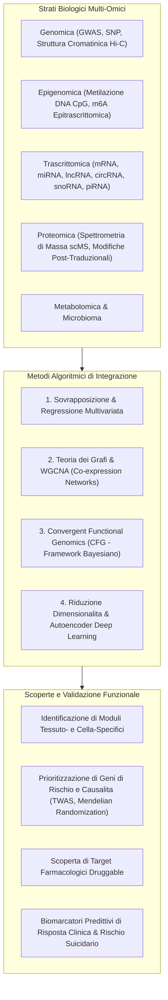

# Multi-Omics Approaches in Depression and Suicide (Integrazione Multi-Omica nella Depressione e nel Suicidio)

## Definizione Operativa
L'approccio **Multi-Omico** in psichiatria biologica consiste nell'integrazione sistematica e computazionale di dati provenienti da molteplici strati biologici—tra cui genomica (SNP, GWAS), trascrittomica (bulk e single-cell mRNA/ncRNA), epigenomica (metilazione del DNA, modifiche istoniche, epitrascrittomica m6A), proteomica (spettrometria di massa) e metabolomica—per decifrare l'architettura fisiopatologica complessa, multifattoriale e dinamica del Disturbo Depressivo Maggiore (MDD) e del comportamento suicidario (Wang & Dwivedi, 2025).

---

## Architettura di Integrazione Multi-Omica

Secondo la biologia dei sistemi, un singolo livello biologico isolato non è in grado di catturare le complesse relazioni regolatorie e gli effetti derivanti dall'interazione gene-ambiente (*GxE*). L'integrazione multi-omica sfrutta quattro paradigmi algoritmici principali:

---

## Metodologie di Integrazione e Risultati Salienti

### 1. Weighted Gene Co-expression Network Analysis (WGCNA) e RRA
- L'analisi WGCNA, combinata con il *Robust Rank Aggregation* (RRA) e i dati GWAS, consente di raggruppare migliaia di geni in moduli funzionali co-espressi e correlarli con tratti clinici:
  - **Moduli Tessuto-Specifici nella PFC**: L'integrazione multi-tissutale ha rivelato che moduli specifici della corteccia prefrontale controllano pathways sinaptiche ed endoteliali critiche nello sviluppo di MDD e disturbo bipolare (Han et al., 2022; Wang & Dwivedi, 2025).
  - **Moduli Infiammatori nel Suicidio**: L'analisi di co-espressione ha identificato 19 moduli ematici e cerebrali condivisi legati all'ideazione suicidaria, massicciamente arricchiti in pathways di risposta immunitaria, infiammazione mediata da citochine e cascate da infezione microbica (Sun et al., 2024).

### 2. Convergent Functional Genomics (CFG)
- Il framework bayesiano CFG (Le-Niculescu et al.) integra evidenze genetiche umane, modelli animali ed espressione genomica funzionale:
  - Consente di assegnare punteggi probabilistici a geni candidati nel sangue, prioritizzando biomarcatori di gravità dell'umore e rischio imminente di suicidio.

### 3. Integrazione Trascrittoma-Epigenoma (mRNA-seq + DNA Methylation)
- L'integrazione simultanea di profili di metilazione del DNA (siti CpG) e mRNA-seq in cervello postmortem ha dimostrato che le alterazioni epigenetiche guidano la disregolazione trascrittomica nel comportamento suicidario, con i **precursori degli oligodendrociti (OPC)** identificati come la popolazione cellulare con il maggior contributo proporzionale ai siti metilati differenziali (Zhou et al., 2023).

### 4. Epitrascrittomica (Modifiche m6A)
- Nei modelli animali di stress cronico imprevedibile (UCMS), il trattamento farmacologico antidepressivo modula l'epitrascrittoma attraverso l'up-regulation degli enzimi metiltransferasi `METTL3` e `WTAP`, promuovendo modifiche $N^6$-metiladenosina (m6A) che attivano la cascata dei fattori neurotrofici (BDNF/TrkB) (Lei et al., 2023).

---

## Implicazioni per la Psichiatria di Precisione

1. **Superamento dei Limiti del Singolo Livello**: La genomica da sola identifica varianti di rischio a basso effetto (piccoli odds ratio), mentre la trascrittomica bulk nasconde l'eterogeneità cellulare. La multi-omica ricompone la causalità gerarchica (DNA $\to$ Epigenetica $\to$ RNA $\to$ Proteine $\to$ Fenotipo).
2. **Identificazione di Nuovi Bersagli Terapeutici**: La stratificazione molecolare permette di selezionare target biologici "druggable" specifici per sottogruppi di pazienti resistenti ai trattamenti convenzionali.
3. **Pannelli Diagnostici Multidimensionali**: Integrazione di biomarcatori ematici (RNA, metilazione) per quantificare oggettivamente il rischio clinico e monitorare la risposta terapeutica.

---

## Relazioni nel Knowledge Base
- [[wang-dwivedi-2025]]: Review sistematica di riferimento su omica e intelligenza artificiale.
- [[non-coding-rna-biomarkers-psychiatry]]: Il livello regolatorio non codificante (miRNA, lncRNA, circRNA).
- [[single-cell-and-spatial-transcriptomics-in-mental-health]]: Deconvoluzione cellulare e risoluzione anatomica.
- [[ai-multi-omics-psychiatric-biomarkers]]: Algoritmi di apprendimento automatico per l'analisi multi-omica.
- [[peripheral-blood-biomarkers-and-exosomes-in-mdd]]: Applicazioni periferiche e biopsia liquida.
- [[treatment-outcome-and-relapse-prediction]]: Predizione dell'efficacia terapeutica.
