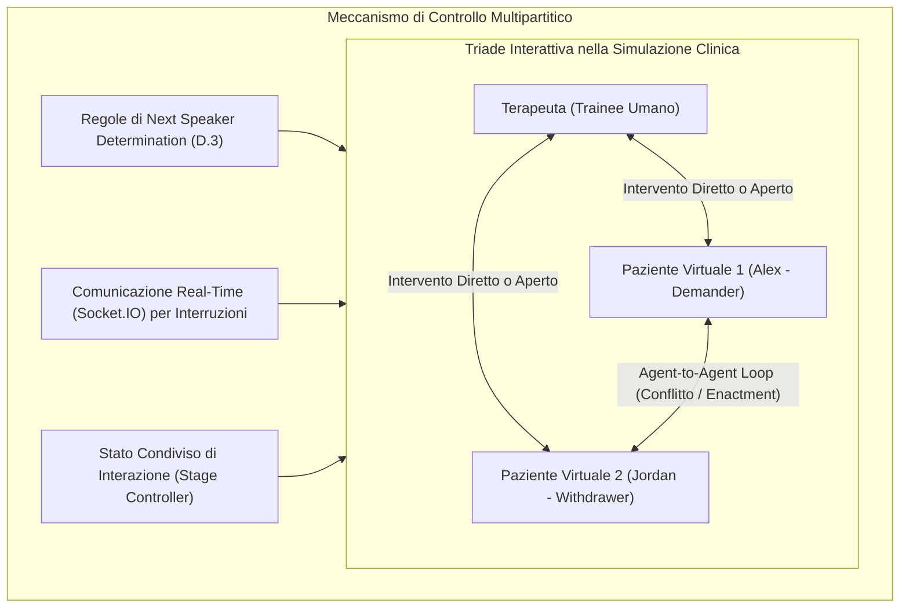

# Simulazione di Interazioni Multipartitiche con LLM

## Definizione Operativa
- Paradigma di progettazione per agenti conversazionali basati su modelli linguistici (LLM) finalizzato alla modellizzazione di dinamiche interattive a più partecipanti ($\ge 3$ attori), superando il tradizionale setting diadico (1-a-1 utente-sistema).
- **Sfide Computazionali e Relazionali:**
  1. **Determinazione del Prossimo Speaker (*Turn-Taking & Speaker Selection*):** In un dialogo triadico (ad es. un terapeuta e due partner in conflitto), non esiste una sequenza rigida domanda-risposta. Il sistema deve determinare dinamicamente chi parla dopo ogni turno in funzione del destinatario esplicito, del contenuto dell'enunciato e dello stadio relazionale attivo.
  2. **Interdipendenza e Co-evoluzione degli Stati:** Le risposte di ciascun agente non dipendono solo dall'input dell'utente principale (il terapeuta), ma anche dalle provocazioni, difese e segnali emotivi espressi dagli altri agenti virtuali.
  3. **Possibilità di Interruzione Real-Time:** Capacità dell'utente umano di intervenire e interrompere una conversazione diretta in corso tra due agenti (scambio agent-to-agent) per riprendere la conduzione dell'interazione.

## Evidenze dalla Letteratura
- **Risoluzione della Deriva di Ruolo (*Role Consistency*):** Negli scambi prolungati tra più agenti, i sistemi basati esclusivamente su system prompt monolitici tendono a perdere il registro, ad allinearsi eccessivamente all'interlocutore (*sycophantic drift*) o a frammentare la coerenza della narrazione (Ganesh et al., 2023; Luz de Araujo et al., 2026). L'adozione di uno stato condiviso orchestrato garantisce una consistenza di ruolo di gran lunga superiore (Wang, Chen et al., 2026).
- **Autenticità dell'Interazione Clinica Triadica:** Gli psicoterapeuti partecipanti allo studio hanno valutato le dinamiche di interazione tra agenti (*agent-to-agent*) e la gestione delle risposte triadiche come marcatamente più realistiche e formative rispetto a modelli 1-a-1 o prompt statici, con incrementi statisticamente significativi nel realismo percepito ($z = 27.87, p < 0.001$) (Wang, Chen et al., 2026).
- **Applicabilità Estesa a Domini Complessi:** L'architettura triadica e multipartitica costituisce una base metodologica esportabile a simulazioni di negoziazione complessa con più parti in causa, mediazione di conflitti legali o aziendali, crisis management e dinamiche di leadership di gruppo (Wang, Chen et al., 2026).

**Riferimenti Bibliografici:**
- Wang, C., Chen, A., Bao, C., Jin, S., Swartz, H., Wu, T., Kraut, R. E., & Zhu, H. (2026). Simulating Couple Conflict: Designing A Multi-Agent System for Therapy Training and Practice. *arXiv preprint arXiv:2601.10970v2*. https://arxiv.org/abs/2601.10970
- Ganesh, A., Palmer, M., & Kann, K. (2023). A Survey of Challenges and Methods in the Computational Modeling of Multi-Party Dialog. *Proceedings of NLP4ConvAI 2023*, 140–154.
- Luz de Araujo, P. H., Hedderich, M. A., Modarressi, A., Schuetze, H., & Roth, B. (2026). Persistent Personas? Role-Playing, Instruction Following, and Safety in Extended Interactions. *Proceedings of EACL 2026*, 5329–5359.

## Relazioni
- Vedi anche: [[wang-chen-et-al-2026]], [[sense-plan-act-therapy-simulation]], [[demand-withdraw-multi-agent-dynamics]], [[stage-structured-dialogue-control]], [[simulazione-pazienti-ai]], [[reverse-training-simulazione]]
