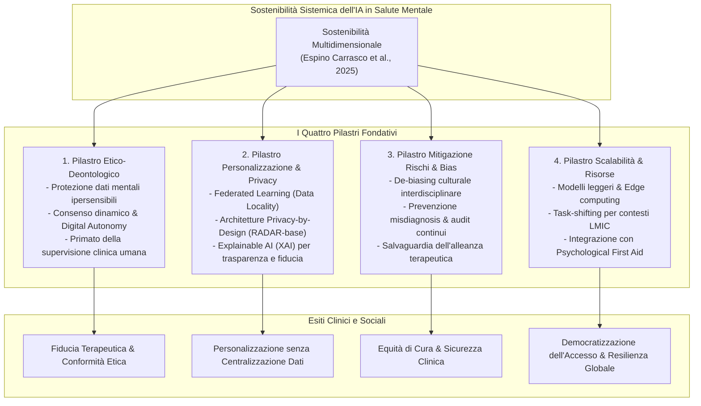

# Sostenibilità Multidimensionale dell'IA nella Salute Mentale (Multidimensional Sustainability Framework)

## Definizione Operativa
- La **Sostenibilità Multidimensionale dell'IA nella Salute Mentale** (*Multidimensional AI Sustainability Framework*) è il modello teorico e operativo formalizzato da **Espino Carrasco et al. (2025)** per valutare, progettare e implementare interventi basati su intelligenza artificiale capaci di garantire efficacia clinica, equità distributiva, integrità etica e longevità ecologico-economica nel lungo periodo.
- **Superamento del Riduzionismo Tecnico ed Economico:** Il framework rifiuta la concezione tradizionale che riduce la sostenibilità alla sola fattibilità finanziaria (*cost-effectiveness*) o alla stabilità del software. L'IA in salute mentale è sostenibile solo quando realizza un equilibrio sistemico tra quattro dimensioni interconnesse:
  1. **Dimensione Etico-Deontologica:** Tutela rafforzata dei dati mentali ipersensibili, consenso dinamico orientato all'[[digital-autonomy|autonomia digitale]] e mantenimento della supervisione umana (*human-in-the-loop*) per proteggere l'alleanza terapeutica e la responsabilità medico-legale.
  2. **Dimensione di Personalizzazione Privacy-Preserving:** Superamento del conflitto tra accuratezza personalizzata e confidenzialità tramite paradigmi decentralizzati quali l'[[federated-learning-and-differential-privacy-mental-health|apprendimento federato (Federated Learning)]], architetture *privacy-by-design* e co-progettazione incentrata sul paziente.
  3. **Dimensione di Mitigazione dei Rischi e De-Biasing Culturale:** Riconoscimento del bias algoritmico non come mero errore di campionamento matematico, ma come discrepanza socio-culturale da correggere tramite audit di equità contestuali e validazione clinica continua contro il rischio di misdiagnosis.
  4. **Dimensione di Scalabilità Globale e Allocazione Risorse:** Sviluppo di modelli computazionalmente efficienti (green/edge computing), integrazione nei flussi clinici esistenti e adozione di strategie di *task-shifting* per colmare le gravi carenze di specialisti nei paesi a basse e medie risorse (LMIC).
- **Utilità Clinica e CBT:** Offre ai clinici e ai progettisti di sistemi sanitari una bussola per implementare strumenti di supporto diagnostico e terapeutico (come diari CBT automatizzati, agenti di psicoeducazione o screening predittivo) che non causino sovraccarico cognitivo, disaffezione (*digital dropout*), iatrogenesi o alienazione relazionale.

---

## Articolazione dei Quattro Pilastri di Sostenibilità

### 1. Pilastro Etico-Deontologico e Tutela dei Dati Ipersensibili
- **Specificità del Dato Psicologico:** I dati relativi allo stato mentale, alla sintomatologia depressiva, ai traumi pregressi e all'ideazione suicidaria presentano un grado di vulnerabilità ontologica ed esistenziale incomparabile rispetto ai dati biometrici generali.
- **Dalla Firma Statica all'Autonomia Digitale:** Il consenso informato tradizionale "a spunta unica" si dimostra inadeguato per algoritmi che apprendono ed evolvono nel tempo. La sostenibilità etica richiede il modello della **digital autonomy** (Laacke et al., 2021; Dhar & Sarkar, 2024):
  - Informazione trasparente e comprensibile anche a utenti con bassa alfabetizzazione digitale;
  - Consenso granulare e rinegoziabile in tempo reale su specifici flussi di monitoraggio (es. disattivazione temporanea dell'analisi vocale o del tracciamento GPS);
  - Garanzia che l'utente non subisca discriminazioni nell'accesso alle cure in caso di revoca parziale del consenso.
- **Preservazione dell'Alleanza e Divieto di Sostituzione:** La tecnologia deve porsi rigorosamente come strumento di ausilio (*AI as augmentation*). L'illusione di poter sostituire il clinico con agenti autonomi comporta la rottura del legame di cura interpersonale e l'impossibilità di gestire le crisi complesse.

---

### 2. Personalizzazione Privacy-Preserving e Apprendimento Federato
- **Risoluzione del Paradosso Dati-Confidenzialità:** L'approccio classico del machine learning centralizzato esige la trasmissione di grandi volumi di conversazioni intime e diari clinici su server cloud, creando vulnerabilità catastrofiche in caso di violazione informatica.
- **Il Meccanismo del Federated Learning (FL):**
  - I dati restano residenti sul dispositivo locale dell'utente (*data locality*);
  - L'addestramento dell'algoritmo avviene on-device;
  - Vengono inviati al server centrale unicamente aggiornamenti numerici anonimizzati e aggregati (pesi del gradiente), schermati da protocolli di *Differential Privacy*;
  - Permette di personalizzare gli interventi adattandoli al profilo specifico del singolo utente senza comprometterne la riservatezza.
- **Explainability e Trasparenza Clinica:** L'integrazione di tecniche di Explainable AI (XAI) consente al terapeuta e al paziente di comprendere la logica che ha generato un determinato alert o suggerimento di intervento, consolidando l'alleanza di lavoro.

---

### 3. Mitigazione del Rischio e De-Biasing Culturale
- **Il Bias come Discrepanza Sistemica:** Il bias negli algoritmi per la salute mentale non è eliminabile con semplici correzioni statistiche del dataset se i costrutti psicopatologici sottostanti riflettono unicamente contesti occidentali, istruiti, industrializzati e ricchi (*WEIRD populations*).
- **Competenza Culturale Integrata:** L'accuratezza diagnostica sostenibile richiede che i team di sviluppo integrino esperti locali e antropologi della salute mentale per calibrare i sistemi sui diversi modi in cui il distress viene espresso (es. somatizzazione vs espressione emotiva verbale).
- **Validazione Empirica e Continuous Performance Monitoring:** Prevenzione di falsi positivi (che inducono stigmatizzazione e iatrogenesi) e falsi negativi (che ritardano l'assistenza in casi di suicidio o autolesionismo) mediante monitoraggio continuo post-deployment.

---

### 4. Scalabilità Globale, Task-Shifting e Risorse nei Paesi LMIC
- **Il Divario Globale di Salute Mentale:** Nei paesi a basso e medio reddito (LMIC), la carenza estrema di professionisti specializzati rende impossibile l'applicazione di modelli di cura intensivi basati su infrastrutture computazionali pesanti e costose.
- **Il Modello di Task-Shifting Supportato dall'IA:**
  - L'IA non opera isolata, ma supporta operatori sanitari di comunità, infermieri ed educatori (*task-sharing / task-shifting*; McInnis & Merajver, 2011; Campion et al., 2022);
  - Fornisce strumenti decisionali semplificati e protocolli di triage rapido;
  - Si interfaccia con interventi a larga scala come l'[[ai-enhanced-psychological-first-aid|AI-Enhanced Psychological First Aid (PFA)]], garantendo interventi tempestivi e sostenibili post-catastrofe o in crisi umanitarie.

---

## Tabella di Sintesi Comparativa

| Dimensione | Rischio di Insostenibilità | Soluzione Strategica | Impatto Sistemico |
| :--- | :--- | :--- | :--- |
| **Etica** | Perdita di privacy, paternalismo, erosione della fiducia clinica | Consenso dinamico (*digital autonomy*), *human-in-the-loop* mandatorio | Tutela deontologica e sicurezza relazionale |
| **Personalizzazione** | Vulnerabilità da banche dati centralizzate, omologazione | **Federated Learning**, *Differential Privacy*, architetture *privacy-by-design* | Cura su misura a rischio zero di esposizione dati |
| **Mitigazione Rischi** | Diagnosi errate, discriminazione algoritmica di minoranze | Audit culturali, validazione clinica longitudinale, Explainable AI | Equità terapeutica e abbattimento dei falsi negativi |
| **Implementazione** | Inapplicabilità in LMIC, dipendenza da risorse proibitive | **Task-shifting**, edge AI a basso consumo, integrazione con **PFA** | Scalabilità democratica e sostenibilità economica |

---

## Riferimenti Bibliografici
- Espino Carrasco, D. K., Palomino Alcántara, M. d. R., Arbulú Pérez Vargas, C. G., Santa Cruz Espino, B. M., Dávila Valdera, L. J., Vargas Cabrera, C., Espino Carrasco, M., Dávila Valdera, A., & Agurto Córdova, L. M. (2025). Sustainability of AI-Assisted Mental Health Intervention: A Review of the Literature from 2020–2025. *International Journal of Environmental Research and Public Health*, 22(9), 1382. https://doi.org/10.3390/ijerph22091382
- Campion, J., Javed, A., Lund, C., Sartorius, N., Saxena, S., Marmot, M., Allan, J., & Udomratn, P. (2022). Public mental health: Required actions to address implementation failure in the context of COVID-19. *Lancet Psychiatry*, 9(2), 169–182. https://doi.org/10.1016/S2215-0366(21)00417-0
- Dhar, S., & Sarkar, U. (2024). Safeguarding Data Privacy and Informed Consent: Ethical Imperatives in AI-Driven Mental Healthcare. In *Intersections of Law and Computational Intelligence in Health Governance* (pp. 197–219). IGI Global.
- Kagee, A. (2023). Designing interventions to ameliorate mental health conditions in resource-constrained contexts: Some considerations. *South African Journal of Psychology*, 53(4), 429–437.
- Laacke, S., Mueller, R., Schomerus, G., & Salloch, S. (2021). Artificial intelligence, social media and depression. A new concept of health-related digital autonomy. *American Journal of Bioethics*, 21(4), 4–20.
- McInnis, M. G., & Merajver, S. D. (2011). Global mental health: Global strengths and strategies. Task-shifting in a shifting health economy. *Asian Journal of Psychiatry*, 4(3), 165–171.
- Pardeshi, S. M., & Jain, D. C. (2024). AI in mental health federated learning and privacy. In *Federated Learning and Privacy-Preserving in Healthcare AI* (pp. 274–287). IGI Global.

---

## Relazioni
- Documento sorgente: [[ijerph-22-01382]]
- Concetti correlati: [[ai-enhanced-psychological-first-aid]], [[federated-learning-and-differential-privacy-mental-health]], [[algorithmic-bias-and-digital-inequalities]], [[consenso-dinamico-e-governance-dati-ia]], [[tiered-human-ai-healing-ecosystem]], [[power-safety-paradox]], [[human-in-the-reasoning]]
