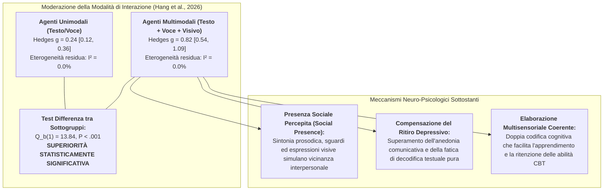

# Vantaggio Multimodale negli Agenti Conversazionali per la Depressione (Multimodal Advantage in AI Mental Health)

## Definizione Operativa
- Il **Vantaggio Multimodale negli Agenti Conversazionali per la Depressione** (*Multimodal Advantage in Conversational AI for Depression*) è un principio empirico e clinico formalizzato dalla meta-analisi di **Hang et al. (2026)** su *npj Digital Medicine*, che dimostra come gli agenti conversazionali guidati da intelligenza artificiale ([[large-language-models|NLP]]) che integrano **molteplici canali di interazione sincronizzati (testo, voce naturale, stimoli visivi e avatar interattivi)** ottengano una riduzione dei sintomi depressivi significativamente superiore rispetto ai sistemi puramente unimodali (solo testo o solo voce).
- **Evidenze Quantitative di Moderazione:**
  - **Agenti Multimodali ($N=2$ trial):** $\text{Hedges } g = 0.82$ ($95\%\text{ CI } [0.54, 1.09]$, $P < .001$), indicando un'efficacia terapeutica di magnitudo **ampia**;
  - **Agenti Unimodali Testuali/Vocali ($N=11$ trial):** $\text{Hedges } g = 0.24$ ($95\%\text{ CI } [0.12, 0.36]$, $P < .001$), indicando un'efficacia **piccola-modesta**;
  - **Differenza tra Sottogruppi:** $Q_b(1) = 13.84, P < .001$.
- **Risoluzione dell'Eterogeneità Clinica:** L'introduzione della modalità di interazione come moderatore ha azzerato l'eterogeneità residua all'interno di ciascun sottogruppo ($I^2 = 0.0\%, P > .10$), dimostrando che la variabilità riscontrata nell'effetto aggregato ($I^2 = 45.3\%$) era largamente determinata dalla mancata distinzione tra interfacce unimodali e multimodali.

---

## Meccanismi Psicopatologici ed Epistemologici

### 1. Presenza Sociale Percepita e Risonanza Affettiva (*Social Presence*)
- La depressione maggiore e i quadri depressivi subclinici sono caratterizzati da alterazioni profonde nei circuiti di ricompensa sociale, ritiro interpersonale e sentimenti pervasivi di isolamento (*social disconnection* e solitudine; Hames et al., 2013).
- Mentre una chat puramente testuale richiede un atto volitivo di lettura e scrittura che può risultare cognitivamente affaticante (*text fatigue*) per un paziente con rallentamento psicomotorio, un'**interfaccia multimodale** (voce calda e modulata, animazioni visive empatiche, avatar relazionali incarnati) attiva risposte neurobiologiche di **presenza sociale percepita** (*social presence*; Cho, 2019; Loveys et al., 2022).
- L'utente non percepisce il sistema come un freddo motore di ricerca di protocolli, ma come un'entità responsiva presente (*embodied conversational companion*), amplificando l'[[digital-therapeutic-alliance|alleanza terapeutica digitale]].

### 2. Teoria della Doppia Codifica e Riduzione del Carico di Decodifica
- In accordo con la *Dual-Coding Theory* (Paivio) e la teoria del carico cognitivo multimediale (Mayer), l'erogazione simultanea di informazioni terapeutiche tramite **canale uditivo-vocale** (intonazione, ritmo empatico) e **canale visivo-grafico** (schemi di ristrutturazione cognitiva, feedback visivi dell'umore) ottimizza la capacità di elaborazione della memoria di lavoro.
- Questo riduce lo sforzo cognitivo richiesto per processare le tecniche di Terapia Cognitivo-Comportamentale (CBT), facilitando l'interiorizzazione dei micro-interventi anche in presenza di deficit attentivi ed esecutivi tipici del quadro depressivo.

### 3. Specificità per la Depressione vs Invarianza nell'Ansia
- Curiosamente, Hang et al. (2026) e le evidenze correlate (Feng et al., 2025) rilevano che il vantaggio multimodale è marcatamente evidente nei **sintomi depressivi**, mentre non modifica sostanzialmente gli esiti su ansia generalizzata e stress.
- **Spiegazione:** L'ansia clinica è guidata da iper-arousal fisiologico e condizionamenti di paura che richiedono protocolli mirati di [[exposure-therapy-deficit-in-mental-health-ai|esposizione comportamentale enterocettiva o in vivo]], indipendentemente dalla ricchezza visiva o vocale dell'interfaccia; al contrario, la depressione risponde primariamente alla rottura del circolo di isolamento e anedonia, terreno in cui la ricchezza sensoriale esplica il suo massimo impatto terapeutico.

---

## Analisi Comparativa: Architetture Unimodali vs Multimodali

| Dimensione Clinico-Tecnologica | Agenti Unimodali (Solo Testo o Voce) | Agenti Multimodali (Testo + Voce + Visual/Avatar) |
| :--- | :--- | :--- |
| **Dimensione dell'Effetto (Depressione)** | $\text{Hedges } g = 0.24$ ($95\%\text{ CI } [0.12, 0.36]$) | $\text{Hedges } g = 0.82$ ($95\%\text{ CI } [0.54, 1.09]$) |
| **Grado di Presenza Sociale** | **Basso:** interazione percepita come transazionale o documentale | **Elevato:** sensazione di compagnia autentica e vicinanza emotiva (*felt company*) |
| **Coinvolgimento Emotivo (Engagement)** | Dipendente dalla motivazione intrinseca; vulnerabile all'abbandono precoce | Alto livello di fidelizzazione grazie a stimoli uditivi e grafici dinamici |
| **Canali di Espressione dell'Utente** | Digitazione tastiera o input vocale asincrono isolato | Dialogo vocale naturale, selezione visiva, input integrati |
| **Complessità Computazionale** | Bassa (parsing testuale e retrieval/generazione standard) | Alta (sincronizzazione multimodale, sintesi vocale TTS prosodica, rendering grafico) |
| **Esempi di Sistemi Validati** | Woebot, Tess, Fido, TEO, Todaki-Text | **XiaoE** (He et al., 2022), **XiaoNan** (Liu et al., 2022) |

---

## Implicazioni per la Progettazione di Digital Therapeutics (DTx)

1. **Integrazione della Prosodia Affettiva:** I futuri agenti conversazionali per la salute mentale non devono limitarsi a perfezionare i prompt testuali degli LLM, ma implementare motori di sintesi vocale (Text-to-Speech con controllo di *prosodia, tono ed esitazioni empatiche*) per massimizzare la percezione di autenticità relazionale.
2. **Supporto Visivo Sincronizzato:** Affiancare al dialogo conversazionale rappresentazioni grafiche dinamiche dei cicli di pensiero disfunzionale (es. modelli ABC interattivi a blocchi visivi) per potenziare la comprensione immediata della ristrutturazione cognitiva.
3. **Avatar Relazionali Non Iper-Realistici:** Utilizzare avatar grafici stilizzati o semi-umanoidi per evitare l'effetto *Uncanny Valley*, favorendo invece un'esperienza di supporto accogliente e non giudicante.

---

## Pagine e Concetti Correlati
- [[s41746-026-02886-x_reference|The Effectiveness of CBT-Based NLP-Enabled AI Conversational Agents (Hang et al., 2026)]]
- [[psychoeducation-dilution-effect-in-ai|Effetto Diluizione della Psicoeducazione negli Agenti Conversazionali]]
- [[exposure-therapy-deficit-in-mental-health-ai|Deficit di Esposizione Comportamentale nell'IA per la Salute Mentale]]
- [[digital-therapeutic-alliance|Alleanza Terapeutica Digitale]]
- [[retrieval-vs-generative-clinical-chatbots|Sistemi di Recupero vs Architetture Generative in Sanità Mentale]]
- [[subclinical-depression-window-of-opportunity|Finestra di Opportunità Subclinica nell'IA]]
- [[jmir_v27i1e69639|Efficacia degli Agenti Conversazionali AI per la Salute Mentale Giovanile (Feng et al., 2025)]]
