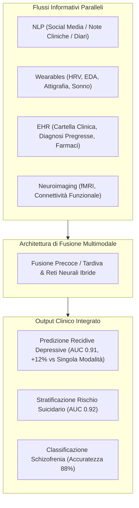

# Sistemi Diagnostici Multimodali e Ibridi nell'IA Psichiatrica

**Summary**: Paradigma diagnostico e predittivo che integra molteplici flussi di dati eterogenei (elaborazione del linguaggio naturale da social/testi, segnali fisiologici e attigrafici da sensori indossabili, neuroimaging fMRI/EEG e cartelle cliniche elettroniche) per superare i limiti delle singole modalità e migliorare l'accuratezza nella prevenzione delle ricadute e del rischio suicidario.
**Sources**: Kandeel et al. (2026) - `ai-v5-e84305.pdf`, Tseng et al. (2023), Zeng et al. (2018), Jacobson et al. (2020)
**Last updated**: 2026-08-27
---

## Definizione e Razionale Clinico

Nella diagnosi e nel monitoraggio dei disturbi mentali (Depressione Maggiore, Disturbo Bipolare, Schizofrenia, Rischio Suicidario), l'impiego di una **singola modalità informativa** presenta limiti strutturali intrinseci:
- I **dati linguistici e testuali (NLP)** catturano la semantica e l'espressione emotiva soggettiva, ma mancano di correlati biologici oggettivi e sono soggetti a bias stilistici e retrospettivi.
- I **sensori indossabili (*wearables*)** monitorano biomarcatori fisiologici continui (HRV, conduttanza cutanea, sonno, attività motoria), ma sono vulnerabili al rumore da artefatti fisici e non rilevano il contesto cognitivo.
- Il **neuroimaging funzionale (fMRI, EEG)** fornisce indicatori biologici ad alta risoluzione (es. disconnettività prefrontale), ma è costoso, temporalmente statico e non applicabile nel monitoraggio ecologico quotidiano.
- Le **cartelle cliniche elettroniche (EHR)** contengono la storia anamnestica e farmacologica, ma sono aggiornate solo in occasione delle visite formali.

I **Sistemi Diagnostici Multimodali e Ibridi (*Multimodal & Hybrid Diagnostic AI*)** fondono computazionalmente questi flussi paralleli per creare un profilo fenotipico digitale dinamico e olistico.

---

## Evidenze di Efficacia Empirica

La revisione sistematica di Kandeel et al. (2026) sintetizza i principali benchmark quantitativi:

| Modalità / Architettura | Studio di Riferimento | Parametri e Dati Utilizzati | Metrica di Performance | Risultato Clinico Chiave |
| :--- | :--- | :--- | :--- | :--- |
| **Multimodale (NLP + Actigraphy + EHR)** | Tseng et al. (2023) | Post Reddit + Dati Fitbit + Cartelle Cliniche | $\text{AUC} = 0.91$ | **Miglioramento del +12%** nella predizione delle ricadute depressive rispetto ai modelli unimodali. |
| **NLP su Social Media** | Gkotsis et al. (2017) | Reti LSTM su testi Reddit (complessità sintattica e sentiment) | Accuratezza **89%** | Rilevamento precoce di pattern linguistici depressivi su larga scala. |
| **NLP Predittivo su Twitter** | De Choudhury et al. (2013) | LDA + SVM (pronomi di 1ª persona, isolamento sociale) | $\text{AUC} = 0.85$ | Predizione dell'insorgenza della depressione **3 mesi prima della diagnosi clinica**. |
| **NLP per Rischio Suicidario** | Coppersmith et al. (2018) | SVM + NLP su Twitter (frasi overt e metafore di distress) | $\text{AUC} = 0.92$ | Screening scalabile per l'attivazione tempestiva di interventi di crisi. |
| **Sensori Wearable (HRV)** | Jacobson et al. (2020) | Variabilità frequenza cardiaca (Empatica E4) | $F_1\text{-score} = 0.81$ | Predizione in tempo reale degli attacchi e degli episodi d'ansia acuta. |
| **Neuroimaging Deep Learning** | Zeng et al. (2018) | CNN su fMRI (disconnettività corteccia prefrontale) | Accuratezza **88%** | Diagnosi oggettiva di schizofrenia indipendente dai self-report. |

---

## Sfide Metodologiche e Tecnologiche

Sebbene i modelli multimodali raggiungano le prestazioni più elevate ($\text{AUC} = 0.85 - 0.91$), la loro applicazione pratica scontra quattro ostacoli rilevanti:

1. **Interoperabilità e Silos di Dati**: La fusione di serie temporali ad alta frequenza da wearable con dati testuali non strutturati (NLP) e cartelle cliniche eterogenee richiede standard informatici e ontologie condivise (es. standard FHIR).
2. **Complessità Computazionale**: I framework di deep learning multimodale richiedono un'elevata potenza di calcolo sia in fase di addestramento che in inferenza, limitando l'implementazione *on-device* in contesti a basse risorse.
3. **Mancanza di Interpretabilità Clinica (*Black-Box Dilemma*)**: Modelli complessi a fusione profonda faticano a esplicitare quale modalità o specifica combinazione di parametri abbia determinato l'allerta di rischio, ostacolando l'adozione fiduciaria da parte dei clinici (ove il 45% dei terapeuti esprime diffidenza).
4. **Trade-off tra Accuratezza e Privacy**: L'aggregazione di flussi multipli aumenta esponenzialmente la vulnerabilità a violazioni del GDPR e attacchi di re-identificazione, rendendo indispensabili protocolli di **Federated Learning** e **Differential Privacy**.

---

## Related pages
- [[kandeel-et-al-2026]]
- [[explainable-mental-disorder-diagnosis]]
- [[federated-learning-and-differential-privacy-mental-health]]
- [[gdpr-governance-mental-health-ai]]
- [[software-as-a-medical-device-salute-mentale]]
- [[ai-clinical-decision-support]]
- [[treatment-outcome-and-relapse-prediction]]
