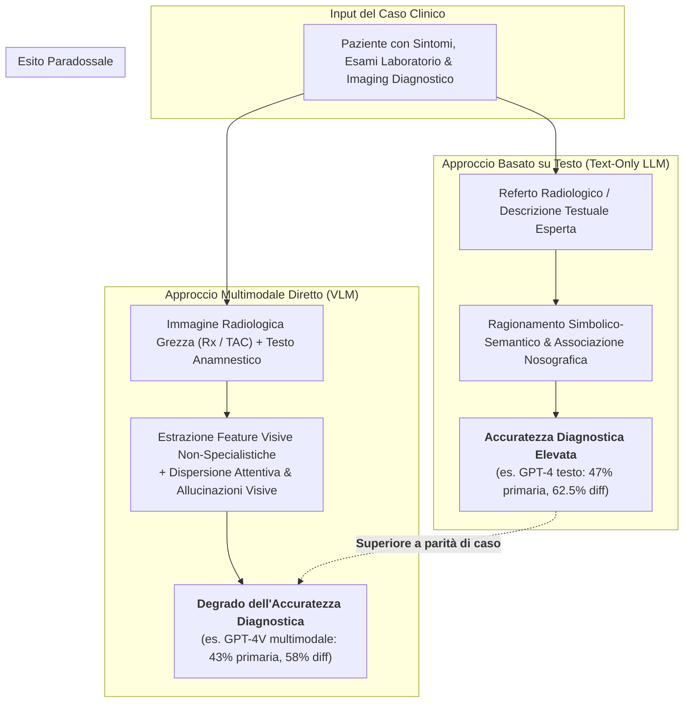
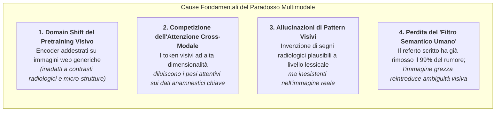
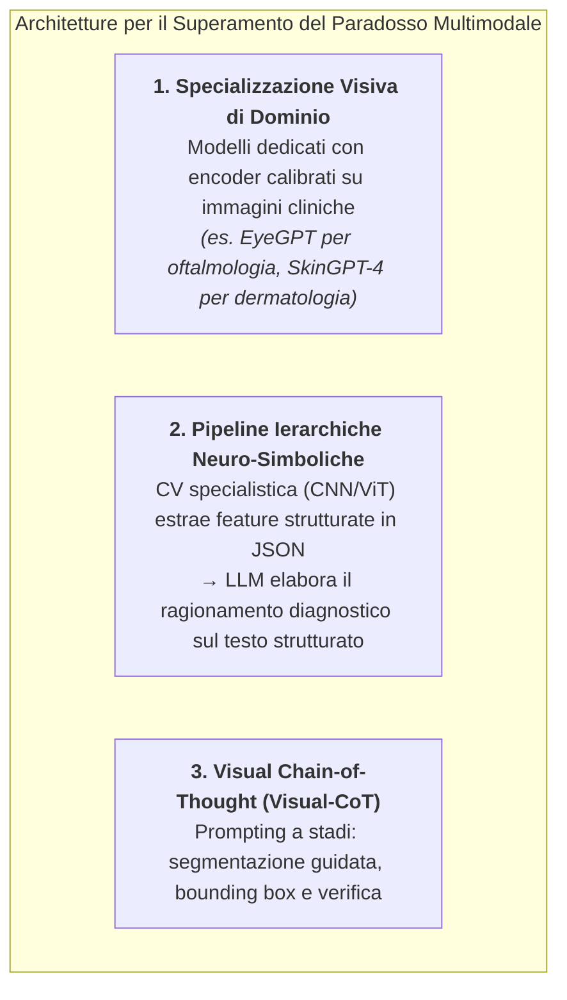

# The Multimodal Diagnostic Paradox in Clinical LLMs (Il Paradosso Diagnostico Multimodale nei Modelli Fondazionali Sanitari)

## Definizione Operativa
- Il **Multimodal Diagnostic Paradox** (Paradosso Diagnostico Multimodale) è il fenomeno empirico controintuitivo, formalizzato nella letteratura di informatica medica e documentato nella meta-analisi di Shan et al. (2025; *JMIR Med Inform*), secondo cui l'alimentazione diretta di modelli multimodali visione-linguaggio (*Vision-Language Models - VLMs*, come GPT-4V o Gemini Pro Vision) con dati di imaging diagnostico (radiografie, TAC, RMN, scansioni retiniche) **non migliora l'accuratezza diagnostica e frequentemente ne determina un netto peggioramento** rispetto all'elaborazione di soli prompt testuali strutturati o referti radiologici scritti.
- **La Discrepanza Chiave:** Mentre l'intuizione clinica suggerirebbe che fornire l'immagine originale unitamente all'anamnesi arricchisca il contesto decisionale, i benchmark evidenziano che i modelli puramente testuali (es. ChatGPT-4 text-only) ottengono un'accuratezza superiore rispetto alla loro controparte multimodale (es. GPT-4V text+vision) sullo stesso set di casi clinici (Horiuchi et al., 2025; Han et al., 2024; Suh et al., 2024).

---

## Evidenze Empiriche nella Letteratura Recente

La revisione sistematica di Shan et al. (2025) e i trial radiologici correlati evidenziano pattern quantitativi concordanti:

1. **Radiologia Muscoloscheletrica (Horiuchi et al., 2025; Eur Radiol):**
   - Nel confronto diretto su 106 casi complessi di radiologia muscoloscheletrica, **ChatGPT-4 basato su solo testo ha superato GPT-4V multimodale** sia nell'accuratezza della diagnosi primaria ($47\%$ vs $43\%$) sia nella Top-3 differenziale ($62.5\%$ vs $58.0\%$).
   - I radiologi umani di controllo hanno raggiunto il $47\%$ nella primaria e il $62.5\%$ nella Top-3, dimostrando che il testo ha permesso all'LLM di eguagliare i radiologi, mentre l'immagine grezza ha degradato la prestazione dell'IA.
2. **General Radiology & "Diagnosis Please" Cases (Suh et al., 2024; Radiology):**
   - Su 190 casi radiologici ad alta complessità tratti dalla rubrica *Diagnosis Please*, i modelli multimodali **GPT-4V e Gemini Pro Vision hanno mostrato una marcata inferiorità rispetto ai radiologi umani** (accuratezza Top-3 del $48.9\%$ per i modelli vs $60.5\%$ per i clinici umani).
   - I modelli multimodali hanno mostrato una frequente incapacità di discriminare reperti patologici focali sottili da artefatti tecnici.
3. **Vignette Cliniche Multimodali (Han et al., 2024; JAMA):**
   - Valutando le risposte a quesiti clinici con immagini associate, l'aggiunta della componente visiva non ha generato alcun guadagno diagnostico incrementale rispetto alla sola trascrizione testuale dei reperti, evidenziando una scarsa calibrazione cross-modale.

---

## Determinanti Meccanicistiche del Decadimento Multimodale

Il paradosso si spiega attraverso l'interazione di quattro vulnerabilità architetturali e semiotiche:

### 1. Domain Shift Radicale del Pre-Addestramento Visivo
- Gli encoder visivi dei VLM generici (come i modelli basati su architetture CLIP/ViT di GPT-4V) sono pre-addestrati su miliardi di coppie immagine-testo provenienti dal web (fotografie di oggetti, paesaggi, volti).
- L'imaging biomedico richiede capacità percettive radicalmente differenti: lettura di variazioni microscopiche di densità (unità Hounsfield in TAC), discriminazione di simmetrie anatomiche, interpretazione di pattern di intensità di segnale in RMN e orientamento spaziale tridimensionale. I pesi visivi generici non possiedono questa sensibilità specialistica.

### 2. Competizione dell'Attenzione Cross-Modale e Rumore Visivo
- Nelle architetture transformer multimodali, i token derivati dalle patch visive competono nello stesso meccanismo di *self-attention* con i token testuali.
- L'enorme quantità di token visivi generati da un'immagine radiologica grezza ad alta risoluzione finisce per "sommergere" i token testuali, distogliendo l'attenzione del modello da indizi anamnestici o di laboratorio critici e portando a conclusioni diagnostiche fuorvianti.

### 3. Allucinazioni Visive e Confabulazione di Pattern
- Senza un addestramento *few-shot* specifico o fine-tuning radiologico, i VLM tendono a conformare l'interpretazione dell'immagine alle aspettative generate dal prompt testuale.
- Se il prompt menziona "tosse e febbre", il modello tende ad "allucinare" opacità polmonari o addensamenti radiologici anche in radiografie toraciche perfettamente normali, compromettendo la specificità diagnostica.

### 4. Il Ruolo del Referto Testuale come "Distillato Semantico"
- Un referto radiologico redatto da un medico umano non è semplicemente una descrizione, ma un **distillato concettuale ad altissimo valore aggiunto**: il radiologo ha già filtrato il $99\%$ degli artefatti visivi irrilevanti, tradotto la morfologia in terminologia nosografica standardizzata e gerarchizzato le anomalie.
- Quando l'LLM lavora sul solo testo del referto, opera sul livello concettuale simbolico in cui eccelle; quando riceve l'immagine grezza, deve farsi carico dell'intero onere percettivo senza avere l'addestramento necessario per sostenerlo.

---

## Tabella Comparativa: Pipeline Testuale vs Pipeline Multimodale

| Dimensione | Approccio Text-Only (Referto/Vignetta) | Approccio Multimodale Grezzo (VLM) |
| :--- | :--- | :--- |
| **Tipo di Input** | Anamnesi, esami di laboratorio, referto di imaging scritto. | Testo clinico + immagini DICOM/JPEG non processate. |
| **Architettura AI** | LLM generativo standard (GPT-4, Claude 3.5 Sonnet). | Vision-Language Model (GPT-4V, Gemini Pro Vision). |
| **Accuratezza Diagnostica Primaria** | **Superiore** ($47\% - 60\%$ in compiti complessi). | **Inferiore** ($43\% - 48.9\%$ negli stessi compiti). |
| **Resistenza al Rumore** | **Elevata:** il testo codifica solo informazioni pertinenti. | **Bassa:** vulnerabile ad artefatti di scansione e falsi pattern. |
| **Rischio di Allucinazione** | Confabulazione semantica su dati anamnestici mancanti. | Allucinazione visiva (falsi reperti radiologici/retinici). |
| **Maturità Clinica Attuale** | **Pronta per Decision Support e Triage Testuale.** | **Sperimentale / Inadatta all'uso clinico senza fine-tuning.** |

---

## Soluzioni Architetturali e Direzioni Future

Per superare il paradosso multimodale, la letteratura identifica tre traiettorie di sviluppo:

1. **Sviluppo di Sistemi Visivi Specialistici di Dominio:**
   - Creazione di modelli verticali con encoder visivi addestrati esclusivamente su dataset clinici annotati (es. *EyeGPT* per le patologie retiniche, *SkinGPT-4* per la dermatologia, *ThyroAIGuide* con CoT ecografico).
2. **Architetture Ierarchiche a Due Stadi (Neuro-Simboliche):**
   - Separare la percezione dal ragionamento: un modello di Computer Vision specialistico (es. ResNet/ViT addestrato su radiografie) segmenta l'immagine e produce un output semantico strutturato (es. formato JSON con densità, coordinate della lesione e probabilità di reperto); successivamente, l'LLM analizza tale output combinandolo con l'anamnesi.
3. **Prompting Visual-CoT con Few-Shot Learning:**
   - Guidare il VLM attraverso stadi espliciti di ragionamento: 1) localizzazione anatomica, 2) descrizione oggettiva delle alterazioni di densità, 3) confronto con quadri normali, 4) sintesi diagnostica finale.

---

## Collegamenti Concettuali

- [[medinform-v13-e64963]] — Sintesi sistematica e meta-analisi di Shan et al. (2025).
- [[diagnostic-accuracy-gap-llm-vs-physicians]] — Il divario strutturale tra LLM e clinici umani.
- [[hybrid-neuro-symbolic-cdss]] — Sistemi di supporto alle decisioni ibridi che combinano visione, regole e LLM.
- [[xai-in-pediatric-surgery]] — Spiegabilità e interpretazione di immagini diagnostiche nei sistemi di intelligenza artificiale.
- [[modello-centauro-clinico]] — Collaborazione e supervisione umana nei compiti diagnostici.

