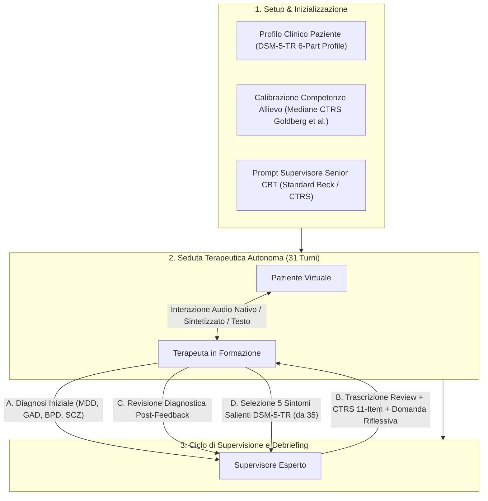

# MyMentorLLM Framework (Architettura Triadica di Simulazione per la Deliberate Practice CBT)

**Summary**: Framework di simulazione generativa multimodale (Rizzi et al., 2026) che riproduce l'intero ciclo di formazione e mentorship in Psicoterapia Cognitivo-Comportamentale (CBT) attraverso un'architettura triadica integrata: Paziente virtuale con ancoraggio DSM-5-TR, Terapeuta in formazione calibrato su dati empirici CTRS reali, e Supervisore clinico esperto per valutazione e debriefing formativo.
**Sources**: `2607.25667v1.pdf` (*arXiv:2607.25667v1*, 2026)
**Last updated**: 2026-08-27
---

## Definizione e Razionale del Framework

Tradizionalmente, le applicazioni di Intelligenza Artificiale in psicoterapia si sono focalizzate sulla simulazione diadica (paziente-chatbot) o sul tentativo di sostituire il clinico. **MyMentorLLM** (Rizzi, Grecucci, Stella, 2026) trasforma l'IA generativa in un **ambiente pedagogico di *deliberate practice*** (pratica deliberata), progettato per potenziare la formazione degli psicoterapeuti senza esporre i pazienti reali a rischi clinici precoci.

A differenza delle simulazioni testuali isolate, MyMentorLLM modella l'intero **ecosistema educativo della CBT**, integrando il colloquio clinico, la diagnosi differenziale, la valutazione standardizzata delle competenze ([[ctrs-automated-evaluation]]) e la supervisione maieutica basata su domande riflessive.

---

## Struttura del Sistema Cognitivo Triadico

Il framework opera mediante tre ruoli autonomi ma rigorosamente interconnessi:

### 1. Il Paziente Virtuale (DSM-5-TR Grounding)
- **Ancoraggio Clinico**: Adattato da casi studio reali di *DSM-5-TR Clinical Cases* (Barnhill, 2023):
  - *Disturbo Depressivo Maggiore (MDD)*: Caso "Despair" (Munday & Abelson), caratterizzato da anedonia, autosvalutazione e rallentamento psicomotorio;
  - *Disturbo d'Ansia Generalizzata (GAD)*: Caso "Always on Edge" (Lawrence & Cabaniss), focalizzato su rimuginio incontrollabile e tensione somatica;
  - *Disturbo Borderline di Personalità (BPD)*: Caso "Fragile and Angry" (Yeomans & Kernberg), dominato da instabilità affettiva e reattività interpersonale.
- **Profilazione a 6 Livelli**: Demografia, motivo consultazione, anamnesi, profilo sintomatologico, stile comunicativo e schemi cognitivo-emotivi.
- **Dinamica di Disclosure e Guardrail**: Le informazioni sensibili emergono gradualmente. Il modello include guardrail relazionali: se il terapeuta usa interventi invalidanti o intrusivi, il paziente si chiude o interrompe la seduta.

### 2. L'Allievo Terapeuta (*Data-Driven Trainee*)
- **Calibrazione Empirica Realistica**: Anziché simulare un terapeuta ideale o un bot onnisciente, la persona dell'allievo è calibrata sui dati reali di **1.264 sedute condotte da 413 clinici** (Goldberg et al., 2020), mappando le competenze sui punteggi mediani CTRS dei tirocinanti (es. conoscenza teorica presente ma applicazione meccanica delle tecniche).
- **Regole di Conduzione**: Mantenimento del setting, approfondimento tematico progressivo, linguaggio descrittivo e priorità assoluta alla gestione del rischio clinico.

### 3. Il Supervisore Esperto CBT
- **Valutazione Obiettiva**: Scoring degli 11 item della scala CTRS (0–6) ancorato ad estratti testuali specifici.
- **Debriefing Didattico**: Analisi metacognitiva, bilanciamento tra cambiamento e validazione, e chiusura con una **singola domanda riflessiva aperta e non prescrittiva** (orientata alla maieutica clinica).

---

## Modalità di Interazione e Scalabilità Sperimentale

MyMentorLLM supporta la comparazione sistematica tra diversi paradigmi di interazione:
1. **Native Speech-to-Speech** (es. Gemini 3.1 Flash Live): Elaborazione audio *end-to-end* che cattura prosodia, pause, esitazioni e timbro emotivo senza trascrizione intermedia.
2. **Audio Sintetizzato / Speech-Mediated** (es. Gemma-4 con OmniVoice): Elaborazione mista audio-testo-TTS.
3. **Text-Only Dialogue** (es. Gemma-4 text, Qwen3.5/3.6): Scambio puramente scritto.

Lo studio su 2.100 sedute ha dimostrato che **la modalità audio nativa è l'unica in grado di riprodurre fedelmente la reale competenza clinica umana (CTRS M=29.97 vs 31.04 umano)**, evitando l'artificiosa iper-competenza generata dalla fluidità del testo.

---

## Applicazioni Formative e Didattiche

- **Palestra Clinica a Zero Rischi**: Addestramento intensivo su quadri clinici complessi (es. BPD) prima del tirocinio ospedaliero o privato.
- **Valutazione Continua delle Competenze**: Monitoraggio oggettivo della progressione dell'allievo lungo le dimensioni CTRS.
- **Riconoscimento Sintomatologico Guidato**: Esercizio di estrazione dei cluster DSM-5-TR a partire dal materiale narrativo grezzo del paziente.

---

## Relazioni
- [[deliberate-practice-in-psicoterapia-ia]]: Quadro concettuale dell'addestramento deliberato.
- [[native-speech-vs-text-in-clinical-simulation]]: Differenze metodologiche tra parlato nativo e testo.
- [[risonanza-affettiva-simulazione-clinica]]: Sintonizzazione emotiva nel framework MyMentorLLM.
- [[over-deference-in-llm-supervision]]: Rischi pedagogici del feedback supervisivo nei modelli piccoli.
- [[ctrs-automated-evaluation]]: Strumento di scoring clinico impiegato nel supervisore.
- [[simulazione-pazienti-ai]]: Metodologie generali di patient simulation con LLM.
- [[supervisione-clinica-ai]]: Teoria e architetture di supervisione automatizzata.
- [[rizzi-et-al-2026]]: Sintesi dello studio empirico su MyMentorLLM.
