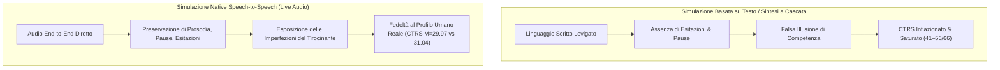

# Native Speech vs Text nella Simulazione Clinica (Audio Nativo vs Testo e Illusione di Competenza)

**Summary**: Analisi comparativa tra modelli generativi speech-to-speech nativi (*end-to-end*) e modelli basati su testo o sintesi vocale nella formazione psicoterapeutica. Evidenzia come la fluidità del testo generi una sovrastima artificiosa delle competenze cliniche (inflazione e saturazione della scala CTRS), mentre il parlato nativo preserva gli indici paralinguistici reali (prosodia, esitazioni, pause), replicando fedelmente il profilo di apprendimento umano.
**Sources**: `2607.25667v1.pdf` (*arXiv:2607.25667v1*, 2026), Goldberg et al. (2020), Low (2024), Muntigl (2016).
**Last updated**: 2026-08-27
---

## Il Divario tra Canale Vocale e Canale Testuale nella Psicoterapia

Nella pratica clinica reale, la psicoterapia non si svolge come uno scambio di messaggi scritti levigati ed esaustivi, ma come un'**interazione vocale situata, dinamica e temporalmente vincolata**. Gran parte dell'informazione clinicamente rilevante — sia per la diagnosi sia per la sintonizzazione emotiva — è distribuita non solo nel contenuto semantico delle parole, ma nel **livello paralinguistico**:
- Prosodia, tono e inflessione della voce;
- Pause di riflessione, silenzi imbarazzati o esitazioni verbali;
- Ritmo e alternanza dei turni di parola (*pacing* e *turn-taking*);
- Risonanza affettiva corporea e vocale.

Le simulazioni basate esclusivamente su testo (o che utilizzano pipeline a cascata *Speech-to-Text $\rightarrow$ LLM $\rightarrow$ Text-to-Speech*) eliminano questa dimensione paralinguistica, riducendo l'incontro clinico a una trascrizione artificialmente perfetta.

---

## Evidenze Empiriche: L'Inflazione del CTRS nei Modelli Testuali

Nello studio di Rizzi et al. (2026) su 2.100 sedute simulate, la valutazione quantitativa delle competenze del terapeuta tramite la **Cognitive Therapy Rating Scale (CTRS, range 0–66)** ha mostrato un contrasto netto tra le diverse modalità:

| Condizione Modello | Modalità Operativa | Punteggio CTRS Medio | Scostamento dal Baseline Umano ($M=31.04$) |
| :--- | :--- | :---: | :--- |
| **Umani (Goldberg et al., 2020)** | Sedute cliniche reali registrate | **31.04** ($SD = 11.10$) | *Baseline di riferimento* ($<40$ soglia di competenza) |
| **Gemini-3.1LA** | **Native Audio $\leftrightarrow$ Audio** | **29.97** ($SD = 7.06$) | **Coerenza perfetta con il livello di tirocinio umano** |
| Qwen3.6-35BT | Testo puro | 41.15 ($SD = 10.49$) | Sovrastima (+10.1 punti) |
| Gemma-4-12BA | Audio sintetizzato (OmniVoice) | 48.15 ($SD = 3.49$) | Sovrastima marcata (+17.1 punti) |
| Gemma-4-12BT | Testo puro | 50.66 ($SD = 4.11$) | Sovrastima marcata (+19.6 punti) |
| Qwen3.5-9BT | Testo puro | 52.91 ($SD = 10.41$) | Sovrastima severa (+21.9 punti) |
| Gemma-4-E2BA | Audio sintetizzato (OmniVoice) | 52.70 ($SD = 3.93$) | Saturazione della scala (+21.7 punti) |
| Gemma-4-E2BT | Testo puro | 55.99 ($SD = 3.52$) | Saturazione massima (+25.0 punti) |

---

## Fenomenologia dell'Illusione di Competenza (*Illusion of Competence*)

1. **Saturazione degli Item Qualitativi**: Nelle condizioni text-only, le dimensioni relative a *Comprensione Empatica*, *Efficacia Interpersonale* e *Individuazione delle Cognizioni Chiave* saturano costantemente verso i punteggi massimi della scala (5–6 su 6). Il testo scritto maschera la goffaggine o i tempi morti che caratterizzano un terapeuta novizio.
2. **Invarianza della Sintesi Vocale a Cascata**: L'aggiunta di una voce sintetizzata a valle di un modello testuale (come in Gemma-4 con OmniVoice) non corregge l'inflazione, poiché il testo generato rimane intrinsecamente strutturato e privo di dinamiche vocali native.
3. **Il Valore Pedagogico dell'Audio Nativo**: I modelli *speech-to-speech* nativi (es. Gemini 3.1 Flash Live Preview) elaborano direttamente le caratteristiche acustiche del parlato. La gestione del tempo, le sovrapposizioni vocali, le interruzioni e le esitazioni spontanee rendono l'interazione clinicamente realistica e vulnerabile agli stessi errori che si osservano nei clinici in formazione.

---

## Implicazioni per la Progettazione di Sistemi Formativi

- **Validità Ecologica del Training**: Per una formazione clinica realmente trasferibile alla pratica con pazienti umani, gli ambienti di simulazione devono privilegiare architetture vocali *end-to-end*.
- **Ricalibrazione dei Benchmark**: I benchmark di valutazione terapeutica basati esclusivamente su trascritti testuali rischiano di certificare falsi positivi di competenza clinica, sopravvalutando le capacità operative reali degli agenti o degli allievi.

---

## Relazioni
- [[mymentorllm-framework]]: Il framework di sperimentazione empirica del confronto voce vs testo.
- [[deliberate-practice-in-psicoterapia-ia]]: Ruolo della fedeltà multimodale nella deliberate practice.
- [[ctrs-automated-evaluation]]: Meccanismi di scoring e soglie di competenza clinica CBT.
- [[risonanza-affettiva-simulazione-clinica]]: Espressione paralinguistica delle emozioni nel dialogo clinico.
- [[rizzi-et-al-2026]]: Studio sperimentale comparativo su audio nativo e testo.
