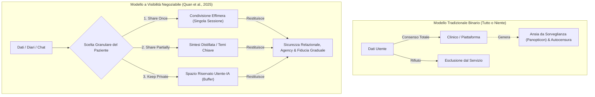

# Visibilità Negoziabile dei Dati e Privacy Dinamica in Sanità Mentale

**Summary**: Paradigma di sicurezza e governance del dato clinico (DG2, Quan et al., 2025) basato su un'architettura di privacy flessibile e multilivello (*share once, share partially, keep private*), progettato per mitigare l'effetto Panopticon e restituire agency relazionale ai pazienti marginalizzati nell'interazione con sistemi IA e terapeuti.
**Sources**: Quan et al. (2025) - `2512.22462v1.pdf`, Belen Saglam et al. (2021)
**Last updated**: 2026-08-27
---

## Il Problema della Privacy Rigida in Salute Mentale

Nelle tradizionali piattaforme di salute mentale digitale e cartelle cliniche elettroniche (EHR), la gestione della privacy segue un modello binario: o il paziente accetta una condivisione totale di note, registrazioni e test con il clinico e l'istituzione, oppure non può accedere al servizio.

Per i **pazienti appartenenti a minoranze stigmatizzate o vulnerabili** (es. comunità LGBTQ+, contesti istituzionali universitari o lavorativi), questo approccio rigido scatena gravi barriere:
1. **Paura della Sorveglianza e Rischio di Riconoscibilità (*Re-identification Risk*)**: Timore che confessioni intime o status non dichiarati vengano divulgati a datori di lavoro, famiglie o istituzioni.
2. **Effetto Panopticon (*Panopticon Effect*)**: La sensazione di essere continuamente osservati e registrati inibisce la spontaneità emotiva e blocca l'autosvelamento autentico (*authentic self-disclosure*).
3. **Mancanza di Plasticità Temporale**: Il livello di fiducia (*trust*) non è costante ma si sviluppa gradualmente lungo le sedute; un sistema che impone la condivisione prima che la fiducia sia consolidata provoca chiusura difensiva o falsificazione delle risposte.

---

## I Livelli di Condivisione Granulare (*Multi-Layer Consent*)

Come formalizzato nella **Design Guideline 2 (DG2)** di Quan et al. (2025), un'architettura di visibilità negoziabile deve offrire almeno tre modalità operative indipendenti:

| Modalità di Condivisione | Descrizione Operativa | Significato Clinico-Relazionale |
| :--- | :--- | :--- |
| **Share Once** (*Condividi una volta*) | Il dato (es. una nota di diario o un resoconto emotivo) viene reso visibile al terapeuta esclusivamente durante la sessione corrente e non archiviato nello storico permanente. | Permette di discutere un evento acuto senza il timore che rimanga impresso nella cartella clinica a lungo termine. |
| **Share Partially** (*Condivisione parziale/astratta*) | Il sistema non trasmette i trascritti integrali, ma genera un'astrazione tematica (es. "elaborazione di un conflitto relazionale", punteggio di stress) omettendo dettagli biografici sensibili. | Fornisce al terapeuta il segnale clinico utile preservando l'anonimato dei dettagli privati. |
| **Keep Private** (*Riserbo totale*) | L'interazione con l'IA rimane strettamente confinata tra l'utente e il chatbot, senza alcuna visibilità per il clinico. | Funge da spazio protetto di decompressione e auto-riflessione (*safe buffer zone*). |

---

## Implicazioni Architetturali per la Memoria degli LLM

L'adozione della visibilità negoziabile richiede vincoli tecnici stringenti sui modelli linguistici:
- **Disaccoppiamento tra memoria locale e memoria condivisa**: La memoria a lungo termine dell'IA (*relational memory*) deve applicare filtri di contesto rigorosi, impedendo la propagazione accidentale di informazioni etichettate come *Keep Private* nei prompt destinati alla sintesi per il terapeuta.
- **Diritto all'Oblio e Revocabilità**: Possibilità per l'utente di revocare in qualsiasi momento la visibilità di frammenti conversazionali passati.

---
## Concetti Correlati
- [[dynamic-boundary-mediation-framework]]
- [[boundary-objects-in-psychotherapy]]
- [[contextualized-relational-memory]]
- [[educator-burden-marginalized-clients]]
- [[etica-privacy-bias-ia-clinica]]
- [[three-layer-governance-framework]]
