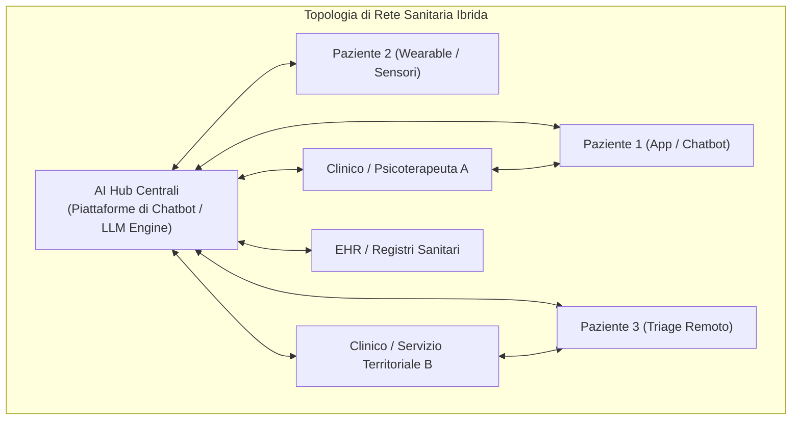

# Network-Based AI in Mental Healthcare (Reti Socio-Tecniche di Assistenza)

## Definizione Concettuale
Inquadramento sistemico e strutturale dell'Intelligenza Artificiale nella salute mentale, non come entità isolate o singoli applicativi software, ma come nodi operativi all'interno di **reti socio-tecniche complesse e distribuite**. Tali reti interconnettono dinamicamente pazienti, terapeuti umani, agenti conversazionali autonomi, cartelle cliniche elettroniche (EHR), sensori biometrici indossabili (*wearable*) e infrastrutture sanitarie telematiche (Rezaei et al., 2026).

---

## Topologia di Rete e Dinamiche di Flusso

### 1. Proprietà di Rete (*Small-World* e *Scale-Free*)
- **Connettività Small-World (*Piccolo Mondo*):** Consente una rapida propagazione delle informazioni e un accesso immediato a risorse di supporto a bassa soglia, riducendo le distanze geografiche e i tempi di attesa per il triage.
- **Distribuzione Scale-Free (*Invarianza di Scala*):** Alcune piattaforme digitali centralizzate (come Woebot, Wysa, Tess o Talkspace) fungono da **super-hub ad altissima connettività**, capaci di gestire milioni di interazioni contemporanee.

### 2. Vantaggi Sistemici
- **Resilienza e Scalabilità nelle Crisi:** Durante emergenze di sanità pubblica (es. pandemia da COVID-19), la struttura a rete ha permesso di assorbire picchi acuti di domanda psicologica offrendo supporto 24/7 a operatori sanitari e popolazioni vulnerabili.
- **Continuità Assistenziale Ibrida:** Integrazione dei flussi di dati generati dai pazienti (*patient-generated health data*, PGHD) tra una sessione terapeutica e l'altra, alimentando il monitoraggio in tempo reale e la prevenzione delle ricadute.

### 3. Rischi Sistemici e Vulnerabilità
- **Propagazione Centralizzata del Bias:** Errori di calibrazione, stereotipi o allucinazioni nel modello centrale dell'hub vengono istantaneamente replicati su tutti i nodi periferici della rete.
- **Punti Singoli di Fallimento (*Single Point of Failure*):** Disconnessioni infrastrutturali, violazioni della privacy dei dati o modifiche unilaterali delle policy commerciali possono compromettere l'accesso di intere comunità cliniche.
- **Isolamento Relazionale:** Rischio di creare circuiti chiusi "utente-bot" che ritardano o sostituiscono il necessario contatto con professionisti umani nei quadri clinici moderati o gravi.

---

## Implicazioni per la Pratica Psicoterapeutica e CBT

- **Modello Centauro e Presidio Umano:** Nelle reti socio-tecniche efficaci, l'IA non sostituisce la relazione diadica terapeuta-paziente ma agisce come nodo facilitatore per il self-monitoring, i compiti a casa (CBT homework) e la psicoeducazione.
- **Governance della Topologia:** Necessità di protocolli standardizzati di interfacciamento (es. RESTful MCP Bridge) per garantire interoperabilità sicura, trasparenza e tracciabilità clinica.

---

## Riferimenti Bibliografici
- Rezaei, Z., Khorraminia, A., Shi, D., & Banad, Y. M. (2026). Network-based artificial intelligence in mental healthcare: A systematic review of chatbots, artificial intelligence/machine learning models and ethical considerations in global healthcare networks. *DIGITAL HEALTH*, 12, 1–30. https://doi.org/10.1177/20552076261421688

---

## Pagine Correlate
- [[rezaei-et-al-2026]]
- [[mental-health-chatbot-taxonomy]]
- [[specialized-nlp-models-mental-health]]
- [[stepped-care-ai-integration]]
- [[modello-centauro-clinico]]
- [[human-in-the-reasoning]]
