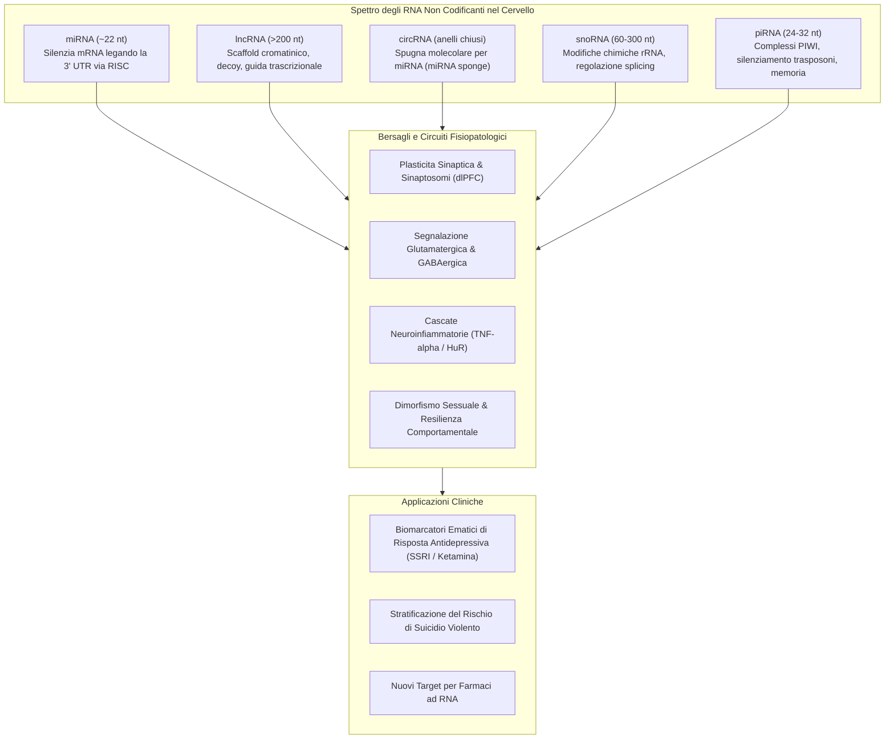

# Non-Coding RNA Biomarkers in Psychiatry (Biomarcatori di RNA Non Codificante nella Psichiatria)

## Definizione Operativa
Gli **RNA non codificanti (ncRNA)** rappresentano oltre il 90% dell'output trascrizionale del genoma umano e costituiscono una classe eterogenea di molecole regolatrici che non vengono tradotte in proteine, ma modulano l'espressione genica a livello epigenetico, trascrizionale e post-trascrizionale. Nella fisiopatologia del Disturbo Depressivo Maggiore (MDD) e del comportamento suicidario, classi distinte di ncRNA—inclusi **microRNA (miRNA)**, **long non-coding RNA (lncRNA)**, **circular RNA (circRNA)**, **small nucleolar RNA (snoRNA)** e **PIWI-interacting RNA (piRNA)**—svolgono un ruolo causale nella neuroplasticità, nella risposta allo stress e nella suscettibilità psicopatologica, emergendo come biomarcatori diagnostici e bersagli farmacologici (Wang & Dwivedi, 2025).

---

## Tassonomia e Meccanismi d'Azione degli ncRNA

---

## Classi di ncRNA e Scoperte Chiave

### 1. microRNA (miRNA, ~22 nucleotidi)
- **Biogenesi**: Trascrizione di pri-miRNA $\to$ clivaggio nucleare da DROSHA/DGCR8 in pre-miRNA $\to$ esportazione citoplasmatica via Exportin 5 $\to$ maturazione da parte di Dicer/TRBP $\to$ assemblaggio nel complesso silenziatore RISC con proteine Argonaute.
- **Rete Prefrontale nel Suicidio**: PCR array e sequencing hanno evidenziato una downregulation diffusa di miRNA nella corteccia prefrontale (PFC) di soggetti suicidi, con un modulo di 29 miRNA che coordina apoptosi, metilazione del DNA, splicing e crescita assonale (Smalheiser et al., 2012).
- **miRNoma Sinaptico (Synaptosomal miRNome)**: Isolamento di sinaptosomi purificati dalla dlPFC di soggetti depressi ha rivelato **351 miRNA differenzialmente espressi**, dimostrando una perturbazione specifica della regolazione post-trascrizionale locale alle sinapsi (Yoshino et al., 2021).
- **Marcatori Funzionali Specifici**:
  - **miR-124-3p**: Iperespresso nel cervello e nel sangue di pazienti con MDD, controlla le vie di neurotrasmissione glutamatergica (Roy et al., 2017).
  - **miR-19a-3p e TNF-α**: Nei soggetti morti per suicidio, miR-19a-3p non riesce a legarsi e reprimere l'mRNA della citochina pro-infiammatoria TNF-α a causa della competizione con la proteina legante l'RNA **HuR**, provocando una neuroinfiammazione cronica non controllata (Wang et al., 2018).
  - **miR-1202**: miRNA primato-specifico ed espresso selettivamente nel cervello, arricchito nel controllo del recettore metabotropico del glutammato GRM4; i suoi livelli predicono la risposta agli antidepressivi (Lopez et al., 2014; Fiori et al., 2017).
  - **miR-135a, miR-16, miR-146a/b-5p, miR-425-3p**: Biomarcatori circolanti di efficacia terapeutica e modulatori dei pathway MAPK/Wnt.

### 2. Long Non-Coding RNA (lncRNA, >200 nucleotidi)
Circa il 40% dei lncRNA umani è espresso specificamente nel cervello, dove agisce regolando l'architettura tridimensionale della cromatina e lo splicing alternativo:
- **LINC00473 (Dimorfismo Sessuale e Resilienza)**: Esclusivamente downregolato nella PFC di donne con depressione; la sua espressione promuove la resilienza neurale e comportamentale femminile contro lo stress (Issler et al., 2020).
- **FEDORA**: lncRNA arricchito in neuroni e oligodendrociti, upregolato nella PFC e nel sangue di donne affette da MDD; i suoi livelli ematici scendono rapidamente e specificamente dopo trattamento efficace con **ketamina** (Issler et al., 2022).
- **LINC01268 (Suicidio Violento e Aggressività)**: Iperespresso nella PFC di vittime di suicidio con metodi violenti; varianti genetiche (SNP) che aumentano l'espressione di LINC01268 correlano con tratti di aggressività lifetime e iporeattività funzionale della PFC (fMRI) durante l'elaborazione di stimoli facciali minacciosi (Punzi et al., 2019).

### 3. Circular RNA (circRNA)
- Molecole chiuse a struttura covalente derivanti dal back-splicing esonico, immuni all'azione delle esonucleasi lineari e dotate di emivita prolungata.
- Fungono da "spugne" capaci di sequestrare miRNA specifici:
  - Biomarcatori ematici alterati nel MDD includono `hsa_circRNA_103636`, `circFKBP8`, `circMBNL1` e `circDYM` (Cui et al., 2016; Shi et al., 2021).

### 4. Small Nucleolar RNA (snoRNA) e PIWI-interacting RNA (piRNA)
- **snoRNA**: Noti originariamente per la modificazione chimica dell'rRNA nucleolare, regolano anche lo splicing alternativo. Il trattamento con antidepressivi monoaminergici up-regola **`SNORD90`**, il quale reprime la neuregulina 3 (`NRG3`) e aumenta i livelli sinaptici di glutammato, esercitando un'azione terapeutica (Lin et al., 2023). Nei sinaptosomi corticali di pazienti psichiatrici, **`SNORD85`** risulta ridotto del 50%.
- **piRNA**: Piccoli RNA (24–32 nt) che agiscono in complessi con le proteine PIWI indipendentemente da Dicer; modelli murini knockout per `Miwi/Piwil1` e `Piwil2` manifestano iperattività, comportamenti ansiosi e deficit di memoria di paura, dimostrando un ruolo regolatorio nel sistema nervoso centrale (Nandi et al., 2016; Sato et al., 2023).

---

## Valore Traslazionale e Clinico

1. **Biopsia Liquida ad Alta Stabilità**: La resistenza enzimatica di lncRNA, circRNA e miRNA (specialmente incapsulati in esosomi) li rende substrati ideali per test molecolari su sangue periferico.
2. **Sottotipizzazione Sesso-Specifica**: La dipendenza dal genere di lncRNA come *LINC00473* e *FEDORA* impone lo sviluppo di pannelli diagnostici e terapeutici differenziati per sesso biologico.
3. **Predizione della Risposta Rapida**: Marcatori come *FEDORA* e *miR-1202* permettono di identificare precocemente i pazienti idonei a trattamenti non convenzionali (es. ketamina, esketamina, modulazione glutamatergica).

---

## Relazioni nel Knowledge Base
- [[wang-dwivedi-2025]]: Sintesi sistematica della review di riferimento.
- [[multi-omics-depression-suicide]]: Integrazione sistemica con altri strati biologici.
- [[peripheral-blood-biomarkers-and-exosomes-in-mdd]]: Trasporto di ncRNA attraverso la barriera emato-encefalica.
- [[single-cell-and-spatial-transcriptomics-in-mental-health]]: Espressione cellula-specifica di ncRNA nel tessuto cerebrale.
- [[ai-multi-omics-psychiatric-biomarkers]]: Analisi computazionale di profili di ncRNA tramite Machine Learning.
