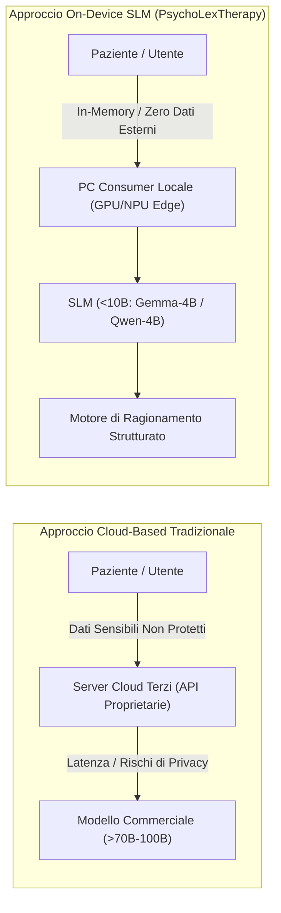

# Small Language Models (SLM) On-Device per la Salute Mentale

**Summary**: Paradigma di implementazione clinico-computazionale che sfrutta modelli linguistici compatti (<10 miliardi di parametri, come Gemma-4B o Qwen-4B) eseguiti interamente su hardware locale (*on-device*). Questo approccio garantisce la riservatezza assoluta dei dati psicologici sensibili, riduce la latenza, abbatte i costi infrastrutturali e, se supportato da percorsi di ragionamento strutturati (*structured reasoning paths*), eguaglia o supera le prestazioni di modelli cloud di grandi dimensioni privi di logica terapeutica.
**Sources**: `2510.03913v1.pdf` (Abbasi & Naderi, 2025: *PsychoLexTherapy: Simulating Reasoning in Psychotherapy with Small Language Models in Persian*)
**Last updated**: 2026-08-27
---

## Il Trade-Off tra Dimensione del Modello, Privacy e Accuratezza Clinica

L'uso di Large Language Models commerciali erogati via cloud (es. GPT-4o, Claude-3.7) nella salute mentale solleva interrogativi etici insormontabili:
- **Rischi di Fuga e Profilazione dei Dati**: I vissuti intimi, i traumi e le dichiarazioni di crisi dei pazienti rischiano di transitare su server proprietari, violando normative severe sulla privacy sanitaria (GDPR, HIPAA, direttive nazionali).
- **Costi e Dipendenza da Connessione**: L'accesso continuo ad API esterne rende insostenibile l'adozione in contesti con risorse limitate o in aree prive di banda ultra-larga.
- **Opacità della Sovranità del Dato**: Nei paesi con lingue e culture sotto-rappresentate (come l'Iran e il mondo persofono), l'esportazione di dati verso provider esteri crea vulnerabilità di sicurezza e conformità etica.

La risposta computazionale risiede nell'adozione di **Small Language Models (SLMs)** locali.

---

## Valutazione delle Competenze di Dominio negli SLM

Affinché un modello compatto possa essere impiegato in un contesto di supporto psicologico, è necessario verificare preliminarmente che la riduzione dei parametri non abbia compromesso le nozioni teoriche fondamentali di psicologia.

### Risultati del Benchmarking su PsychoLexEval (Abbasi & Naderi, 2025)

Gli autori hanno valutato 8 modelli open-source in modalità *zero-shot* (3.430 domande di psicologia specialistica in persiano):

| Famiglia Modello | Dimensione Parametri | Accuratezza Zero-Shot | Idoneità al Deployment On-Device |
| :--- | :---: | :---: | :--- |
| **Gemma-3** | **7.8B** | **55,2%** | Elevata (richiede GPU consumer con 12-16GB VRAM) |
| **Qwen-3** | **8.2B** | **53,0%** | Elevata |
| **Gemma-3 (Scelto)** | **4.3B** | **50,4%** | **Ottimale (eseguibile su singolo PC con 8GB RAM/VRAM)** |
| **Qwen-3** | **4.0B** | **48,3%** | Ottimale |
| Gemma-3 | 1.0B | 33,1% | Insufficiente (compromissione semantica di dominio) |
| Mistral | 7.2B | 31,2% | Bassa competenza in persiano specifico |
| LLaMA-3.2 | 3.2B | 28,7% | Bassa competenza su compiti clinici in Farsi |
| LLaMA-3.2 | 1.2B | 21,3% | Prestazioni vicine al caso casuale (25%) |

*Criterio di Selezione Clinico-Informatica*: **Gemma-4B** (4.3B) è stato scelto come base per PsychoLexTherapy poiché garantisce una solida competenza clinico-teorica (50,4% di accuratezza accademica) mantenendo un'impronta computazionale compatibile con laptop e desktop ordinari senza schede video professionali.

---

## Compensare i Limiti dei Piccoli Modelli tramite Architetture di Ragionamento

I modelli compatti (<10B) soffrono intrinsecamente di una minore capacità di inferenza libera a lungo raggio rispetto ai modelli da centinaia di miliardi di parametri. Tuttavia, la ricerca dimostra che:
1. **La Struttura Supplisce alla Scala**: Guidare un modello da 4B tramite percorsi a passi prefissati ([[therapeutic-reasoning-paths]]) consente di superare nei giudizi di empatia e allineamento terapeutico anche modelli massivi interrogati con prompt generici.
2. **Disaccoppiamento del Flusso**: Far generare allo SLM la traccia analitica come passaggio logico intermedio non visibile all'utente previene allucinazioni ed errori di tono.
3. **Memoria Modulare Separata**: L'uso di un gestore di stato esterno ([[memory-augmented-therapeutic-dialogue]]) libera i parametri del modello dal dover comprimere l'intera cronologia nella finestra di contesto, riducendo drasticamente il degrado prestazionale.

---

## Vantaggi Etici e Operativi

- **Privacy-by-Design**: I dati non lasciano mai la memoria volatile o lo storage protetto del dispositivo dell'utente o del terapeuta.
- **Resilienza e Sovranità**: Il sistema funziona interamente offline, garantendo continuità operativa anche in situazioni di isolamento di rete o interruzioni di connettività.
- **Democratizzazione della Ricerca**: Ricercatori e clinici in contesti a basse risorse possono replicare, analizzare ed eseguire audit completi sui modelli senza sostenere costi di inferenza commerciale.

---

## Concetti Correlati

- [[psycholextherapy-framework]]: Il framework interamente basato su SLM on-device.
- [[therapeutic-reasoning-paths]]: La metodologia algoritmica che potenzia le capacità degli SLM.
- [[memory-augmented-therapeutic-dialogue]]: Modulo MemoBase per l'estensione della memoria locale.
- [[persian-psychotherapy-benchmarks]]: I dataset di validazione per modelli compatti.
- [[etica-privacy-bias-ia-clinica]]: Normative e principi di governance per i dati sanitari.
