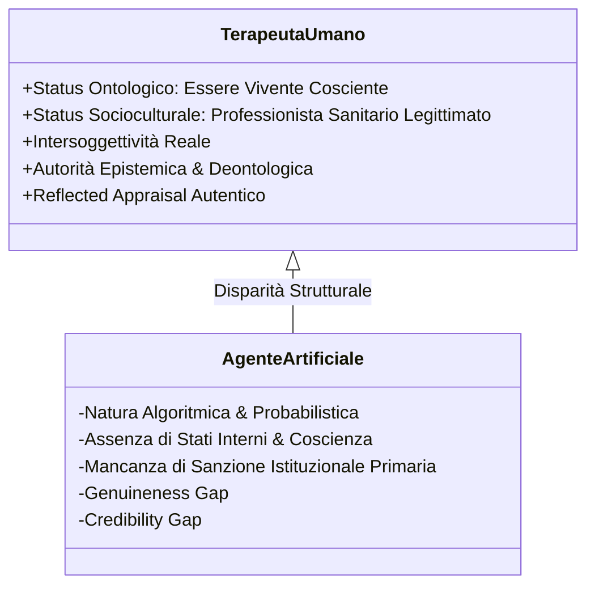

# Status Ontologico e Socioculturale del Terapeuta

**Summary**: Concettualizzazione proposta da Herbener & Damholdt (2025) dei due pilastri costitutivi che rendono la figura del terapeuta umano un ingrediente attivo insostituibile nei processi di cambiamento psicoterapeutico, distinguendola strutturalmente dagli agenti artificiali.
**Sources**: Herbener & Damholdt (2025) - `2509.02144v1.pdf`
**Last updated**: 2026-08-27
---

## Definizione dei Due Pilastri

Nel framework teorico di Herbener & Damholdt (2025), l'efficacia della psicoterapia tradizionale poggia su due condizioni fondamentali radicate nella natura del clinico umano:

1. **Status Ontologico (*Ontological Status*)**:
   - Riguarda la natura intrinseca del terapeuta come **essere umano cosciente**, dotato di soggettività, stati mentali interni autentici, corporeità, intenzionalità e vulnerabilità esistenziale condivisa.
   - Permette l'intersoggettività autentica, la risonanza affettiva corporea, la relazione reale (Gelso, 2014) e la convalida del Sé tramite il [[reflected-appraisal-in-ai-therapy|Reflected Appraisal]].

2. **Status Socioculturale (*Sociocultural Status*)**:
   - Riguarda la posizione del terapeuta come **professionista della salute mentalmente e legalmente sanzionato** dalla comunità e dalle istituzioni sanitarie (Frank & Frank, 1991).
   - È supportato da credenziali formali, percorsi formativi abilitanti, adesione a codici etico-deontologici, supervisione e riconoscimento sociale dell'autorità epistemica.
   - Consente la rimoralizzazione del paziente, attiva le euristiche dell'esperto e consolida aspettative di miglioramento positive (*outcome expectations*).

---

## Confronto Strutturale: Terapeuta Umano vs. Agente IA

| Dimensione | Terapeuta Umano | Agente Artificiale (LLM / Bot) | Conseguenza dell'Assenza nell'IA |
| :--- | :--- | :--- | :--- |
| **Coscienza e Intenzionalità** | Stati mentali soggettivi, risonanza affettiva, autenticità intenzionale. | Dispositivo probabilistico guidato da pattern statistici nei pesi neurali. | **[[genuineness-gap\|Genuineness Gap]]**: Mancanza di convalida del Sé e depotenziamento delle esperienze emotive correttive. |
| **Intersoggettività (Stern)** | Comprensione reciproca di intenzioni ed emozioni condivise. | Simulazione sintattica superficiale senza comprensione semantico-esperienziale. | Incapacità di soddisfare pienamente i bisogni umani primari di appartenenza e attaccamento. |
| **Legittimazione Istituzionale** | Ordini professionali, abilitazione di Stato, responsabilità legale e morale. | Software programmato, privo di status giuridico autonomo e riconoscimento deontologico. | **[[credibility-gap\|Credibility Gap]]**: Riduzione dell'autorità di influenza e minore ricettività del paziente. |
| **Prototipo Cognitivo** | Corrisponde al modello interiorizzato di curante (titoli, esperienza, empatia viva). | Attiva euristiche contrastanti (*Machine Heuristics* di computazione fredda). | Minore mobilitazione della speranza e rischio di drop-out precoce. |

---

## Implicazioni Epistemiche per la Psicoterapia Digitale

L'emulazione impeccabile del comportamento conversazionale e delle tecniche terapeutiche (es. ristrutturazione cognitiva, validazione verbale) è una possibilità tecnologica ormai raggiunta, ma **non equivale a riprodurre i processi di cambiamento della psicoterapia**.

Gli autori sottolineano che:
- La psicoterapia non è riducibile a un insieme di istruzioni tecniche disincarnate; è una **prassi di guarigione socialmente situata e relazionalmente fondata**.
- L'assenza dello status ontologico e socioculturale impone di non considerare gli agenti IA come "terapeuti autonomi", bensì come strumenti avanzati all'interno di un'architettura **[[blended-care-ai-framework|Blended Care]]** supervisionata da clinici umani.

---

## Relazioni
- [[herbener-damholdt-2025]]
- [[genuineness-gap]]
- [[credibility-gap]]
- [[reflected-appraisal-in-ai-therapy]]
- [[machine-heuristics-in-therapy]]
- [[blended-care-ai-framework]]
- [[common-vs-specific-factors]]
