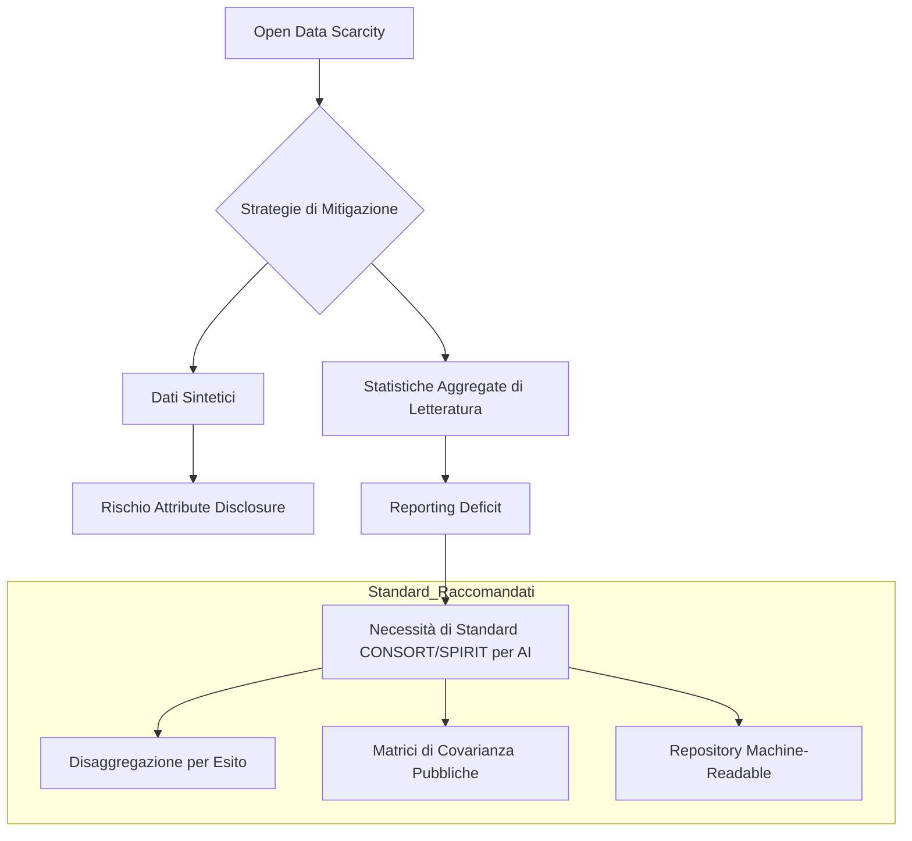

# Scarsità di Dati Aperti, Privacy e Rischi di Re-Identificazione in Psicologia Clinica

## Definizione Operativa
La *Open Data Scarcity* (scarsità di dati aperti) in psicologia clinica e psichiatria rappresenta una barriera metodologica critica allo sviluppo di modelli predittivi e sistemi di supporto decisionale basati su IA. Essa è definita dall'impossibilità di accedere e condividere dataset clinici multicentrici a causa di stringenti vincoli etici (Dichiarazione di Helsinki), normativi (GDPR) e della natura altamente sensibile dei dati di salute mentale (diagnosi, profili psicometrici, rischio di stigma). L'alternativa dei dati sintetici presenta rischi di *Attribute Disclosure* e *Membership Inference*, portando a considerare le statistiche descrittive aggregate di letteratura come una via sicura (*privacy-preserving*) ma attualmente frustrata da un diffuso *reporting deficit*.

## Evidenze dalla Letteratura
La ricerca in salute mentale soffre di una severa carenza di dati aperti, limitando la ricerca a campioni ridotti (N < 500), favorendo l'overfitting e ostacolando la generalizzabilità dei modelli.

### Dati Sintetici e Rischi di Re-Identificazione
L'impiego di GAN e VAE per creare dati sintetici (Goncalves et al., 2020) non garantisce la privacy. Come dimostrato da Hittmeir et al. (2020), la memorizzazione di attributi rari in modelli addestrati su dataset ristretti permette attacchi di re-identificazione tramite informazioni ausiliarie.

### Alternativa: Statistiche di Letteratura
Jacobs et al. (2026) propongono l'uso di statistiche pubblicate (medie, deviazioni standard, matrici di correlazione) per simulare coorti, azzerando il rischio di re-identificazione. Tuttavia, un'analisi su 188 pubblicazioni relative al trattamento CBT per il DOC ha rivelato che solo 7 studi forniscono dati sufficienti per la simulazione, a causa di una sistematica omissione di statistiche disaggregate per esito clinico e matrici di covarianza.

**Riferimenti Bibliografici:**
*   Jacobs, et al. (2026). *Analisi della riproducibilità mediante dati simulati da letteratura* (Paper: `2601.06159v1.pdf`).
*   Hittmeir, et al. (2020). *Rischi di Attribute Disclosure in dati sintetici clinici*.
*   Goncalves, et al. (2020). *Modelli generativi per la privacy in salute mentale*.

## Relazioni

*   [[jacobs-et-al-2026]]
*   [[pretraining-simulated-data-clinical-ml]]
*   [[mccv-and-statistical-validation-clinical-ml]]
*   [[etica-privacy-bias-ia-clinica]]
*   [[treatment-outcome-and-relapse-prediction]]
