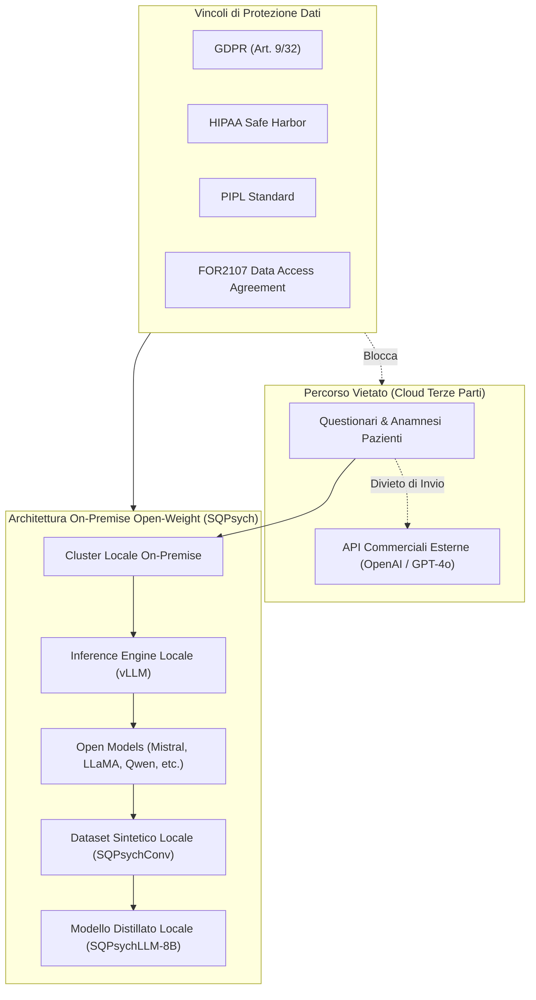

# Sintesi Clinica Privacy-Compliant con LLM Open-Weight Locali

## Definizione Operativa

Il paradigma di **Sintesi Clinica Privacy-Compliant** si riferisce a un metodo architetturale e metodologico volto alla generazione di dataset sintetici e all'addestramento di agenti per la salute mentale, basato esclusivamente su modelli fondazionali *open-weight* eseguiti *on-premise*.

Questo approccio è progettato per eliminare la trasmissione di dati clinici sensibili e questionari verso servizi API commerciali proprietari (es. OpenAI), garantendo la conformità alle normative sulla protezione dei dati sanitari (GDPR, HIPAA, PIPL).

## Evidenze dalla Letteratura

L'elaborazione di dati sanitari relativi alla salute mentale è soggetta a rigidi quadri regolatori:
- **GDPR (Regolamento UE 2016/679)**: Gli articoli 9 e 32 impongono tutele speciali per i dati biometrici e relativi alla salute.
- **HIPAA (USA) e PIPL (Cina)**: Proibiscono la divulgazione non autorizzata o la trasmissione a terze parti di cartelle cliniche e identificatori psicometrici.

La letteratura (Vu et al., 2025) evidenzia come l'uso di API proprietarie per la generazione di dialoghi sintetici (es. CACTUS, SMILE) violi gli accordi di governance clinica (es. consorzio FOR2107) e impedisca la riproducibilità scientifica a causa degli aggiornamenti opachi dei modelli chiusi.

Il framework **SQPsych** dimostra che è possibile:
1. **Host locale via vLLM**: Eseguire modelli di grandi dimensioni (27B–123B) su cluster locali (es. NVIDIA A100) mantenendo il controllo totale del flusso dati.
2. **Distillazione efficiente**: Trasferire le competenze di counseling clinico su modelli compatti (8B) tramite fine-tuning completo su dati sintetici locali (SQPsychConv), ottenendo performance superiori alle baseline proprietarie con una frazione del volume di dati (10%).

**Riferimenti Bibliografici:**
*   Vu, et al. (2025). *Roleplaying with Structure: Synthetic Therapist-Client Conversation Generation from Questionnaires*.

## Relazioni

- [[sqpsych-framework]]: Architettura di generazione sintetica SQPsych.
- [[vu-et-al-2025]]: Sintesi del paper di riferimento.
- [[etica-privacy-bias-ia-clinica]]: Principi di governance, etica e sicurezza nei sistemi di intelligenza artificiale clinica.
- [[specialized-nlp-models-mental-health]]: Panoramica dei modelli NLP specializzati e distillati per la salute mentale.
- [[three-layer-governance-framework]]: Framework di governance per l'impiego di agenti intelligenti in psicoterapia.
