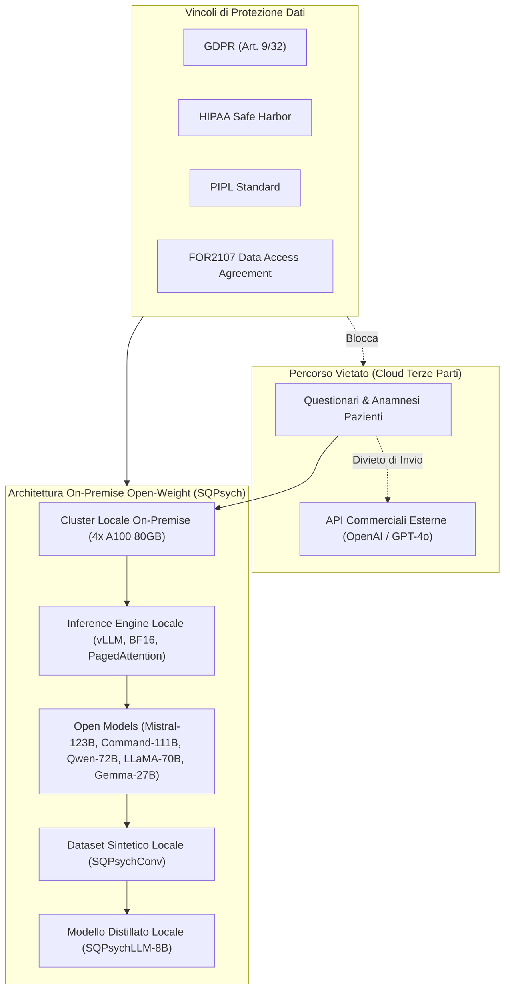

# Sintesi Clinica Privacy-Compliant con LLM Open-Weight Locali

**Summary**: Paradigma architetturale e metodologico per la generazione di dataset sintetici e l'addestramento di agenti per la salute mentale basato esclusivamente su modelli fondazionali open-weight eseguiti on-premise. Questo approccio garantisce la piena conformità alle normative sulla privacy dei dati sanitari (GDPR, HIPAA, PIPL), superando il divieto di trasmissione di dati clinici e questionari sensibili verso servizi API commerciali proprietari (es. OpenAI).
**Sources**: `2510.25384v1.pdf` (Vu et al., 2025: *Roleplaying with Structure: Synthetic Therapist-Client Conversation Generation from Questionnaires*)
**Last updated**: 2026-08-27
---

## Il Conflitto Normativo tra Dati Clinici e API Proprietarie

L'elaborazione di dati sanitari relativi alla salute mentale è soggetta a quadri regolatori estremamente restrittivi:
- **GDPR (Regolamento UE 2016/679)**: Gli articoli 9 e 32 impongono tutele speciali per i dati biometrici e relativi alla salute, richiedendo che qualsiasi trasferimento di dati all'esterno di ambienti controllati sia rigorosamente limitato e auditato.
- **HIPAA (Health Insurance Portability and Accountability Act, USA)** e **PIPL (Personal Information Protection Law, Cina)**: Proibiscono la divulgazione non autorizzata o la trasmissione a terze parti di cartelle cliniche e identificatori psicometrici anche parzialmente anonimizzati.

La maggior parte delle ricerche pregresse sulla generazione di dialoghi sintetici (es. CACTUS, SMILE) ha impiegato API commerciali proprietarie (GPT-4o, ChatGPT, GPT-3.5). Tale pratica:
1. **Viola gli Accordi di Governance**: Gli access terms dei repository clinici (es. consorzio *FOR2107*) vietano esplicitamente l'invio dei dati dei pazienti a infrastrutture cloud non certificate di terze parti.
2. **Impedisce la Riproducibilità e l'Audit**: I modelli proprietari a codice chiuso subiscono aggiornamenti continui non documentati che compromettono la riproducibilità scientifica.

---

## Pipeline di Generazione Locale e Distillazione

Nel framework **SQPsych** (Vu et al., 2025), la conformità etico-legale è garantita dall'integrazione di tre pilastri tecnologici:

### 1. Hosting Locale ad Alte Prestazioni via vLLM
I modelli fondazionali a pesi aperti (*open-weight*) vengono eseguiti direttamente su nodi di calcolo locali dedicati (4 GPU NVIDIA A100 80GB VRAM) mediante runtime `vLLM` con gestione della memoria basata su *PagedAttention*:
- **Controllo Totale del Flusso Dati**: Nessun frammento di informazione esce dal perimetro di rete dell'istituzione di ricerca.
- **Supporto Modelli di Grandi Dimensioni (27B–123B)**:
  - *Mistral-Large-Instruct-2407* (123B)
  - *c4ai-command-a-03-2025* (111B)
  - *Qwen2.5-72B-Instruct* (72B)
  - *Llama-3.3-70B-Instruct* (70B)
  - *Llama-3_3-Nemotron-Super-49B-v1* (49B)
  - *QwQ-32B* (32B)
  - *Gemma-3-27b-it* (27B)

### 2. Distillazione di Competenze Cliniche su Modelli Compatti (8B)
Una volta generato il corpus di dialoghi sintetici multi-turno (**SQPsychConv**), le capacità di counseling clinico vengono trasferite a modelli compatti ed efficienti (**SQPsychLLM**) tramite fine-tuning completo su `Llama-3-8B-Instruct` in precisione BF16 con gli stessi iperparametri di riferimento (CAMEL).

---

## Vantaggi Operativi e Prestazionali

1. **Efficienza dei Dati (*Data Efficiency*)**:
   - I modelli SQPsychLLM-8B superano le baseline proprietarie (come CAMEL addestrato su GPT-4o) impiegando **solo il 10% del volume di turni conversazionali** (64k–100k utterance vs 995k di CACTUS).
2. **Costi e Sostenibilità di Erogazione**:
   - I modelli distillati da 8B possono essere rilasciati open-source ed eseguiti su hardware commodity (singola GPU consumer da 16–24GB), abilitando strumenti di supporto psicologico a basso costo per l'autocura e la formazione clinica.
3. **Trasparenza e Ispezionabilità dei Pesi**:
   - L'accesso completo ai pesi del modello consente l'audit approfondito delle attivazioni neurali, la mitigazione mirata dei bias e l'analisi della sicurezza prima dell'impiego.

---

## Pagine Correlate
- [[sqpsych-framework]]: Architettura di generazione sintetica SQPsych.
- [[vu-et-al-2025]]: Sintesi del paper di riferimento.
- [[etica-privacy-bias-ia-clinica]]: Principi di governance, etica e sicurezza nei sistemi di intelligenza artificiale clinica.
- [[specialized-nlp-models-mental-health]]: Panoramica dei modelli NLP specializzati e distillati per la salute mentale.
- [[three-layer-governance-framework]]: Framework di governance per l'impiego di agenti intelligenti in psicoterapia.
