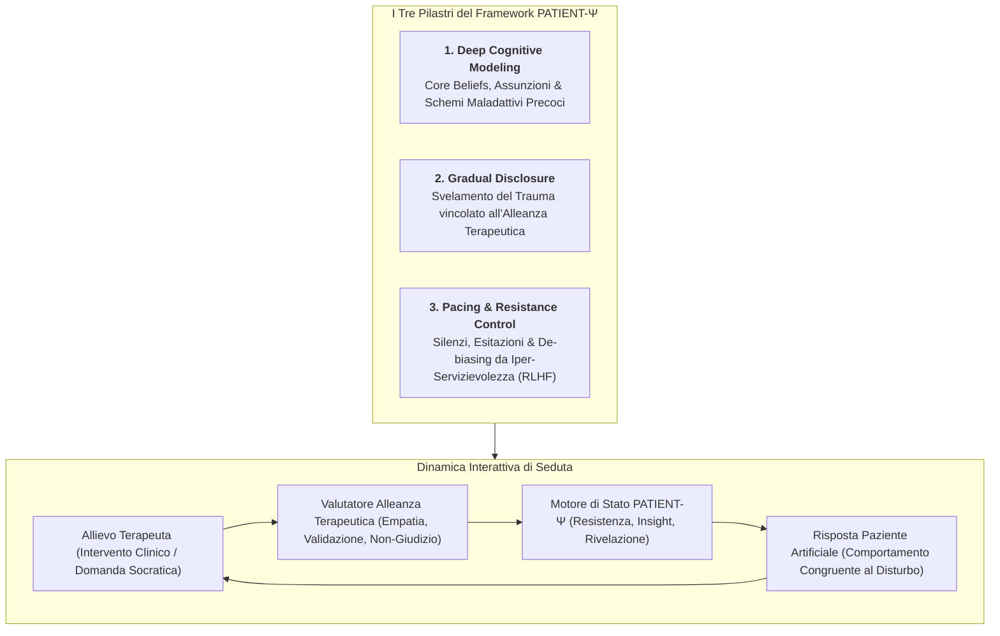
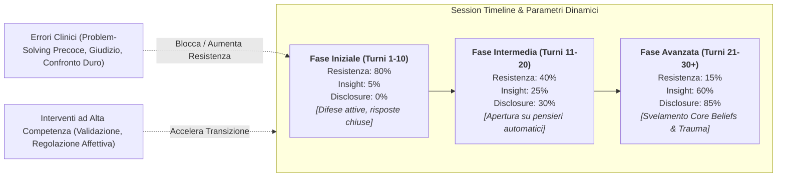
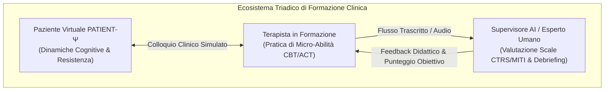

# Framework PATIENT-Ψ per la Simulazione di Pazienti Artificiali e Gradual Disclosure

## Definizione Operativa
- Il **Framework PATIENT-Ψ** è un'architettura avanzata per la simulazione generativa di **pazienti artificiali realistici ed ecologici**, ideata specificamente per l'addestramento clinico e la [[deliberate-practice-in-psicoterapia-ia|Deliberate Practice]] di psicologi, psicoterapeuti e psichiatri in formazione.
- **Superamento della Caricatura Sintomatica:** I sistemi di simulazione tradizionali e i chatbot standard generano rappresentazioni caricaturali e bidimensionali del disagio mentale, basandosi su mere checklist di criteri descrittivi del DSM-5. PATIENT-Ψ modella il paziente virtuale come un sistema cognitivo-affettivo profondo ancorato a:
  1. **Deep Cognitive Modeling (Programmazione Profonda):** Definizione esplicita di schemi cognitivi disfunzionali, credenze condizionali e *Core Beliefs* nucleari (es. credenze di indegnità, abbandono, vulnerabilità o difettosità).
  2. **Gradual Disclosure (Rivelazione Graduale Condizionata):** Meccanismo algoritmico che impedisce al paziente artificiale di confessare precocemente il proprio trauma o i conflitti nucleari, subordinando lo svelamento al livello qualitativo dell'alleanza terapeutica e della sintonizzazione empatica instaurata dal clinico.
  3. **Pacing Emotivo e Regolazione dell'Interazione:** Introduzione vincolata di silenzi, esitazioni verbali, resistenze al cambiamento, difese relazionali e ritmi conversazionali realistici, contrastando attivamente l'iper-servizievolezza e la compiacenza (*sycophancy*) tipiche dei modelli commerciali ottimizzati con RLHF.
- **Ribaltamento del Paradigma Pedagogico:** Il framework sposta radicalmente l'applicazione dell'IA nella salute mentale: anziché utilizzare l'IA come terapeuta surrogato non validato su pazienti vulnerabili, l'agente generativo viene impiegato come **ambiente simulato ad alta fedeltà** per testare e perfezionare le abilità cliniche umane senza alcun rischio per pazienti reali.

---

## La Meccanica della Gradual Disclosure e Session Timeline

### 1. Dinamica di Rivelazione Condizionata
- Nella psicoterapia reale, un paziente con Disturbo Post-Traumatico da Stress (PTSD) o Disturbo Borderline di Personalità (BPD) non espone immediatamente il nucleo traumatico o la propria vulnerabilità nucleare.
- PATIENT-Ψ implementa una soglia parametrica: se il clinico in formazione adotta un atteggiamento direttivo prematuro, saltando la fase di validazione emotiva (*problem-solving precoce / BOLT*), il paziente simulato incrementa la propria resistenza difensiva (chiusura verbale, razionalizzazione o diffidenza), impedendo l'accesso ai contenuti profondi.

### 2. Contrasto alla "Sycophancy Trap" da RLHF Commerciale
- I modelli linguistici commerciali pre-addestrati con *Reinforcement Learning from Human Feedback* (RLHF) tendono per default ad essere cooperativi, amichevoli e ansiosi di assecondare l'interlocutore.
- Questa caratteristica rende i modelli nativamente inidonei alla simulazione clinica, poiché conferiscono all'allievo la falsa impressione che il paziente collabori istantaneamente e accetti docilmente ogni interpretazione.
- PATIENT-Ψ de-biassa specificamente il modello, iniettando costrutti di attrito psicologico:
  - Esitazioni e latenze di risposta paralinguistiche.
  - Frasi frammentate ed espressioni di ambivalenza relazionale.
  - Rifiuto motivato di compiti a casa (homework non svolti) o diffidenza verso la formulazione del terapeuta.

---

## Integrazione con la Deliberate Practice e Valutazione delle Competenze

- **Palestra Ecologica Protetta:** Consente a studenti e specializzandi di effettuare decine di simulazioni ad alta complessità (es. gestione di rotture dell'alleanza, de-escalation della rabbia, esplorazione della freccia discendente) prima del contatto con pazienti in carne ed ossa.
- **Standardizzazione e Ripetibilità:** Permette di sottoporre un'intera coorte di allievi al medesimo identico caso clinico simulato, isolando le abilità diagnostico-relazionali dei terapeuti in condizioni sperimentali rigorosamente controllate.

---

## Riferimenti Bibliografici
- *L'Intelligenza Artificiale Generativa in Psicoterapia: Dalla Scatola Nera alla Pratica Clinica Sicura* (`Clinical_AI_Blueprint.pdf`).
- Rizzi, R., Grecucci, A., & Stella, M. (2026). MyMentorLLM: A Psychotherapy GenAI Environment with Multimodal Voice/Text Patients, Trainees and Experts for Deliberate Practice. *arXiv:2607.25667*.
- Rousmaniere, T. (2024). *Deliberate Practice in Clinical Psychology*. American Psychological Association.
- Goldberg, S. B., et al. (2020). The Cognitive Therapy Rating Scale (CTRS) in therapist training: A systematic evaluation. *Journal of Consulting and Clinical Psychology*.

---

## Relazioni
- Scheda sintesi collegata: [[clinical-ai-blueprint]]
- Concetti correlati: [[coast-framework-clinical-prompting]], [[mind-safe-framework]], [[simulazione-pazienti-ai]], [[deliberate-practice-in-psicoterapia-ia]], [[sycophantic-mirroring]], [[over-deference-in-llm-supervision]], [[cbt-dialogue-systems-and-tools]], [[libet-prime-agenti-didattici]].
